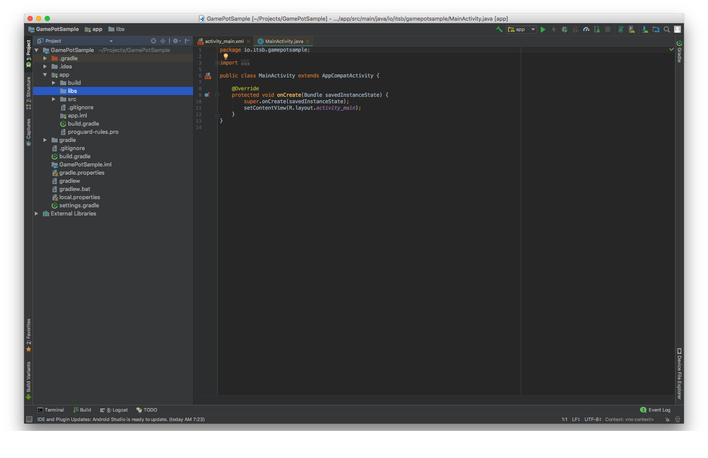
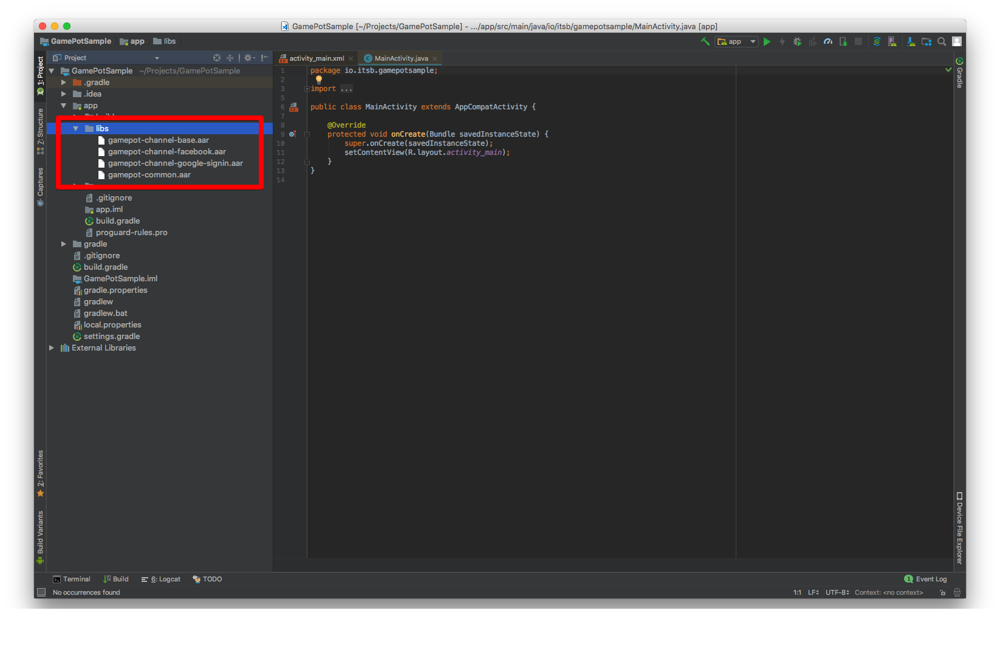
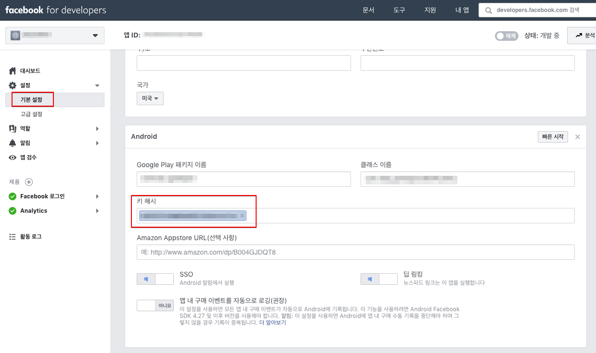

# 1. 시작하기

## 개발환경 구성

Android용 애플리케이션의 개발을 위해서는 개발툴(Android Studio 등)을 설치해야 합니다. 사용하는 개발툴에 따라서는 추가적으로 Java SDK와 Android SDK 등을 설치해야 할 수도 있습니다.

Android에서 GamePot을 사용하기 위한 시스템 환경은 다음과 같습니다.

[ 시스템 환경 ]

- 최소사항 : API 15 (IceCreamSandwich, 4.0.3) 이상, gradle:2.3.0 이상
- 개발 환경 : Android Studio

### 프로젝트 생성



### 라이브러리 추가

다운로드한 AOS SDK 파일을 app/libs 폴더에 추가합니다.



### build.gradle 설정

build.gradle파일은 프로젝트 root 폴더와 app 폴더에 각각 존재합니다.

1. 프로젝트 root폴더에 build.gradle 수정

   ```java
   buildscript {
        
       repositories {
           ...
           google()
           jcenter()
           maven { url "https://jitpack.io" }
           maven { url "https://jcenter.bintray.com" }
       }
       dependencies {
          ...
           classpath 'com.google.gms:google-services:4.0.1'
       }
   }
    
   allprojects {
       repositories {
           ...
           google()
           jcenter()
           maven { url "https://jitpack.io" }
           maven { url "https://jcenter.bintray.com" }
       }
   }
   
   ```

2. app폴더에 build.gradle 수정

   > [xxxxx]에는 실제 적용될 값을 넣습니다.

   ```java
   android {
       defaultConfig {
           ...
           // GamePot [START]
           resValue "string", "gamepot_project_id", "[projectId]" // required
           resValue "string", "gamepot_api_url", "[apiUrl]" // required
           resValue "string", "gamepot_store", "[storeId]" // required
           resValue "string", "gamepot_app_title","@string/app_name" // required (fcm)
           resValue "string", "gamepot_push_default_channel","Default" // required (fcm)
           resValue "string", "facebook_app_id", "[Facebook ID]" // facebook
           resValue "string", "fb_login_protocol_scheme", "fb[Facebook ID]" // (facebook)
           // GamePot [END]
       }
   }
    
   repositories {
       flatDir {
           dirs 'libs'
       }
   }
    
   dependencies {
       compile 'com.android.support:multidex:1.0.1'
    
       // GamePot common [START]
       compile(name: 'gamepot-common', ext: 'aar')
       compile('io.socket:socket.io-client:1.0.0') {
           exclude group: 'org.json', module: 'json'
       }
       compile('com.github.ihsanbal:LoggingInterceptor:2.0.5') {
           exclude group: 'org.json', module: 'json'
       }
       compile "com.github.nisrulz:easydeviceinfo:2.4.1"
       compile 'com.android.installreferrer:installreferrer:1.0'
       compile 'com.google.code.gson:gson:2.8.2'
       compile 'com.jakewharton.timber:timber:4.7.0'
       compile 'com.squareup.okhttp3:okhttp:3.10.0'
       compile 'com.apollographql.apollo:apollo-runtime:1.0.0-alpha2'
       compile 'com.apollographql.apollo:apollo-android-support:1.0.0-alpha2'
       compile 'com.android.billingclient:billing:1.1'
       compile 'com.google.firebase:firebase-core:16.0.1'
       compile 'com.google.firebase:firebase-messaging:17.1.0'
       // GamePot common [END]
    
       compile(name: 'gamepot-channel-base', ext: 'aar')
       // GamePot facebook [START]
       compile(name: 'gamepot-channel-facebook', ext: 'aar')
       compile 'com.facebook.android:facebook-android-sdk:4.37.0'
       // GamePot facebook [END]
    
       // GamePot google sigin [START]
       compile(name: 'gamepot-channel-google-signin', ext: 'aar')
       compile "com.google.android.gms:play-services-base:15.0.1"
       compile "com.google.android.gms:play-services-auth:15.0.1"
       // GamePot google sigin [END]
   }
   
   // ADD THIS AT THE BOTTOM
   apply plugin: 'com.google.gms.google-services'
   ```

3. 구글에서 발급받은 google-service.json 파일을 /app/ 폴더 하위에 복사합니다.

4. Gradle Sync Now

   Android Studio에서 아래 버튼을 눌러 새로고침 합니다.


* 새로고침을 누른 후 발생할 수 있는 실패

  * Configuration 'compile' is obsolete and has been replaced with 'implementation' and 'api'.
    It will be removed at the end of 2018. For more information see: <http://d.android.com/r/tools/update-dependency-configurations.html>

    > Gradle 버전을 3 이상 쓰시는 경우 compile을 implementation

  * No matching client found for package name 'packagename'

    > app의 패키지명과 google-service.json에 선언된 패키지명을 일치하도록 변경해주세요.

###AndroidManifest.xml 설정

일반적으로 게임에 사용되는 설정 값을 추가합니다. 각 설정별로 자세한 설명은 코드를 참고해주세요.

> 권장 사항으로 개발사 판단하에 적용여부를 검토해주세요.

```xml
<?xml version="1.0" encoding="utf-8"?>
<manifest xmlns:android="http://schemas.android.com/apk/res/android"
    xmlns:tools="http://schemas.android.com/tools">
 
    <!--전화 기능이 없는 기기(태블릿)에서도 스토어에서 다운로드 받을 수 있도록 설정-->
    <uses-feature android:name="android.hardware.telephony" android:required="false" />
    <!--음성 채팅이 지원되는 게임을 마이크가 없는 기기에서도 스토어에서 다운로드 받을 수 있도록 설정-->
    <uses-feature android:name="android.hardware.microphone" android:required="false" />
 
    <!--allowBackup을 필히 false로 해주세요. (게임이 재 설치되면 자동으로 shared preference값을 복구하는것을 막는 용도입니다.)-->
    <application
        android:name="android.support.multidex.MultiDexApplication"
        android:allowBackup="false"
        tools:replace="android:allowBackup">
 
        <!--resizeableActivity : 앱 분할 화면 보기 기능 비활성화-->
        <activity
            android:resizeableActivity="false">
            <intent-filter>
                <action android:name="android.intent.action.MAIN" />
                <category android:name="android.intent.category.LAUNCHER" />
            </intent-filter>
        </activity>
 
        <!--갤럭시 S8과 같은 스크린 대응-->
        <meta-data android:name="android.max_aspect" android:value="2.1" />
 
    </application>
</manifest>
```

### Push Notification 아이콘 설정


푸시 수신 시 Notification bar에 보여질 icon은 기본적으로 SDK내부에 기본 이미지로 처리되며, 게임에 맞게 직접 넣을 수도 있습니다.

#### icon 직접 넣기

> [링크](http://romannurik.github.io/AndroidAssetStudio/icons-notification.html#source.type=clipart&source.clipart=ac_unit&source.space.trim=1&source.space.pad=0&name=ic_stat_gamepot_small)를 통해 아이콘을 제작하면 자동으로 폴더 별로 제작되어 각 폴더에 넣어주시기만 하면 됩니다.

1. res/drawable 관련 폴더를 아래와 같이 생성

   res/drawable-mdpi/

   res/drawable-hdpi/

   res/drawable-xhdpi/

   res/drawable-xxhdpi/

   res/drawable-xxxhdpi/

2. 아래 사이즈 별로 이미지 제작

   24x24

   36x36

   48x48

   72x72

   96x96

3. 아래와 같이 각 폴더별로 사이즈에 맞는 이미지를 추가

   | 폴더명                | 사이즈 |
   | :-------------------- | :----- |
   | res/drawable-mdpi/    | 24x24  |
   | res/drawable-hdpi/    | 36x36  |
   | res/drawable-xhdpi/   | 48x48  |
   | res/drawable-xxhdpi/  | 72x72  |
   | res/drawable-xxxhdpi/ | 96x96  |

4. 이미지 파일명을 `ic_stat_gamepot_small`로 변경

# 2. 초기화

MainActivity.java 파일에 아래 부분을 추가 합니다.

```java
import io.gamepot.common.GamePot;
import io.gamepot.common.GamePotLocale;
  
@Override
protected void onCreate(Bundle savedInstanceState) {
    super.onCreate(savedInstanceState);
    // GAMEPOT 초기화. context는 꼭 application context를 넣어 주세요.
    // setup api는 다른 api보다 가장 처음에 호출해야 합니다.
    GamePot.getInstance().setup(getApplicationContext());  
}
 
@Override
protected void attachBaseContext(Context newBase) {
    super.attachBaseContext(GamePotLocale.onAttach(newBase));
}

@Override
protected void onActivityResult(int requestCode, int resultCode, Intent data) {
    super.onActivityResult(requestCode, resultCode, data);
    GamePot.getInstance().onActivityResult(requestCode, resultCode, data);
}

@Override
protected void onStart() {
    super.onStart();
    GamePotChat.getInstance().start();
}

@Override
protected void onStop() {
    super.onStop();
    GamePotChat.getInstance().stop();
}

@Override
protected void onDestroy() {
    super.onDestroy();
    GamePot.getInstance().onDestroy();
}
```

# 3. 로그인 / 로그아웃 / 회원 탈퇴

구글 / 페이스북 / 네이버 등의 다양한 로그인 SDK 를 통합하여 사용하실 수 있습니다.

## 구글(Firebase) 콘솔 설정

APK 빌드 시 사용한 Keystore의 SHA-1값을 Firebase console에 추가합니다.

> SHA-1 값은 개발사에 요청합니다.


## 페이스북 콘솔 설정

APK 빌드 시 사용한 Keystore의 키 해시 값을 페이스북 콘솔에 추가합니다.

> 키 해시 값은 개발사에 요청합니다.



## 설정

### MainActivity.java 파일 수정

로그인 관련 코드를 아래와 같이 선언합니다.

```java
import io.gamepot.channel.GamePotChannel;
import io.gamepot.channel.GamePotChannelType;
import io.gamepot.channel.facebook.GamePotFacebook;
import io.gamepot.channel.google.signin.GamePotGoogleSignin;
 
public class MainActivity extends AppCompatActivity {
    @Override
    protected void onCreate(Bundle savedInstanceState) {
        // setup api는 맨 처음에 호출돼야 합니다.
        GamePot.getInstance().setup(getApplicationContext());
        
        ...
        // 로그인을 사용하려는 채널별로 addChannel을 호출해주세요.(Guest 방식은 기본으로 포함)
        // Google Login 초기화
        GamePotChannel.getInstance().addChannel(this, GamePotChannelType.GOOGLE, new GamePotGoogleSignin());
        // Facebook Login 초기화
        GamePotChannel.getInstance().addChannel(this, GamePotChannelType.FACEBOOK, new GamePotFacebook());
        ...
    }
    
    @Override
    protected void onActivityResult(int requestCode, int resultCode, Intent data) {
        super.onActivityResult(requestCode, resultCode, data);
        GamePotChannel.getInstance().onActivityResult(this, requestCode, resultCode, data);
    }
    
    @Override
    protected void onDestroy() {
        super.onDestroy();
        GamePotChannel.getInstance().onDestroy();
    }
}
```

## 로그인

로그인 UI는 개발사에서 구현하시고, 로그인 버튼 클릭 시에 연동 합니다.

```java
import io.gamepot.channel.GamePotChannel;
import io.gamepot.channel.GamePotChannelListener;
import io.gamepot.channel.GamePotChannelType;
import io.gamepot.channel.GamePotUserInfo;
import io.gamepot.common.GamePotError;
 
// 로그인 타입 정의
// GamePotChannelType.GOOGLE: 구글
// GamePotChannelType.FACEBOOK: 페이스북
// GamePotChannelType.GUEST: 게스트
 
// 구글 로그인 버튼을 눌렀을 때 호출
GamePotChannel.getInstance().login(this, GamePotChannelType.GOOGLE, new GamePotChannelListener<GamePotUserInfo>() {
    @Override
    public void onCancel() {
        // 사용자가 로그인을 취소한 상황.
    }
 
    @Override
    public void onSuccess(GamePotUserInfo userinfo) {
        // 로그인 완료. 게임 로직에 맞게 처리해주세요.
    }
 
    @Override
    public void onFailure(GamePotError error) {
        // 로그인 실패. error.getMessage()를 이용해서 오류 메시지를 보여주세요.
    }
});
```

## 자동 로그인

사용자가 마지막에 로그인 했던 정보를 전달하는 api를 이용하여 자동 로그인을 구현 할 수 있습니다.

```java
import io.gamepot.channel.GamePotChannel;
import io.gamepot.channel.GamePotChannelListener;
import io.gamepot.channel.GamePotChannelType;
import io.gamepot.channel.GamePotUserInfo;
import io.gamepot.common.GamePotError;
 
// 사용자가 마지막에 로그인 했던 정보를 전달하는 api
final GamePotChannelType lastLoginType = GamePotChannel.getInstance().getLastLoginType();
 
if(lastLoginType != GamePotChannelType.NONE) {
    // 마지막에 로그인 했던 로그인 타입으로 로그인 하는 방식입니다.
    GamePotChannel.getInstance().login(this, lastLoginType, new GamePotChannelListener<GamePotUserInfo>() {
        @Override
        public void onCancel() {
            // 사용자가 로그인을 취소한 상황.
        }
 
        @Override
        public void onSuccess(GamePotUserInfo info) {
            // 자동로그인 완료. 게임 로직에 맞게 처리해주세요.
        }
 
        @Override
        public void onFailure(GamePotError error) {
            // 자동로그인 실패. error.getMessage()를 이용해서 오류 메시지를 보여주세요.
        }
    });
}
else
{
    // 처음 게임을 실행했거나 로그아웃한 상태. 로그인을 할 수 있는 로그인 화면으로 이동해주세요.
}
```

## 로그아웃

현재 회원 계정을 로그아웃 합니다.

```java
import io.gamepot.channel.GamePotChannel;
import io.gamepot.common.GamePotCommonListener;
import io.gamepot.common.GamePotError;
 
GamePotChannel.getInstance().logout(this, new GamePotCommonListener() {
    @Override
    public void onSuccess() {
        // 로그아웃 완료. 초기화면으로 이동해주세요.
    }
 
    @Override
    public void onFailure(GamePotError error) {
        // 로그아웃 실패. error.getMessage()를 이용해서 오류 메시지를 보여주세요.
    }
});
```

## 회원탈퇴

현재 회원 계정을 탈퇴 시킵니다.

```java
import io.gamepot.channel.GamePotChannel;
import io.gamepot.common.GamePotCommonListener;
import io.gamepot.common.GamePotError;
 
GamePotChannel.getInstance().deleteMember(this, new GamePotCommonListener() {
    @Override
    public void onSuccess() {
        // 회원탈퇴 성공. 초기화면으로 이동해주세요.
    }
 
    @Override
    public void onFailure(GamePotError error) {
        // 회원탈퇴 실패. error.getMessage()를 이용해서 오류 메시지를 보여주세요.
    }
});
```

# 4. 계정연동

하나의 게임 계정에 복수개의 소셜계정(구글/페이스북 등)을 연결/해제 할 수 있는 기능입니다. (최소 연동 소셜계정은 1가지 입니다.)

> 연동화면 UI는 개발사에서 구현해주세요.

## 계정연동

Google / Facebook 등의 아이디로 계정을 연동 하실 수 있습니다.

```java
import io.gamepot.channel.GamePotChannel;
import io.gamepot.channel.GamePotChannelListener;
import io.gamepot.channel.GamePotChannelType;
import io.gamepot.channel.GamePotUserInfo;
import io.gamepot.common.GamePotError;

// 구글 계정에 연동
// GamePotChannelType.GOOGLE
// 페이스북 계정에 연동
// GamePotChannelType.FACEBOOK
 
GamePotChannel.getInstance().createLinking(this, GamePotChannelType.GOOGLE, new GamePotChannelListener<GamePotUserInfo>() {
    @Override
    public void onSuccess(GamePotUserInfo userInfo) {
        // 연동 완료. 연동 결과에 대한 문구를 노출시켜 주세요. (ex. 계정 연동에 성공했습니다.)
    }
 
    @Override
    public void onCancel() {
        // 사용자가 취소한 경우
    }
 
    @Override
    public void onFailure(GamePotError error) {
        // 연동 실패. error.getMessage()를 이용해서 오류 메시지를 보여주세요.
    }
});
```

## 연동된 리스트

해당 API를 통해 계정에 대해 연동 여부를 체크 하실 수 있습니다.

```java
import io.gamepot.channel.GamePotChannel;
import java.util.ArrayList;

// 타입 정의
// GamePotChannelType.GOOGLE
// GamePotChannelType.FACEBOOK
// 타입에 따른 연동 결과를 리턴 합니다.
boolean isLinked = GamePotChannel.getInstance().isLinked(GamePotChannelType.GOOGLE);

// 연동되어 있는 모든 타입에 대해 JSON 형태로 리턴 합니다.
// 만약 GOOGLE과 FACEBOOK에 연동된 경우 아래와 같이 리턴됩니다.
// [{“provider”:”google”},{“provider”:”facebook”}]
JSONArray linking = GamePotChannel.getInstance().getLinkedList();
```


## 연동 해제

기존에 연동 되어 있는 계정을 해제 합니다.

```java
import io.gamepot.channel.GamePotChannel;
import io.gamepot.channel.GamePotChannelType;
import io.gamepot.common.GamePotCommonListener;
import io.gamepot.common.GamePotError;

GamePotChannel.getInstance().deleteLinking(this, GamePotChannelType.GOOGLE, new GamePotCommonListener() {
    @Override
    public void onSuccess() {
        // 연동해제 완료. 연동 결과에 대한 문구를 노출시켜 주세요. (ex. 계정 연동을 해지했습니다.)
    }
 
    @Override
    public void onFailure(GamePotError error) {
        // 연동해제 실패. error.getMessage()를 이용해서 오류 메시지를 보여주세요.
    }
});
```

# 5. 광고플랫폼

Facebook / Adjust / Adbrix 등의 여러가지 다양한 광고 플랫폼 SDK 를 통합하여 사용하실 수 있습니다.

## 설정

### MainActivity.java 파일 수정

광고 플랫폼 관련 코드를 아래와 같이 선언합니다.

```java
import io.gamepot.ad.GamePotAd;
import io.gamepot.ad.GamePotAdActions;
import io.gamepot.ad.facebook.GamePotAdFacebook;
import io.gamepot.ad.igaworks.GamePotAdIgaworks;
import io.gamepot.ad.adjust.GamePotAdAdjust;
 
public class MainActivity extends AppCompatActivity {
    @Override
    protected void onCreate(Bundle savedInstanceState) {
        // setup api는 맨 처음에 호출돼야 합니다.
        GamePot.getInstance().setup(getApplicationContext()); 
        
        ...
		// GamePot 광고 초기화. 사용하려는 광고 모듈 별로 addAd 해주세요.
        GamePotAd.getInstance().setActivity(this);
        // Facebook 초기화
		GamePotAd.getInstance().addAd(new GamePotAdFacebook());
        // IGAWorks 초기화
		GamePotAd.getInstance().addAd(new GamePotAdIgaworks());
        // Adjust 초기화
        GamePotAd.getInstance().addAd(new GamePotAdAdjust());
        ...
    }
        
    @Override
    protected void onResume() {
        super.onResume();
        GamePotAd.getInstance().tracking(GamePotAdActions.RESUME);
    }

    @Override
    protected void onPause() {
        super.onPause();
        GamePotAd.getInstance().tracking(GamePotAdActions.PAUSE);
    }

    @Override
    protected void onDestroy() {
        super.onDestroy();
        GamePotAd.getInstance().onDestroy();
    }
}
```

### InstallReferrer 설정

#### ReferrerCatcher.java파일 추가

프로젝트에 ReferrerCatcher.java 파일을 생성 후 아래 코드를 추가해주세요.

```java
import android.content.BroadcastReceiver;
import android.content.Context;
import android.content.Intent;
import android.os.Bundle;
import android.util.Log;

import com.adjust.sdk.AdjustReferrerReceiver;
import com.google.android.gms.analytics.CampaignTrackingReceiver;
import com.igaworks.IgawReceiver;

public class ReferrerCatcher extends BroadcastReceiver {
    @Override
    public void onReceive(Context context, Intent intent) {
        if(intent != null) {
            Bundle extras = intent.getExtras();
            if (extras != null) {
                Log.i("ReferrerCatcher", extras.getString("referrer"));
            }
        }

        // TODO : Adjust를 사용하는 경우에만 아래 코드 추가
        try {
            Class.forName("com.adjust.sdk.AdjustReferrerReceiver");
            Class.forName("com.google.android.gms.analytics.CampaignTrackingReceiver");

            // Adjust [START]
            new AdjustReferrerReceiver().onReceive(context, intent);
            new CampaignTrackingReceiver().onReceive(context, intent);
            // Adjust [END]

            Log.i("ReferrerCatcher", "Adjust");
        } catch (Exception e) {
            e.printStackTrace();
        }

        // TODO : Igaworks를 사용하는 경우에만 아래 코드 추가
        try {
            Class.forName("com.igaworks.IgawReceiver");

            // IGAW [START]
            IgawReceiver igawReceiver = new IgawReceiver();
            igawReceiver.onReceive(context, intent);
            // IGAW [END]

            Log.i("ReferrerCatcher", "IGAW");
        }
        catch(Exception e) {
            e.printStackTrace();
        }
    }
}
```

#### AndroidManifest.xml파일 수정

AndoridManifest.xml에 아래 코드를 추가하고 android:name에는 위에서 만든 ReferrerCatcher 클래스의 경로를 넣어주세요.

```xml
<manifest>
	...
	<application>
		...
		<!--IGAW / Facebook / Adjust 모듈을 사용하면 필수-->
        <receiver android:name="{ReferrerCatcher의 경로}" android:exported="true">
            <intent-filter>
                <action android:name="com.android.vending.INSTALL_REFERRER" />
            </intent-filter>
        </receiver>
        <!--[END]-->
		...
	</application>
	...
</manifest>
```

### build.gradle파일 수정

사용하려는 플랫폼에 맞게 관련 설정 값을 추가합니다.

```java

android {
	...
    defaultConfig {
    	...
    	// FACEBOOK 이용 시 추가 [START]
    	resValue "string", "facebook_app_id", "xxxxxxxxxxxxxxxx"
        resValue "string", "fb_login_protocol_scheme", "fbxxxxxxxxxxxxxxxx"
    	// FACEBOOK 이용 시 추가 [END]
        
        // Adjust 이용 시 추가 [START]
        resValue "string", "gamepot_adjust_apptoken","xxxxxxxxxxxx"
        resValue "string", "gamepot_adjust_signature","(1, xxxxxxxxxx, xxxxxxxxxx, xxxxxxxxxx, xxxxxxxxxx)" // adjust sdk signature 이용 시 추가
        // Adjust 이용 시 추가 [END]
        
        // IGAWorks 이용 시 추가 [START]
        resValue "string", "gamepot_igaworks_app_key", "xxxxxxxxxx"
        resValue "string", "gamepot_igaworks_hash_key", "xxxxxxxxxx"
        // IGAWorks 이용 시 추가 [END]
    }
}

dependencies {
    compile(name: 'gamepot-ad-base', ext: 'aar')
        
    // Adjust 이용 시 추가 [START]
    compile(name: 'gamepot-ad-adjust', ext: 'aar')
    compile 'com.adjust.sdk:adjust-android:4.14.0'
    compile 'com.android.installreferrer:installreferrer:1.0'
    compile 'com.google.android.gms:play-services-analytics:16.0.1'
    // Adjust 이용 시 추가 [END]

    // FACEBOOK 이용 시 추가 [START]
    compile(name: 'gamepot-ad-facebook', ext: 'aar')
    compile 'com.facebook.android:facebook-android-sdk:[4,5)'
    // FACEBOOK 이용 시 추가 [END]

    // IGAWorks 이용 시 추가 [START]
    compile(name: 'gamepot-ad-igaworks', ext: 'aar')
    compile 'com.android.installreferrer:installreferrer:1.0'
    // IGAWorks 이용 시 추가 [END]
}
```

## EventTracking 전달

Event Tracking은 아래와 같이 경우에 따라 호출 하는 코드가 다릅니다.

하기 코드 참고하여 호출 해주세요.

```java
import io.gamepot.ad.GamePotAd;
import io.gamepot.ad.GamePotAdActions;
import io.gamepot.ad.builders.GamePotAdEventBuilder;
import io.gamepot.ad.builders.GamePotAdLevelBuilder;
import io.gamepot.ad.builders.GamePotAdTutorialBuilder;

// 앱 실행
GamePotAd.getInstance().tracking(GamePotAdActions.APPLICATION_START);

// 일반
GamePotAd.getInstance().tracking(GamePotAdActions.EVENT, new GamePotAdEventBuilder().setEvent("test").build());

// 레벨 업 시
GamePotAd.getInstance().tracking(GamePotAdActions.LEVEL, new GamePotAdLevelBuilder().setLevel(4).build());

// 튜토리얼 완료 시
GamePotAd.getInstance().tracking(GamePotAdActions.TUTORIAL_COMPLETE, new GamePotAdTutorialBuilder().setContentData("튜토리얼 완료").setContentId("1").setSuccess(true).build());
```

# 6. 결제

## 페이스북 콘솔 설정

아래 '앱 내 구매 이벤트를 자동으로 로깅' 항목을 OFF합니다.


## 설정

결제의 결과 값은 Listener 형태로 구현되어 있습니다.

MainActivity.java에서 앱 실행 시 한번 호출하도록 선언합니다.

```java
import io.gamepot.common.GamePot;
import io.gamepot.common.GamePotPurchaseInfo;
import io.gamepot.common.GamePotPurchaseListener;
import io.gamepot.common.GamePotError;
 
public class MainActivity extends AppCompatActivity {
    @Override
    protected void onCreate(Bundle savedInstanceState) {
        // setup api는 맨 처음에 호출돼야 합니다.
        GamePot.getInstance().setup(getApplicationContext()); 
        
        ...
		GamePot.getInstance().setPurchaseListener(new GamePotPurchaseListener<GamePotPurchaseInfo>() {
            @Override
            public void onSuccess(GamePotPurchaseInfo info) {
         		// 광고 플랫폼에 결제 이벤트를 던져주기 위한 코드로 꼭! 삽입해 주세요.
                GamePotAd.getInstance().tracking(GamePotAdActions.BILLING, info);

                // 결제 성공. 아이템 지급 요청은 webhook에 설정된 주소로 server to server로 요청합니다.
                // 이 곳에서는 결과에 대한 처리만 해주시고 실제 아이템 지급은 하지 마세요.
            }

            @Override
            public void onFailure(GamePotError error) {
                // 결제 실패. error.getMessage()를 이용해서 오류 메시지를 보여주세요.
            }

            @Override
            public void onCancel() {
                // 결제 진행 중 사용자가 취소한 경우
            }
        });
        ...
    }
}
```

## 결제 시도

하나의 결제 api로 GooglePlay, OneStore 모두 결제가 가능합니다

```java
import io.gamepot.common.GamePot;

// productId 는 스토어에 등록된 상품ID를 입력해 주시면 됩니다.
GamePot.getInstance().purchase("product id");
```

# 7. 기타 API

## 네이버 카페 SDK

해당 기능을 사용하려면 네이버 카페 SDK와 선행해서 연동에 필요한 값을 획득해야 합니다.

### 설정

#### build.gradle파일 수정

```java
android {
    ...
    defaultConfig {
        ...
        resValue "string", "gamepot_naver_clientid", "{네아로에서 사용할 client 아이디}"
        resValue "string", "gamepot_naver_secretid", "{네아로에서 사용할 secret 아이디}"
        resValue "integer", "gamepot_naver_cafeid", "{네이버 카페 아이디}"
        ...
    }
}
...
dependencies {
    ...
    // naver cafe [START]
    compile(name: 'gamepot-navercafe', ext: 'aar')
    compile(name: 'cafeSdk-3.3.1', ext: 'aar')
    compile 'com.navercorp.volleyextensions:volleyer:2.0.1', {
        exclude group: 'com.mcxiaoke.volley', module: 'library'
    }
    compile 'com.github.bumptech.glide:glide:3.7.0'
    compile 'com.squareup:otto:1.3.8'
    // naver cafe [END]
    ...
}
```

#### MainActivity.java 수정

```java
import io.gamepot.navercafe.GamePotNaverCafe;
 
public class MainActivity extends Activity {
    @Override
    protected void onCreate(final Bundle savedInstanceState) {
        // setup api는 맨 처음에 호출돼야 합니다.
        GamePot.getInstance().setup(getApplicationContext()); 
        
        ...
        // GamePot setup api호출 이후에 호출해주세요.
        GamePotNaverCafe.getInstance().init(this);
        ...
    }
}
```

### 카페 호출

네이버 카페 SDK 호출은 아래와 같이 합니다.

```java
GamePotNaverCafe.getInstance().startHome(this);
```

로그인에 성공 후, 아래 코드를 추가하면 네이버 카페 관리자 메뉴에서 회원을 식별할 수 있습니다.

```java
GamePotNaverCafe.getInstance().setUserId(this, GamePot.getInstance().getMemberId());
```

## 쿠폰

사용자에게 입력받은 쿠폰을 사용할 때 아래 코드를 호출해 주세요.

> 쿠폰 입력 화면 UI는 개발사에서 구현해주세요.

```java
import io.gamepot.common.GamePot;
import io.gamepot.common.GamePotError;
import io.gamepot.common.GamePotListener;
 
GamePot.getInstance().coupon(/*사용자에게 입력받은 쿠폰*/, new GamePotListener<String>() {
    @Override
    public void onSuccess(String message) {
        // 쿠폰 사용 성공. message값을 팝업으로 노출해주세요.
    }
 
    @Override
    public void onFailure(GamePotError error) {
        // 쿠폰 사용 실패. error.getMessage()를 이용해서 오류 메시지를 보여주세요.
    }
});
```

## Push on/off

전체푸시, 야간푸시, 광고성푸시 3가지 종류의 푸시를 각각 on/off를 처리 할 수 있습니다.

> on/off설정하는 UI는 개발사에서 구현해주세요.

```java
import io.gamepot.common.GamePot;
import io.gamepot.common.GamePotError;
import io.gamepot.common.GamePotCommonListener;

// 푸쉬 수신 On / Off
GamePot.getInstance().setPushEnable(/*true or false*/, new GamePotCommonListener() {
    @Override
    public void onSuccess() {
    }

    @Override
    public void onFailure(GamePotError error) {
    }
});

// 야간 푸쉬 수신 On / Off
GamePot.getInstance().setNightPushEnable(/*true or false*/, new GamePotCommonListener() {
    @Override
    public void onSuccess() {
    }

    @Override
    public void onFailure(GamePotError error) {
    }
});

// 광고 푸쉬 수신 On / Off
// 광고성 푸시 설정
GamePot.getInstance().setAdPushEnable(/*true or false*/, new GamePotCommonListener() {
    @Override
    public void onSuccess() {
    }

    @Override
    public void onFailure(GamePotError error) {
    }
});

// 푸쉬 / 야간푸쉬 / 광고푸쉬를 한번에 설정
// 로그인 전에 푸쉬 / 야간푸쉬 / 광고푸쉬 허용 여부를 받는 게임이라면 로그인 후에 아래 코드로 필히 호출 합니다.
GamePot.getInstance().setPushEnable(/*true or false*/, /*true or false*/, /*true or false*/, new GamePotCommonListener() {
    @Override
    public void onSuccess() {
    }

    @Override
    public void onFailure(GamePotError error) {
    }
});
```

현재 푸시 상태를 가져오려면 아래 코드를 참고하세요.

```java
import io.gamepot.common.GamePot;
import org.json.JSONObject;

// enable: 전체푸시
// night: 야간푸시
// ad: 광고성푸시
// {"enable":true, "night":true, "ad":false}
JSONObject status = GamePot.getInstance().getPushStatus();
```

## 공지사항

대시보드 - 공지사항에서 업로드한 이미지가 노출되는 기능입니다.

### 호출

```java
GamePot.getInstance().showNoticeWebView(/*현재 액티비티*/);
```

## 고객센터

대시보드 - 고객센터와 연동되는 유저와 운영자간에 소통 채널입니다.

### 호출

```java
GamePot.getInstance().showCSWebView(/*현재 액티비티*/);
```

## 로컬 푸시(Local Push notification)

푸시 서버를 통하지 않고 단말기에서 자체적으로 푸시를 노출하는 기능입니다.

### 호출

#### 푸시 등록

정해진 시간에 로컬 푸시를 노출하는 방법은 아래와 같습니다.

> 리턴 값으로 전달되는 pushid는 개발사에서 관리합니다.

```java
String date = "2018-09-27 20:00:00";
GamePotLocalPushBuilder builder = new GamePotLocalPushBuilder(getActivity())
                        .setTitle("로컬푸시 테스트")
                        .setMessage("로컬푸시 메시지 입니다. " + date)
                        .setDateString(date).build();
int pushid = GamePot.getInstance().sendLocalPush(builder);
```

#### 등록한 푸시 취소

푸시 등록시 얻은 pushid를 기반으로 기존에 등록된 푸시를 취소할 수 있습니다.

```java
GamePot.getInstance().cancelLocalPush(/*현재 액티비티*/, /*푸시 등록시 얻은 pushid*/);
```

## 점검/강제업데이트

점검이나 강제업데이트 기능이 필요한 경우 대시보드 - 운영에서 기능을 활성화 할 경우 동작합니다.

### 호출

기존에 적용된 아래 api에서 사용이 가능합니다.

#### 1. setup api

기존 setup api에서 두번째 파라미터를 추가합니다.

```java
GamePot.getInstance().setup(getApplicationContext(), new GamePotAppStatusListener() {
    @Override
    public void onNeedUpdate(GamePotAppStatus status) {
        // TODO : 강제업데이트가 필요한 경우. 아래 api를 호출하면 SDK 자체에서 팝업을 띄울 수 있습니다.
        // TODO : Customizing을 하고자 하는 경우 아래 api를 호출하지 말고 Customizing을 하면 됩니다.
        GamePot.getInstance().showAppStatusPopup(MainActivity.this, status, new GamePotAppCloseListener() {
            @Override
            public void onClose() {
                // TODO : showAppStatusPopup api를 호출하신 경우 앱을 종료해야하는 상황에 호출됩니다.
                // TODO : 종료 프로세스를 처리해주세요.
                MainActivity.this.finish();
            }
        });
    }

    @Override
    public void onMainternance(GamePotAppStatus status) {
        // TODO : 점검중인 경우. 아래 api를 호출하면 SDK 자체에서 팝업을 띄울 수 있습니다.
        // TODO : Customizing을 하고자 하는 경우 아래 api를 호출하지 말고 Customizing을 하면 됩니다.
        GamePot.getInstance().showAppStatusPopup(MainActivity.this, status, new GamePotAppCloseListener() {
            @Override
            public void onClose() {
                // TODO : showAppStatusPopup api를 호출하신 경우 앱을 종료해야하는 상황에 호출됩니다.
                // TODO : 종료 프로세스를 처리해주세요.
                MainActivity.this.finish();
            }
        });
    }
});
```

#### 2. login api

기존 login api에서 listener를 `GamePotAppStatusChannelListener`로 변경합니다.

```java
GamePotChannel.getInstance().login(this, GamePotChannelType.GOOGLE, new GamePotAppStatusChannelListener<GamePotUserInfo>() {
    @Override
    public void onNeedUpdate(GamePotAppStatus status) {
        // TODO : 강제업데이트가 필요한 경우. 아래 api를 호출하면 SDK 자체에서 팝업을 띄울 수 있습니다.
        // TODO : Customizing을 하고자 하는 경우 아래 api를 호출하지 말고 Customizing을 하면 됩니다.
        GamePot.getInstance().showAppStatusPopup(MainActivity.this, status, new GamePotAppCloseListener() {
            @Override
            public void onClose() {
                // TODO : showAppStatusPopup api를 호출하신 경우 앱을 종료해야하는 상황에 호출됩니다.
                // TODO : 종료 프로세스를 처리해주세요.
                MainActivity.this.finish();
            }
        });
    }

    @Override
    public void onMainternance(GamePotAppStatus status) {
        // TODO : 점검중인 경우. 아래 api를 호출하면 SDK 자체에서 팝업을 띄울 수 있습니다.
        // TODO : Customizing을 하고자 하는 경우 아래 api를 호출하지 말고 Customizing을 하면 됩니다.
        GamePot.getInstance().showAppStatusPopup(MainActivity.this, status, new GamePotAppCloseListener() {
            @Override
            public void onClose() {
                // TODO : showAppStatusPopup api를 호출하신 경우 앱을 종료해야하는 상황에 호출됩니다.
                // TODO : 종료 프로세스를 처리해주세요.
                MainActivity.this.finish();
            }
        });
    }

    @Override
    public void onCancel() {
        // 사용자가 로그인을 취소한 상황.
    }

    @Override
    public void onSuccess(GamePotUserInfo userinfo) {
        // 로그인 완료. 게임 로직에 맞게 처리해주세요.
    }

    @Override
    public void onFailure(GamePotError error) {
        // 로그인 실패. error.getMessage()를 이용해서 오류 메시지를 보여주세요.
    }
});
```


