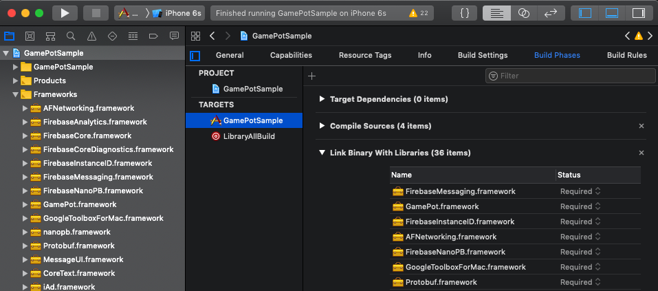
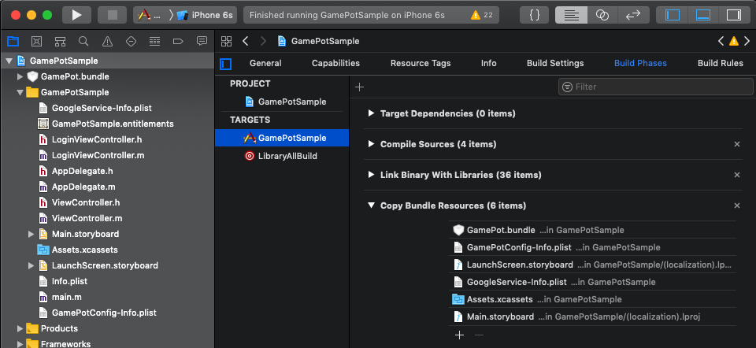
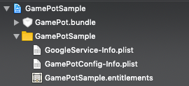
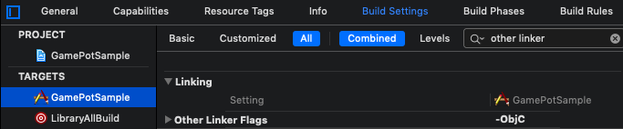
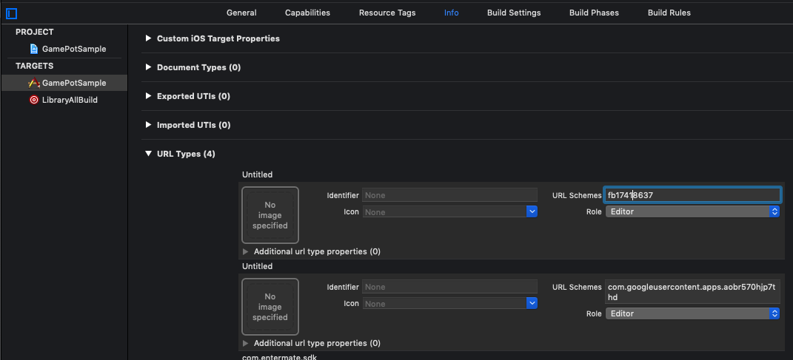
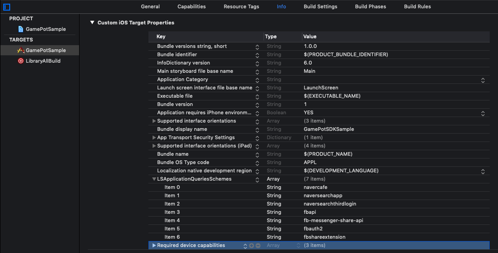
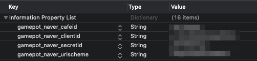

# 1. 시작하기

## 개발환경 구성

IOS용 애플리케이션 개발을 위해서는 개발툴 (XCode)을 설치해야 합니다. 

IOS에서 GamePot을 사용하기 위한 시스템 환경은 다음과 같습니다. 

[ 시스템 환경 ]

- 최소사항 : IOS 9.0 이상
- 개발 환경 : XCode

### Freamwork 추가


다운로드한 iOS SDK 파일을 Xcode 프로젝트 폴더 타겟에 드래그 하여 추가합니다.

### Dependencies 추가

이용하고자 하는 서비스에 따라 필수 Dependencies 목록이 다릅니다. 

해당 표를 참고하시어 Dependencies를 추가 합니다.

서비스 별 Dependencies

| Service       | Framework                                                    | Dependencies                                                 | bundle                                            |
| ------------- | ------------------------------------------------------------ | ------------------------------------------------------------ | ------------------------------------------------- |
| 기본(Base)    | AFNetworking.framework<br />FirebaseAnalytics.framework<br />FirebaseCore.framework
FirebaseCoreDiagnostics.framework
FirebaseInstanceID.framework
FirebaseMessaging.framework
FirebaseNanoPB.framework
GamePot.framework
GoogleToolboxForMac.framework
nanopb.framework
Protobuf.framework | libz.tbd<br />WebKit.framework<br />                         | GamePot.bundle                                    |
| 로그인(Login) | [ Base ]<br />GamePotChannel.framework<br /><br />[ Google Sign In ]<br />GamePotGoogleSignIn.framework<br/>GoogleSignIn.framework
GTMOAuth2.framework
GTMSessionFetcher.framework<br /><br />[ Facebook ]<br />Bolts.framework<br/>FBSDKCoreKit.framework
FBSDKLoginKit.framework
GamePotFacebook.framework | [ Google Sign In ]<br />SafariServices.framework<br />[ Facebook ]<br />SafariServices.framework | [ Google Sign In ]<br />GoogleSignIn.bundle<br /> |
| 광고(AD)      | [ Base ]<br />GamePotAd.framework<br /><br />[ Facebook ]<br />Bolts.framework<br/>FBSDKCoreKit.framework
GamePotAdFacebook.framework<br />[ Adbirx ]<br />AdBrix.framework<br/>GamePotAdAdbrix.framework
IgaworksCore.framework<br /><br />[ Adjust ] <br />AdjustSdk.framework<br/>GamePotAdAdjust.framework | [ Facebook ]<br /><br />[ Adbrix ]<br />MessageUI.framework<br />libxml2.tbd<br />iAd.framework<br />CoreTelephony.framework<br />UIKit.framework<br />CoreGraphics.framework<br />CoreText.framework<br />MobileCoreServices.framework<br />SystemConfiguration.framework<br />Security.framework<br /><br />[ Adjust ] <br />AdSupport.framework |                                                   |
| GameCenter    | GamePotGameCenter.framework                                  |                                                              |                                                   |
| NaverCafe     | AFNetworking.framework<br/>GamePotNavarCafe.framework
NaverCafeSDK.framework | AVKit.framework<br />AVFoundation.framework<br />MediaPlayer.framework<br />CoreMedia.framework<br />AssetsLibrary.framework<br />ImageIO.framework<br />QuartzCore.framework<br />ReplayKit.framework(Optional로 설정)<br />MobileCoreServices.framework<br />SystemConfiguration.framework<br />Security.framework<br />WebKit.framework<br />libNaverLogin.a<br/>NaverThirdPartyConstantsForApp.h
NaverThirdPartyLoginConnection.h
NLoginThirdPartyOAuth20InAppBrowserViewController.h
NLoginThirdPartyOAuth20InAppBrowserViewController.m | NaverAuth.bundle<br/>NaverCafeSDK.bundle          |



### Bundle Resource 추가

이용하고자 하는 서비스에 따라 Bundle Resource 파일을 추가해야 합니다.

서비스 별 Dependencies 표를 참고하여 Bundle Resource 파일을 추가합니다.



### InfoPlist 추가

GamePot SDK는 기본적으로 Google Firebase를 사용합니다. 따라서 Google Firebase를 설정하여 생성된 

GoogleService-Info.plist를 프로젝트에 추가 합니다.

GamePot SDK의 기본설정 값을 포함하고 있는 GamePotConfig-Info.plist 파일도 추가 합니다.



### 빌드 옵션 추가

Build Settings -> Linking -> Other Linker Flags 섹션에 -ObjC 옵션을 추가 합니다.



## Google Sign In 로그인 환경 설정

서비스 별 Dependencies 표의 Login >> Google Sign In 을 참고하여 Framework 및 Dependencies를 추가합니다.

GoogleService-Info.plist 파일의 REVERSED_CLIENT_ID 값을 복사하여 Info >> URL Types에 항목을 추가하여  URL Schemes에 값을 넣습니다.


## Facebook 로그인 환경 설정

서비스 별 Dependencies 표의 Login >> Facebook 을 참고하여 Framework 및 Dependencies를 추가합니다.

Facebook App ID를 Info >> URL Types에  fb+Facebook App ID 형태로 추가 합니다.


Info >> iOS Target Property 의 LSApplicationQueriesSchemes에 아래 항목을 추가합니다.

fbapi
fb-messenger-share-api
fbauth2
fbshareextension 



# 2. 초기화

> AppDelegate 파일에 아래 부분을 추가 합니다.

```objective-c
#import <GamePot/GamePot.h>

- (BOOL)application:(UIApplication *)application didFinishLaunchingWithOptions:(NSDictionary *)launchOptions {
    ...
    // GamePot SDK Initialize    
    [[GamePot getInstance] setup];
    
    // Push Permission
    if(SYSTEM_VERSION_GRATERTHAN_OR_EQUALTO(@"10.0"))
    {
        UNUserNotificationCenter *center = [UNUserNotificationCenter currentNotificationCenter];
        center.delegate = self;
        [center requestAuthorizationWithOptions:(UNAuthorizationOptionSound | UNAuthorizationOptionAlert | UNAuthorizationOptionBadge) completionHandler:^(BOOL granted, NSError * _Nullable error){
            if(!error){
                dispatch_async(dispatch_get_main_queue(), ^{
                    [[UIApplication sharedApplication] registerForRemoteNotifications];
                });
            }
        }];
    }
    else
    {
        // Code for old versions
        UIUserNotificationType allNotificationTypes = (UIUserNotificationTypeSound | UIUserNotificationTypeAlert | UIUserNotificationTypeBadge);
        UIUserNotificationSettings *settings = [UIUserNotificationSettings settingsForTypes:allNotificationTypes categories:nil];
        [application registerUserNotificationSettings:settings];
        [application registerForRemoteNotifications];
    }
    ...
}

 // Push
- (void)application:(UIApplication *)application didRegisterForRemoteNotificationsWithDeviceToken:(NSData *)deviceToken
{
    ...
    [[GamePot getInstance] handleRemoteNotificationsWithDeviceToken:deviceToken];
    ...
}

- (void)applicationWillEnterForeground:(UIApplication *)application {
    [[GamePotChat getInstance] start];
}

- (void)applicationDidEnterBackground:(UIApplication *)application {
    [[GamePotChat getInstance] stop];
}
```


# 3. 로그인 / 로그아웃 / 회원 탈퇴

> 구글 / 페이스북 / 네이버 등의 여러가지 다양한 로그인 SDK 를 통합하여 사용하실 수 있습니다.

## 설정

```objective-c
// AppDelegate.m
#import <GamePotChannel/GamePotChannel.h>

// Google Login 사용 시
#import <GamePotGoogleSignIn/GamePotGoogleSignIn.h>

// Facebook Login 사용 시
#import <GamePotFacebook/GamePotFacebook.h>

- (BOOL)application:(UIApplication *)application didFinishLaunchingWithOptions:(NSDictionary *)launchOptions {
    ...
    // GamePotSDK 채널 초기화 사용하려는 채널별로 addChannel 을 사용해야만 하며, 
    // Guest 방식은 기본으로 포함됩니다.
    // Google Login 초기화
    GamePotChannelInterface* google     = [[GamePotGoogleSignIn alloc] init];
    [[GamePotChannelManager getInstance] addChannelWithType:GOOGLE interface:google];

    // Facebook 로그인 초기화
    GamePotChannelInterface* facebook   = [[GamePotFacebook alloc] init];
    [[GamePotChannelManager getInstance] addChannelWithType:FACEBOOK interface:facebook];
    
    // 로그인 처리를 위해 필요 합니다.
    [[GamePotChannelManager getInstance] application:application didFinishLaunchingWithOptions:launchOptions];

    ...   
}

- (BOOL)application:(UIApplication *)app openURL:(NSURL *)url options:(NSDictionary<UIApplicationOpenURLOptionsKey,id> *)options
{
    // 로그인 처리를 위해 필요 합니다.
    BOOL nChannelManagerResult = [[GamePotChannelManager getInstance] application:app openURL:url options:options];
    return nChannelManagerResult;    
}
```


## 로그인

> 로그인 버튼 클릭 시에 연동 합니다.

```objective-c
#import <GamePotChannel/GamePotChannel.h>
// 로그인 타입 정의
// GamePotChannelType.GOOGLE
// GamePotChannelType.FACEBOOK
// GamePotChannelType.GUEST

// 구글 로그인 버튼 클릭 시에 호출
[[GamePotChannelManager getInstance] Login:GOOGLE viewController:self success:^(GamePotUserInfo* userInfo) {
    // 로그인 완료
} cancel:^{
    // 로그인 시도 중 유저가 취소 하였을 때
} fail:^(NSError *error) {
    // 로그인 중 오류 발생
}];

```


## 자동 로그인

> GamePot은 자동 로그인을 지원합니다.

```objective-c
#import <GamePotChannel/GamePotChannel.h>

// 마지막 로그인된 정보를 가져와서 해당 정보로 자동로그인이 될 수 있도록 호출 합니다.
// lastLoginType : 마지막 로그인 값을 가져올 수 있습니다.
GamePotChannelType type = [[GamePotChannelManager getInstance] lastLoginType];

if(type != NONE)
{
    // 마지막에 로그인 했던 로그인 타입으로 로그인 하는 방식입니다.
    // 자동 로그인 처리시 아래와 같이 호출해주시면 됩니다.
    [[GamePotChannelManager getInstance] Login:type viewController:self success:^(GamePotUserInfo* userInfo) {

    } cancel:^{

    } fail:^(NSError *error) {

    }];
}
else
{
	// 마지막 로그인 된 정보가 없음. 로그인 버튼이 있는 로그인 화면으로 이동 
}
```


## 로그아웃

> 현재 회원 계정을 로그아웃 시킵니다.

```objective-c
#import <GamePotChannel/GamePotChannel.h>

[[GamePotChannelManager getInstance] LogoutWithSuccess:^{
	// 로그아웃 완료 후에는 초기화면으로 이동 합니다.
} fail:^(NSError *error) {
    // 로그아웃 실패 오류 메시지를 보여줍니다.
}];
```


## 회원탈퇴

> 현재 회원 계정을 탈퇴 시킵니다.

```objective-c
#import <GamePotChannel/GamePotChannel.h>

[[GamePotChannelManager getInstance] DeleteMemberWithSuccess:^{
	// 회원 탈퇴 성공 로그인 화면으로 이동
} fail:^(NSError *error) {
    // 회원 탈퇴 실패
}];

```

# 4. 계정연동

> 하나의 게임 계정에 복수개의 소셜계정(구글/페이스북 등)을 연결/해제 할 수 있는 기능입니다. (최소 연동 소셜계정은 1가지 입니다.)
>
> 게임내에서 연동화면 UI를 구현하시고, 연동버튼을 누를때 아래 코드를 호출해 주세요.

## 계정연동

> Google / Facebook 등의 아이디로 계정을 연동 하실 수 있습니다.

```objective-c
#import <GamePotChannel/GamePotChannel.h>

// 타입 정의
// GamePotChannelType.GOOGLE
// GamePotChannelType.FACEBOOK
[[GamePotChannelManager getInstance] CreateLinking:GOOGLE viewController:self success:^(GamePotUserInfo *userInfo) {
	// TODO : 연동 완료. 게임 팝업으로 연동 결과에 대한 문구를 노출시켜 주세요. (ex. 계정 연동에 성공했습니다.)
} cancel:^{
	// TODO : 사용자가 취소한 경우
} fail:^(NSError *error) {
    // TODO : 연동 실패. 게임 팝업으로 연동 실패 원인에 대한 문구를 노출시켜 주세요.
    // TODO : 문구는 [error localizedDescription]를 사용해 주세요.
}];

```


## 연동된 리스트

> 해당 API를 통해 계정에 대해 연동 여부를 체크 하실 수 있습니다.

```objective-c
#import <GamePotChannel/GamePotChannel.h>

// 타입 정의
// GamePotChannelType.GOOGLE
// GamePotChannelType.FACEBOOK
// 타입에 따른 연동 결과를 리턴 합니다.
BOOL isGoogleLinked = [[GamePotChannelManager getInstance] isLinked:GOOGLE];

// 연동되어 있는 타입에 대해 JsonString 형태로 리턴 합니다.
NSString* linkedList = [[GamePotChannelManager getInstance] getLinkedListJsonString];
```


## 연동 해제

> 기존에 연동 되어 있는 계정을 해제 합니다.

```objective-c
#import <GamePotChannel/GamePotChannel.h>

[[GamePotChannelManager getInstance] DeleteLinking:GOOGLE success:^{
     // TODO : 해제 완료. 게임 팝업으로 연동 결과에 대한 문구를 노출시켜 주세요. (ex. 계정 연동을 해제했습니다.)
} fail:^(NSError *error) {
     // TODO : 해제 실패. 게임 팝업으로 해지 실패 원인에 대한 문구를 노출시켜 주세요.
     // TODO : 문구는 [error localizedDescription]를 사용해 주세요.
}];
```

# 5. 광고플랫폼

> Facebook / Adjust / Adbrix  등의 여러가지 다양한 광고 플랫폼 SDK 를 통합하여 사용하실 수 있습니다.

## 설정

```objective-c
// AppDelegate.m

#import <GamePotAd/GamePotAd.h>
// Facebook 광고 플랫폼 사용 시
#import <GamePotAdFacebook/GamePotAdFacebook.h>
// Adjust 광고 플랫폼 사용 시
#import <GamePotAdAdjust/GamePotAdAdjust.h>
// Adbrix 광고 플랫폼 사용 시
#import <GamePotAdAdbrix/GamePotAdAdbrix.h>

- (BOOL)application:(UIApplication *)application didFinishLaunchingWithOptions:(NSDictionary *)launchOptions {
    ...
    // Facebook 광고 플랫폼 초기화
    GamePotAdInterface* adFacebook    = [[GamePotAdFacebook alloc] init];
    [[GamePotAdManager getInstance] addAds:adFacebook];
    
    // Adjust 광고 플랫폼 초기화
    GamePotAdInterface* adAdjust      = [[GamePotAdAdjust alloc] init];
    [[GamePotAdManager getInstance] addAds:adAdjust];
    
    // Adbrix 광고 플랫폼 초기화
    GamePotAdInterface* adAdbrix      = [[GamePotAdAdbrix alloc] init];
	[[GamePotAdManager getInstance] addAds:adAdbrix];
	...
}
```


## EventTracking 전달


## Deep Link

# 6. 결제

## 설정

> 결제의 결과 값은 Delegate 형태로 구현되어 있습니다. 따라서 아래와 같이 Delegate를 추가 해주세요.

```objective-c
#import <GamePot/GamePot.h>

@interface ViewController () <GamePotPurchaseDelegate>
@end
@implementation ViewController  

- (void)viewDidLoad
{
    ...
    [[GamePot getInstance] setPurchaseDelegate:self];    
    ...
}

- (void)GamePotPurchaseSuccess:(GamePotPurchaseInfo *)_info
{
    // 결제 성공
    
    // 광고 플랫폼에 결제 이벤트를 던져주기 위한 코드로 광고를 사용한다면 꼭! 삽입해 주세요.
    [[GamePotAdManager getInstance] tracking:BILLING obj:_info];
}

- (void)GamePotPurchaseFail:(NSError *)_error
{
    // 결제 오류
}

- (void)GamePotPurchaseCancel
{
    // 결제 시동 중 취소
}
@end
```


## 결제 시도

```objective-c
#import <GamePot/GamePot.h>

// productid 는 스토어에 등록된 상품 ID를 입력해주시면 됩니다.
[[GamePot getInstance] purchase:productid];
```

# 7. 기타 API

## 네이버 카페 SDK

> 해당 기능을 사용하려면 네이버 카페 SDK와 선행해서 연동에 필요한 값을 획득해야 합니다.

GamePotConfig-Info.plist 파일에 사용에 필요 한 값을 추가해주세요.

```objective-c
gamepot_naver_cafeid // 네이버 카페 아이디
gamepot_naver_clientid // 네아로에서 사용할 client 아이디
gamepot_naver_secretid // 네아로에서 사용할 secret 아이디
gamepot_naver_urlscheme // 네아로에서 사용할 urlscheme
```



서비스 별 Dependencies 항목의 Naver Cafe 항목을 참고하여 Framework 및 Dependencies를 추가합니다.

```objective-c
// AppDelegate.m
#import <GamePotNavarCafe/GamePotNavarCafe.h>

- (BOOL)application:(UIApplication *)application didFinishLaunchingWithOptions:(NSDictionary *)launchOptions {
    ...
    // 네이버 카페 초기화
    [[GamePotNaverCafe getInstance] setup];
    ...
}

- (BOOL)application:(UIApplication *)app openURL:(NSURL *)url options:(NSDictionary<UIApplicationOpenURLOptionsKey,id> *)options
{
    BOOL nChannelManagerResult = [[GamePotChannelManager getInstance] application:app openURL:url options:options];
    BOOL nNaverCafeResult = [[GamePotNaverCafe getInstance] application:app openURL:url options:options];
    
    return nChannelManagerResult || nNaverCafeResult;
}
```

네이버 카페 SDK 호출은 아래와 같이 합니다.

```objective-c
#import <GamePotNavarCafe/GamePotNavarCafe.h>

[[GamePotNaverCafe getInstance] start:self];
```

로그인에 성공 후, 아래 코드를 추가하면 네이버 카페 관리자 메뉴에서 회원을 식별할 수 있습니다.

```objective-c
#import <GamePotNavarCafe/GamePotNavarCafe.h>

[[GamePotNaverCafe getInstance] setUserId:[userInfo memberid]];
```


## 쿠폰

```objective-c
#import <GamePot/GamePot.h>

[[GamePot getInstance] coupon:/*사용자에게 입력받은 쿠폰*/ handler:^(BOOL _success, NSError *_error) {
    if(_success)
    {
        // TODO : message에 쿠폰 사용에 대한 결과가 리턴됩니다. 게임 팝업에 이 메시지를 노출해 주세요.
    }
    else
    {
        // TODO : _error에 쿠폰 사용 실패 원인에 대한 정보가 리턴됩니다.
        // [_error localizedDescription]의 내용을 게임 팝업으로 노출해 주세요.
    }
}];
```


## 업적

> 업적은 GameCenter의 기능으로 GameCenter 연동을 선행해야 합니다.

### 연동

서비스 별 Dependencies 항목의 GameCenter를 참고하여 Framework 및 Dependencies를 추가합니다.

아래 초기화 코드를 AppDelegate 파일에 추가 합니다.

```objective-c
// AppDelegate
#import <GamePotChannel/GamePotChannel.h>
#import <GamePotGameCenter/GamePotGameCenter.h>

- (BOOL)application:(UIApplication *)application didFinishLaunchingWithOptions:(NSDictionary *)launchOptions {
    ...       
    // GamePot setup api호출 이후에 호출해주세요.
    GamePotChannelInterface* gamecenter = [[GamePotGameCenter alloc] init];
    [[GamePotChannelManager getInstance] addChannelWithType:GAMECENTER interface:gamecenter];

    [[GamePotChannelManager getInstance] enableGameCenter:YES];
    ... 
}
```


### 업적 리스트 화면

> 게임 내에 업적 버튼을 누르면 아래 코드를 호출해 주세요.

```objective-c
#import <GamePotChannel/GamePotChannel.h>

[[GamePotChannelManager getInstance] showAchievement:self];
```


### 업적 달성 시

> 업적 달성 조건이 충죽되면 아래 코드를 호출해 주세요.

```objective-c
#import <GamePotChannel/GamePotChannel.h>

[[GamePotChannelManager getInstance] achievementSubmitPercent:/*업적 아이디*/ percent:/*업적 달성율*/ handler:^(id data, NSError *error) {
    if(error)
    {
        // Error 발생
        return;
    }

	// 성공
}];

```


# 8. 다운로드

