---
search:
  keyword: ['gamepot']
---

NAVER Cloud Platform의 GAMEPOT에서 제공하는 대시보드를 사용하는 사람들을 위한 대시보드 전용 가이드입니다.

## GAMEPOT 대시보드 소개

**Q. 대시보드란?**

대시보드를 통해 게임을 운영하고 관리하실  수 있습니다.

**Q. 대시보드에서 어떤 운영 기능이 포함되나요?**

대시보드에는 회원 접속 통계 및 결제에 관한 통계 및 확인이 가능하고 NAVER Cloud Platform의 서비스와 연동하여 PUSH, SMS, 로그 분석 등 다양한 기능을 제어할 수 있습니다. 또한 쿠폰이나 업데이트 등 게임에 필요한 운영 기능을 자체적으로 가지고 있어 보다 효율적인 게임 관리가 가능합니다.

## GAMEPOT 대시보드 시작하기

### 로그인

#### STEP 1. 대시보드 접속

NAVER Cloud Platform의 콘솔에서 대시보드 URL을 클릭하여 생성된 대시보드로 접속합니다.

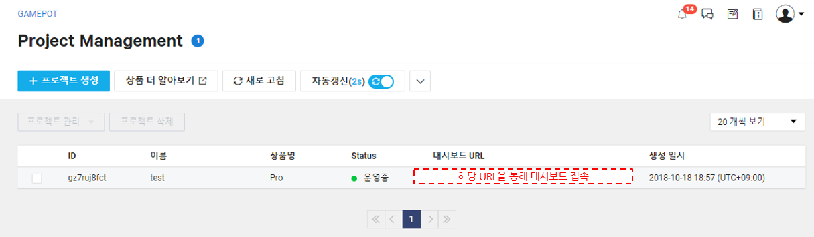

대시보드에 접속하면 가장 먼저  **회원가입**을 클릭하여 계정을 생성해 주세요.

가장 처음에 생성된 계정이 대시보드 관리의 모든 권한을 갖는 마스터 계정이 됩니다.

#### STEP 2. 회원가입

대시보드 이용할 계정을 생성합니다. 초기에 생성된 계정은 자동으로 마스터로 지정됩니다.

## 대시보드 메뉴 활용하기

### 대시보드

대시보드에서는 가입현황, 매출, 접속, 통계 등의 게임의 전반적인 운영 상황을 한 눈에 파악할 수 있습니다.

### 공지사항

대시보드에 등록된 공지사항 이미지는 게임에 접속된 회원들에게 보입니다. 지정된 날짜와 스토어를 지정하면 해당 날짜 시간에 보이고 종료날짜 이후에는 표시되지 않습니다.

공지사항 기능을 사용하기 위해서는 먼저 NAVER Cloud Platform의 API 인증키와 Object Storage 서비스가 필요합니다. 공지사항 기능을 사용하면서 발생하는 Object Storage 비용은 별도로 발생합니다.

#### Step 1. API 인증키 준비

공지사항 매뉴는 API를 통해 Object Storage를 연동하여 사용합니다. 따라서 NAVER Cloud Platform의 API 인증키를 사전에 준비해야 합니다.

API 인증키는 **포털 > 마이페이지 > 계정관리 > 인증키 관리** 메뉴에서 만들 수 있습니다.

① API 인증키를 생성하기 위해서 **신규 API 인증키 생성**을 클릭하세요.

- API 인증키는 계정당 2개까지 생성할 수 있습니다.

#### Step 2. 대시보드와 API 인증키 연동하기

발급 받은 인증키를 대시보드 연동을 해야 Object Storage의 버킷이 생성되고 공지사항 기능을 사용할 수 있습니다. 대시보드의 **설정 > NCP** 메뉴로 이동하여 API 인증키를 연결합니다.

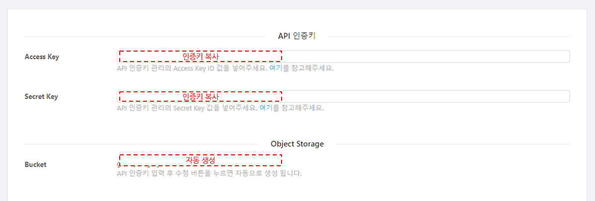

API 인증키가 연결되면 Object Storage의 버킷이 자동으로 생성됩니다. 공지사항에 사용된 모든 이미지는 해당 버킷에 저장됩니다.

#### Step 3. 공지사항 추가

공지사항을 추가하기 위해서는 좌측의 **공지사항 > 목록** 메뉴로 진입하여 **공지사항 추가** 버튼을 클릭합니다.

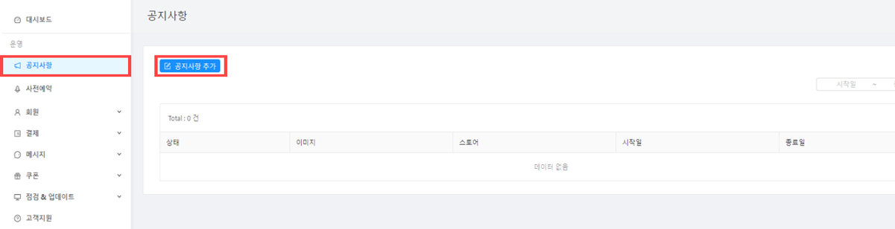

이후 다음과 같은 팝업 메뉴가 나타나면 원하는 값을 입력하고 **저장** 버튼을 클릭하면 공지가 추가됩니다.

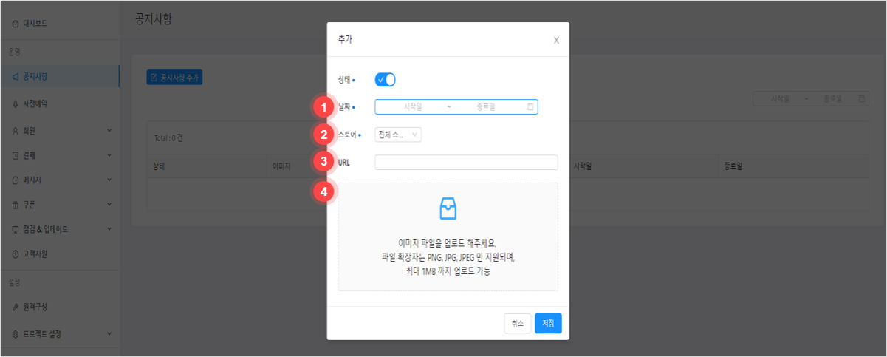

① 이미지를 표시하고자 하는 시작일과 종료일을 지정합니다.

② 스토어는 전체를 지정하거나 특정 스토어에만 보이도록 선택하실 수 있습니다.

③ URL은 클릭 시에 오픈되는 페이지가 필요할 경우 지정하시면 됩니다.

④ 이미지를 마우스로 끌어다 놓거나 직접 지정하여 파일을 선택하실 수 있습니다.

### 회원관리

#### 회원목록

가입된 회원의 사용자 목록이 표시됩니다. 간단한 목록이 표시되며 사용자 ID를 클릭하면, 자세한 정보가 보입니다.

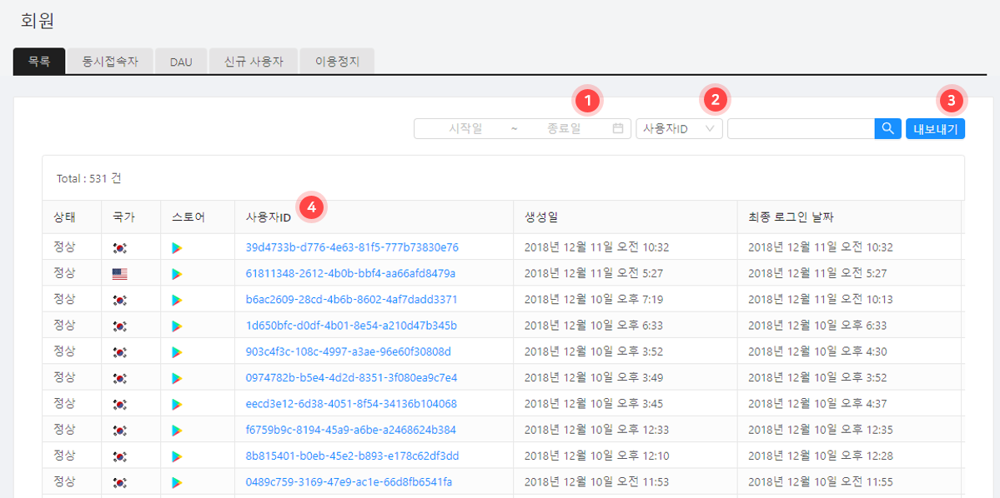

사용자ID를 클릭하면 아래와 같은 상세페이지가 나타납니다.

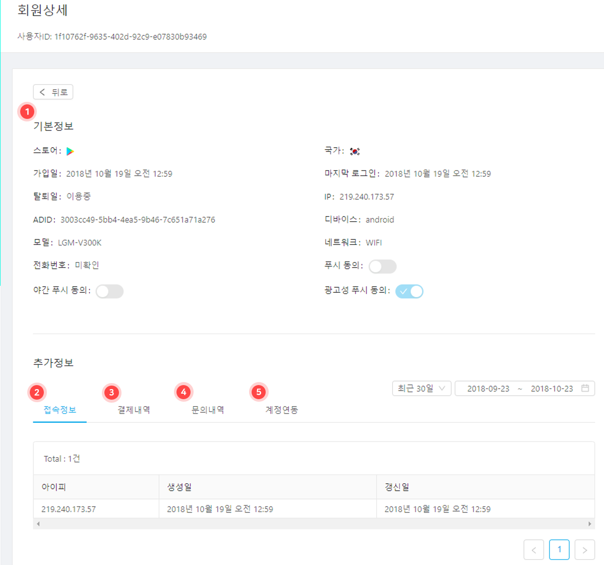

① 회원에 대한 기본정보를 표시합니다.

② 접속정보는 로그인한 내역을 표시합니다.

③ 결제정보에는 해당 회원이 결제한 모든 내역을 표시합니다.

④ 문의내역에는 문의, 답변 내역을 표시합니다.

⑤ 고객의 연동한 소셜 계정을 모두 보여줍니다.

* 소셜 계정을 추가하거나 연결을 취소하실 수 있습니다.

#### 현재 접속자

현재 접속된 유저수를 확인하실 수 있습니다. 1분 단위로 최대 3일간의 접속자 수를 확인할 수 있습니다.

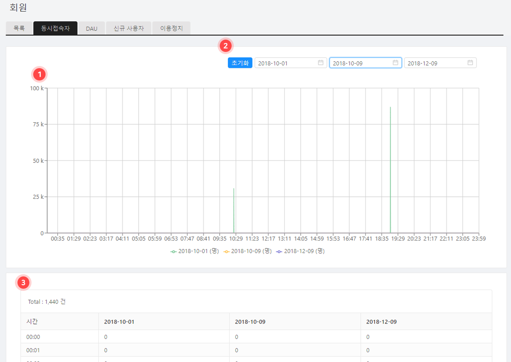

### 사전예약

사전예약은 게임을 정식 오픈하기 이전에 미리 접수를 받아 서비스 오픈 시에 안내 문자를 발송할 수 있는 기능입니다.
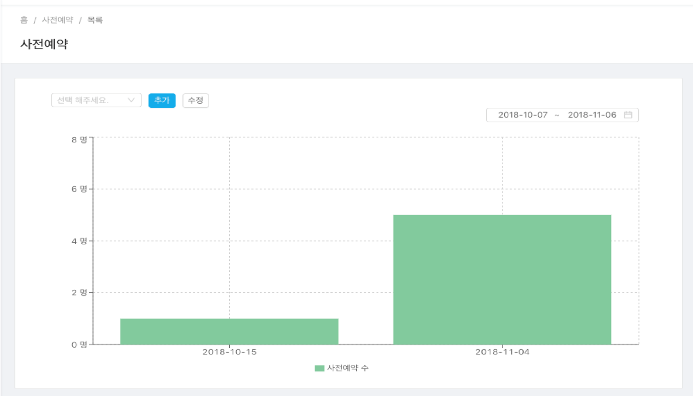

아래와 같이 사전예약명에 신규로 추가해 주세요.

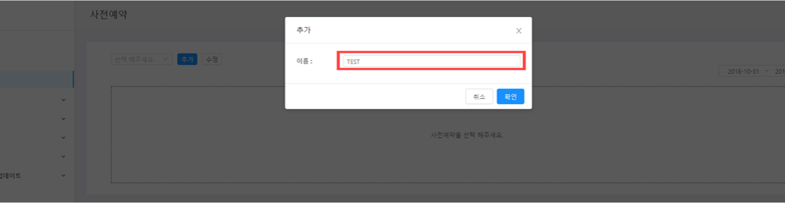

### 메시지

별도의 메시지 서버 구축 없이 SMS, PUSH 등을 통해 메시지 알림 기능을 구현할 수 있는 서비스입니다. 해당 기능을 사용하기 위해서는 NAVER Cloud Plaform의 Simple & Easy Notification Service(SENS)를 신청해야만 합니다.

① SENS와 연동하기 위해서는 우선 서비스 키를 발급해야 합니다. **서비스 키 발급** 버튼을 클릭하고 [SENS 공통 가이드](../sens/sens-1-2.md)를 참고하여 서비스 키를 발급 받습니다.

② **인증서 등록 가이드** 버튼을 클릭하여 **SENS 웹 콘솔 사용 가이드**에 따라 인증서를 등록합니다.

③ **설정** 버튼을 클릭하여 아래의 화면으로 이동하여 PUSH 서비스 ID 값을 입력합니다.

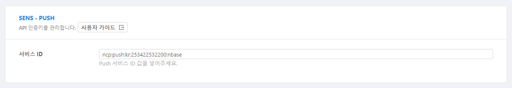

#### 푸시(PUSH)

**메시지 > 푸시 메시지** 메뉴를 클릭하면  발송 상태, 예약 시간, 발송 시간 등을 확인할 수 있는 목록 화면이 나타납니다.

**푸시 메시지** 메뉴에서 **+메시지 추가** 버튼을 클릭하면 아래와 같은 팝업이 노출됩니다. 해당 팝업 메뉴를 통해 메시지 발송이 가능합니다.

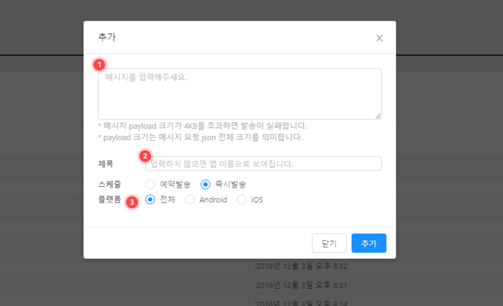

① 푸시 메시지 내용을 입력해 주세요.

② 제목은 필요에 따라 입력해 주시고 미입력 시 앱 이름이 제목으로 보입니다.

③ 플랫폼을 지정하여 지정된 플랫폼 유저들만 푸시를 받을 수 있습니다.

#### 문자 메시지

SMS/LMS 발송, 이력 및 결과 조회 등의 기능을 사용할 수 있습니다. SMS/LMS를 발송하려면 먼저 NAVER Cloud Platform의 SENS에서 서비스 키 발급과 발신 번호 등록이 필요합니다.

① SENS와 연동하기 위해서는 우선 서비스 키를 발급과 발신번호 등록을 해야 합니다. **서비스 키 발급** 버튼을 클릭하여 [SENS 공통 가이드](../sens/sens-1-2.md)와 [SENS SMS 사용 가이드](../sens/sens-1-3.md)를 참고하여 서비스 키  발급과 발신 번호를 등록합니다.

② **설정** 버튼을 클릭하여 서비스 ID와 Secret Key를 입력하여 주세요.

**메시지 추가** 버튼을 클릭합니다. 아래와 같은 팝업이 노출됩니다.

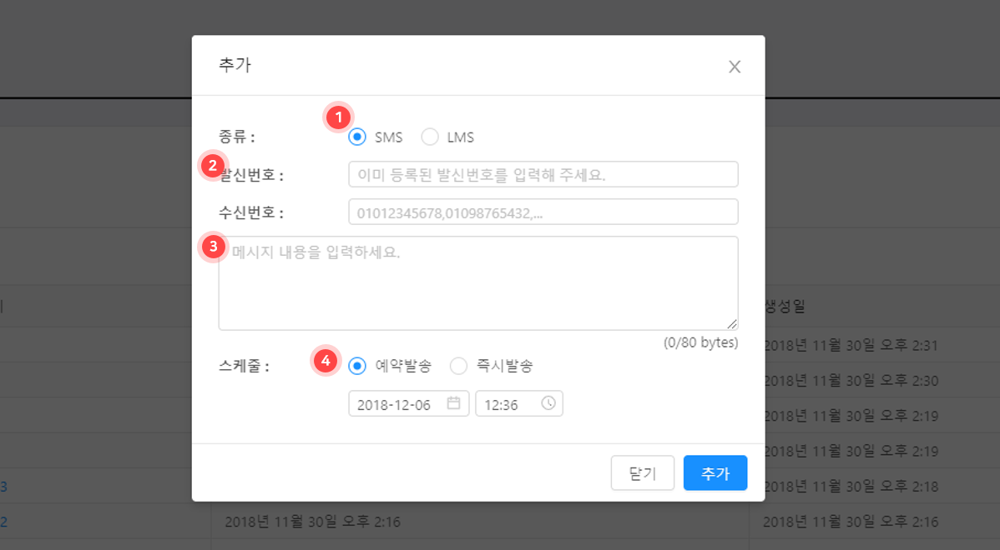

① SMS 단문메시지, LMS 장문 메시지입니다. 메시지에 따라 가격이 상이합니다.

② 네이버 클라우드 콘솔에 등록하신 발신번호를 입력해 주세요.(등록되지 않은 번호는 발송이 되지 않습니다.)

③ 메시지 내용을 입력해 주세요.

④ 예약시간을 지정하시면 지정된 시간에 메시지가 발송됩니다.

### 결제

구글플레이, 앱스토어, 원스토어에서 결제/취소된 내역을 확인하실 수 있습니다. 결제된 내역을 취소하거나 자세한 내역을 확인하실 수 있습니다.

#### 결제목록

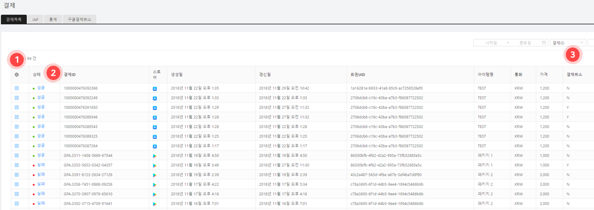

#### 구매(IAP)

인앱 구매시 상품정보를 관리하는 기능입니다. 구글플레이, 앱스토어, 원스토어 등의 상품을 모두 등록하셔야 합니다.

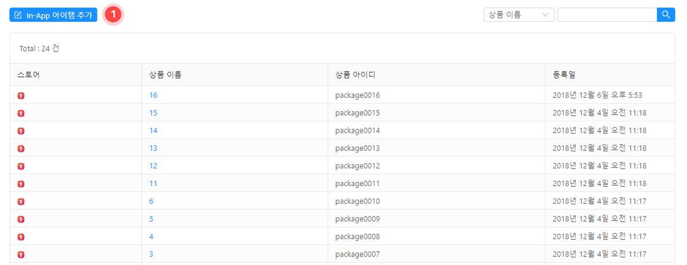

① **In-App 아이템 추가** 버튼을 클릭하면 스토어, 상품 이름, 상품 아이디를 입력하여 유료 아이템을 생성할 수 있습니다.

#### 통계

일일 단위로 결제 금액 데이터를 그래프로 보여주는 기능입니다.

① 기간을 지정하여 그래프를 볼 수 있습니다.

### 고객지원

고객이 등록한 티켓을 등록하고 조회하는 기능입니다. 게임 내에서 고객지원 창을 보여주고 기본 정보를 입력하며 해당 정보를 확인하실 수 있습니다.

#### 고객문의

고객이 문의한 내역을 확인하실 수 있습니다.

**문의내용**을 클릭합니다.

① 고객과 문의 답변한 내역입니다. 채팅 형식으로 그 동안의 모든 내용을 확인하실 수 있습니다.

② 해당 회원에 대한 모든 정보를 기본적으로 표시합니다.

### 쿠폰

게임 내에 필수적으로 사용되는 쿠폰 기능은 일반 쿠폰, 키워드 쿠폰을 지원합니다.

#### 일반쿠폰

일반 쿠폰은 일반적으로 코드 형태로 되어 있는 쿠폰입니다. 게임 내에서 사용될 쿠폰을 쉽게 생성 및 관리 하실 수 있는 기능입니다. **+쿠폰생성**을 클릭하면 아래와 같은 팝업이 나타나고 이를 통해 쿠폰을 생성할 수 있습니다.

① 사용기간을 지정하여 해당 기간이외에는 쿠폰이 사용되지 않도록 합니다.

② 쿠폰길이에 따라서 만들 수 있는 쿠폰이 제한이 있습니다. 8~10 사이가 생성하시면 됩니다.

③ Prefix(접두사), Suffix(접미사)를 지정한 경우 쿠폰번호 생성 시 지정된 문구가 붙습니다.

④ 쿠폰 수량은 생성 후에 증가시킬 수 있습니다.

쿠폰 생성이 완료되면 생성된 쿠폰 리스트가 아래와 같이 나타납니다.

쿠폰의 현재 상태와 사용량 제한수량 등을 확인하실 수 있습니다.

리스트에서 기존에 생성된 쿠폰 수량을 변경할 수 있어 손쉽게 쿠폰 수량을 증가시킬 수 있습니다.

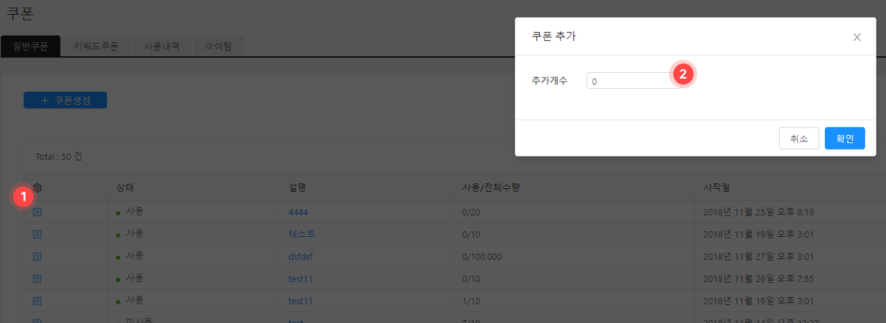

① 리스트에서 가장 앞쪽에 파란색 아이콘을 클릭하면 쿠폰 추가 팝업이 노출됩니다.

② 팝업된 설정창에서 추가 개수를 입력하여 쿠폰을 추가하면 됩니다.

#### 키워드 쿠폰

'크리스마스','오픈이벤트','새해' 와 같이 지정된 키워드를 생성하고 해당 키워드를 쿠폰창에 입력시에 아이템을 지급하는 기능입니다.  최근 쿠폰 코드 입력이 복잡하여 게임 사용자의 편의를 위해 키워드 쿠폰이 많이 활용됩니다.

**+쿠폰 생성**을 클릭합니다.

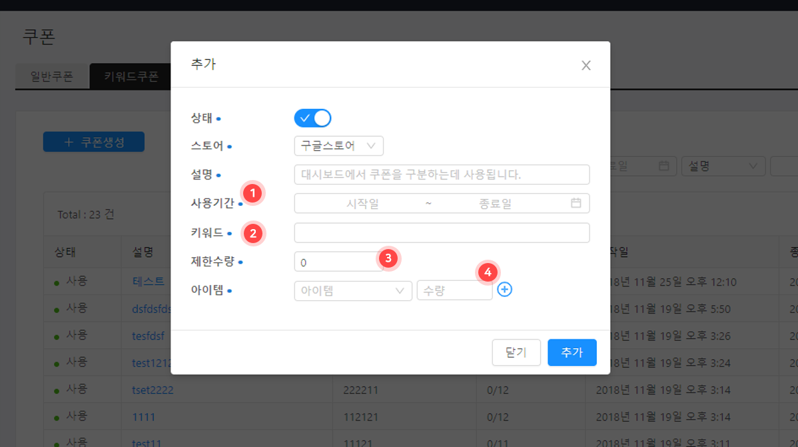

① 쿠폰을 사용가능한 기간을 지정합니다.

② 쿠폰을 지급할 키워드를 입력합니다.

③ 제한 수량을 초과하지 않고 지급이 가능합니다.

#### 사용내역

전체 발급된 쿠폰 번호를 조회하실 수 있습니다. 쿠폰 번호 조회 시에 발급 쿠폰 사용일 아이템 정보 등을 확인하실 수 있습니다.

#### 아이템

아이템 메뉴에서는 쿠폰을 통해 획득 가능한  쿠폰 아이템을 생성할 수 있는 메뉴입니다. **아이템 추가** 버튼을 클릭하여 아이템을 추가할 수 있습니다.

① 아이템의 이름을 입력합니다.

② 아이템 ID를 입력합니다. 아이템 ID는 아이템마다 고유해야 합니다.

### 운영

운영 메뉴는 게임 관리를 더욱 쉽고 편리하게 가능합니다. 게임의 점검이나 업데이트가 있을 경우 업데이트를 유도하는 기능이 있습니다.

#### 점검

게임 점검 시간에 자동으로 점검 메시지와 함께 게임 접속을 차단합니다.

점검 시간과 메시지를 입력한 뒤 저장하면 게임 내 점검 공지가 노출됩니다.

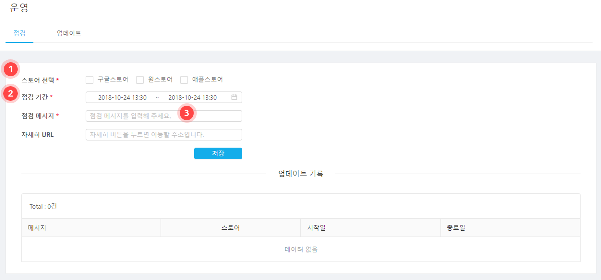

① 스토어를 지정하실 수 있습니다. 전체 점검일 경우 전체 스토어로 지정해 주세요.

② 점검시작 시간과 종료 시간을 지정해 주세요.

③ URL은 점검시에 자세히 보기 클릭 시에 이동시킬 주소를 입력해 주세요.

**예: 카페 공지사항 이나 자체 제작된 점검 안내 페이지**

#### 업데이트

최신 버전이 아닐 경우 강제로 업데이트 안내를 보여주고 구글플레이나 애플스토어와 같은 스토어의 업데이트 화면으로 이동합니다.

### 로그

로그는 NAVER Cloud Plaform의 ELSA를 연동하여 게임 내 로그나 크래시 로그 등을 수집하실 수 있는 기능입니다. ELSA의 사용법은 [ELSA 이용 가이드](../elsa/elsa-1-1.md)를 참고하세요.

### 원격구성

원격구성 기능은 앱을 업데이트 하지 않고 앱의 동작과 모양을 변경할 수 있도록 하는 기능입니다. 서버에 매개변수를 추가하고 해당 값을 GAMEPOT SDK 에서 불러와 사용하실 수 있습니다.

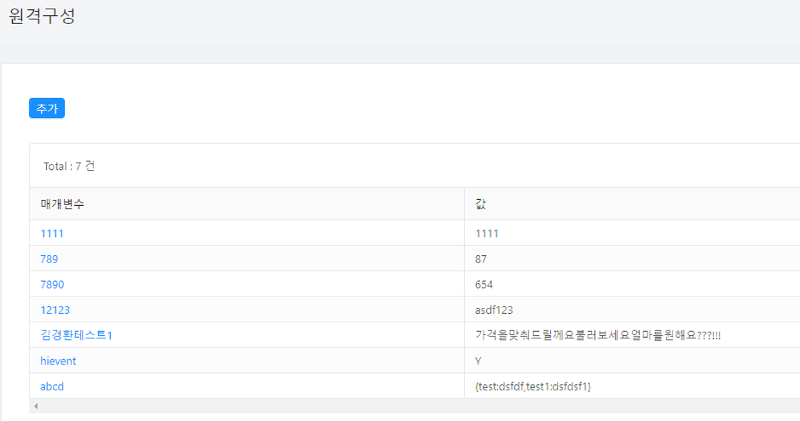

**추가** 버튼을 클릭합니다. 아래와 같은 팝업 창이 노출되면, 매개변수와 값을 입력합니다.

해당 매개변수와 값이 반영되는 시점은 새롭게 앱을 실행하는 유저부터 반영됩니다.

### 설정

#### 일반

앱의 전반적인 환경을 설정하고 앱을 운영하기 위한 다양한 키값을 입력하실 수 있습니다.

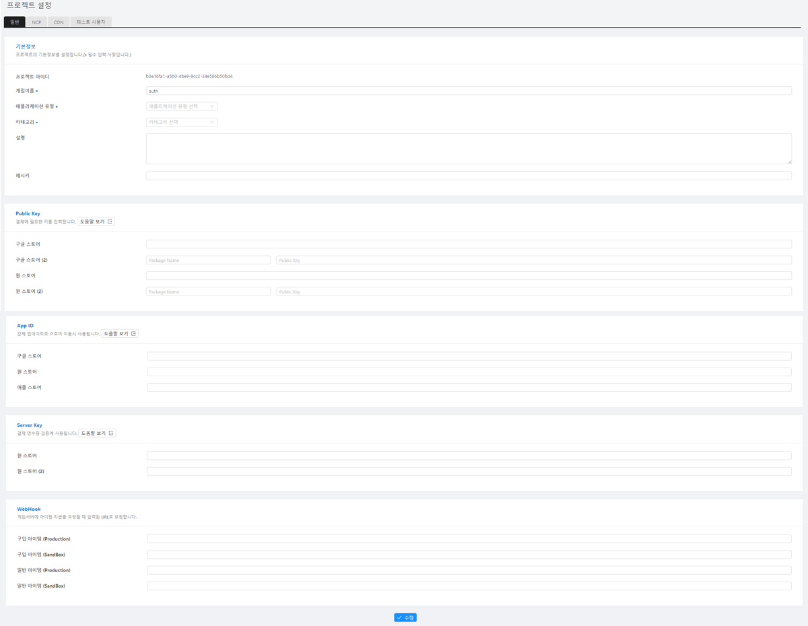

WebHook 항목에 Purchase는 결제 성공 시 아이템 지급을 요청하는 주소를 입력합니다.

#### NCP

네이버 클라우드 플랫폼과 연동하기 위한 키값을 추가 변경하실 수 있습니다.

#### CDN

CDN을 이용하고자 할 경우 아래 CDN 주소를 입력해 주세요.

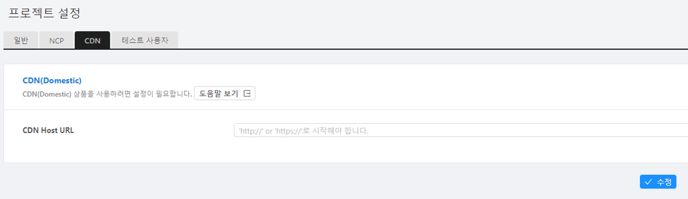

***CDN 주소 입력시 주의사항**

* 반드시 CDN의 원본은 [공지사항]기능에 사용되는 Object Storage가 설정되어야 합니다.
* 입력한 CDN이 없거나 URL 오타, 또는 원본 설정이 잘못되었을 경우, 업로드된 이미지가 게임상에 정상적으로 보이지 않게 됩니다. 

#### 테스트 사용자

등록된 아이피로 접속하는 경우 지정된 종류에 따라 아래 기능이 활성화됩니다.

* 개발 : SDK 로그가 활성화 되어 로그가 노출됩니다.
* 점검 : 점검 기능이 활성화 되어있더라도 무시하고 진행됩니다.
* 업데이트 : 업데이트 기능이 활성화 되어있더라도 무시하고 진행됩니다.

**추가** 버튼을 클릭합니다. 아래와 같은 팝업 창이 노출되면, 매개변수와 값을 입력합니다.

### 회원정보수정

대시보드 이용 계정의 이름, 비밀번호를 변경하실 수 있습니다.

① 대시보드 우측 상단의 아이콘을 클릭하면 드롭다운 메뉴가 나타납니다.

② 사용자의 이름을 변경할 수 있습니다.

③ 비밀번호를 변경할 수 있습니다.

### 환경설정

게임팟 대시보드 관리를 위한 사용자 관리, 업데이트, 시스템 기능 등이 있습니다.

#### 사용자

대시보드 내를 이용할 수 있는 사용자를 관리하는 메뉴로 사용자 추가/삭제하실 수 있습니다. 

① 등록된 사용자 아이디입니다.

② 등록된 사용자 이름입니다.

#### 업데이트

게임팟 시스템을 최신의 버전으로 업데이트합니다.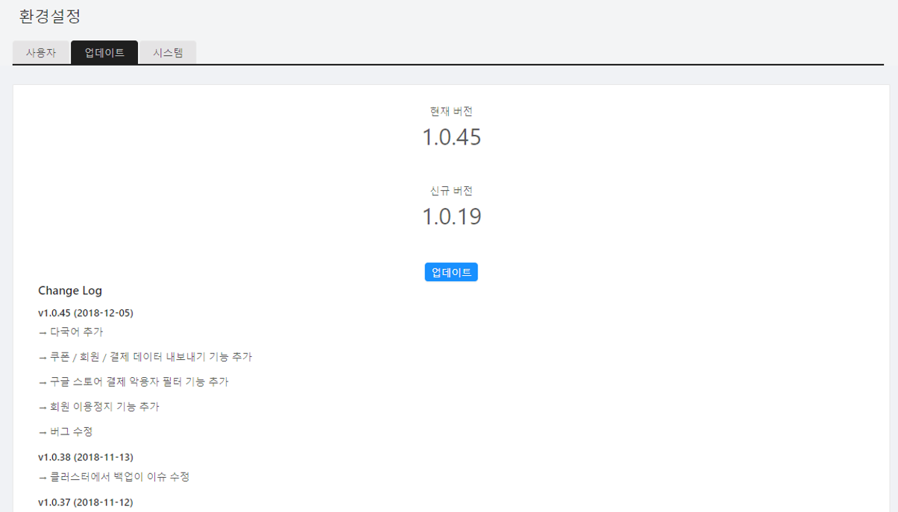

#### 시스템

현재 디스크 상태와 백업 현황을 파악하실 수 있습니다. 마지막 백업 시간을 확인 하실 수 있습니다.

① 현재 시스템의 디스크 사용량입니다.

② 백업설정은 전체 DB에 대하여 하루에 한번 백업을 하며,  object storage에 자동 저장됩니다.
