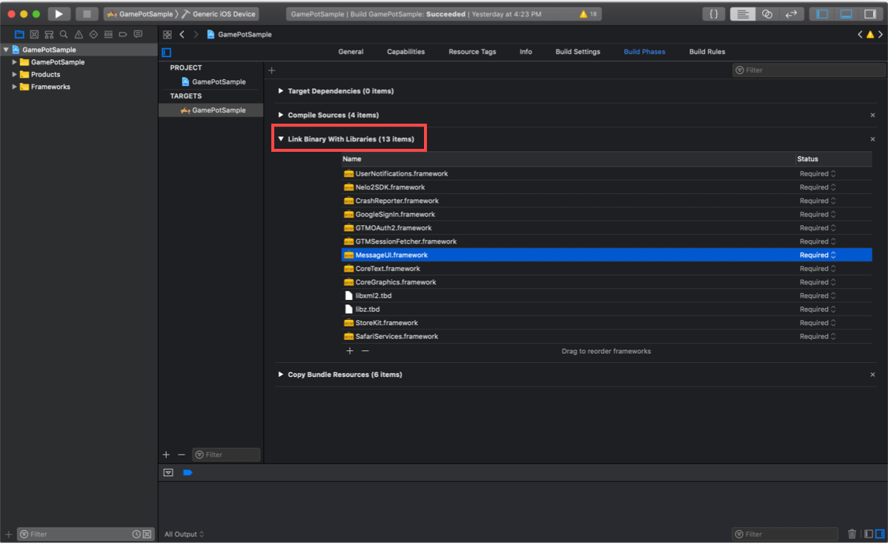
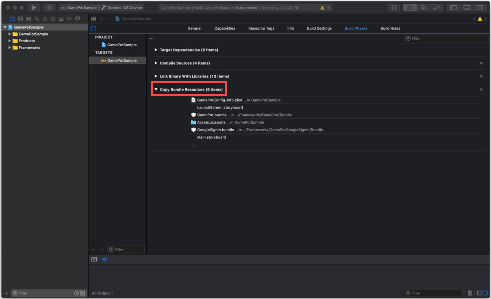
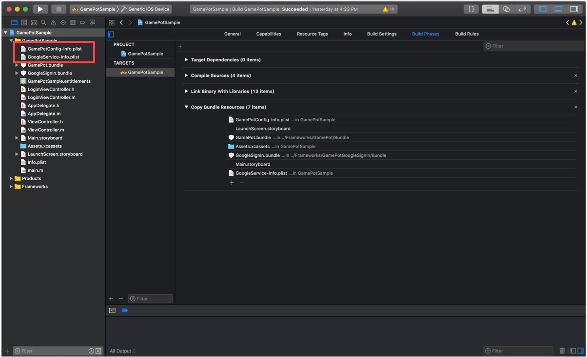
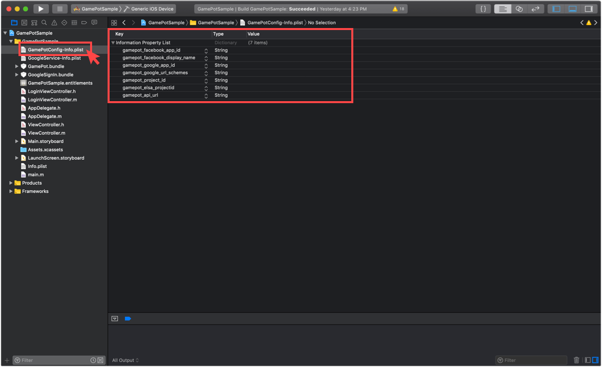
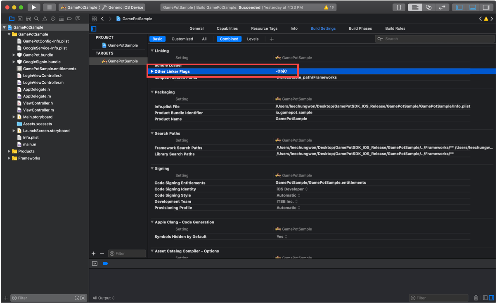
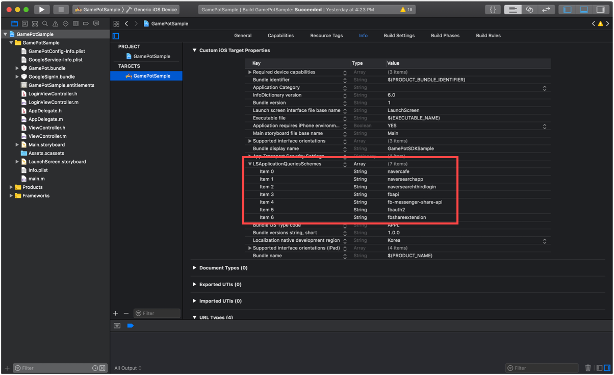

---
search:
  keyword: ['gamepot']
---

## 1. 入门

#### Step 1. 配置开发环境

为了开发 IOS APP 首先需要安装开发工具（XCode）。

在 IOS 使用 GamePot 所需要的系统环境为如下。

[ 系统环境 ]

- 최소사항 : IOS 9.0 이상
- 개발 환경 : XCode

#### Step 2. 添加 Freamwork


通过拖动将下载的 IOS SDK 文件添加到 Xcode 项目文件夹目标中。

#### Step 3. 添加 Dependencies

依照使用的功能，所需要的 Dependencies 列表有差异

请参考下列表格添加所需要的 Dependencies

功能别 Dependencies

| Service     | Framework                                                                                                                                                                                                                                                                                                                                 | Dependencies                                                                                                                                                                                                                                                                                                                                                                                                                                                                                                                                                       | bundle                                            |
| ----------- | ----------------------------------------------------------------------------------------------------------------------------------------------------------------------------------------------------------------------------------------------------------------------------------------------------------------------------------------- | ------------------------------------------------------------------------------------------------------------------------------------------------------------------------------------------------------------------------------------------------------------------------------------------------------------------------------------------------------------------------------------------------------------------------------------------------------------------------------------------------------------------------------------------------------------------ | ------------------------------------------------- |
| 基本(Base)  | AFNetworking.framework<br />FirebaseAnalytics.framework<br />FirebaseCore.framework<br />FirebaseCoreDiagnostics.framework<br />FirebaseInstanceID.framework<br />FirebaseMessaging.framework<br />FirebaseNanoPB.framework<br />GamePot.framework<br />GoogleToolboxForMac.framework<br />nanopb.framework<br />Protobuf.framework<br /> | libz.tbd<br />WebKit.framework<br />UserNotifications.framework<br />                                                                                                                                                                                                                                                                                                                                                                                                                                                                                              | GamePot.bundle<br />                              |
| 登录(Login) | [ Base ]<br />GamePotChannel.framework<br /><br />[ Google Sign In ]<br />GamePotGoogleSignIn.framework<br/>GoogleSignIn.framework<br />GTMOAuth2.framework<br />GTMSessionFetcher.framework<br /><br />[ Facebook ]<br />Bolts.framework<br/>FBSDKCoreKit.framework<br />FBSDKLoginKit.framework<br />GamePotFacebook.framework<br />    | [ Google Sign In ]<br />SafariServices.framework<br />[ Facebook ]<br />SafariServices.framework<br />                                                                                                                                                                                                                                                                                                                                                                                                                                                             | [ Google Sign In ]<br />GoogleSignIn.bundle<br /> |
| 广告(AD)    | [ Base ]<br />GamePotAd.framework<br /><br />[ Facebook ]<br />Bolts.framework<br/>FBSDKCoreKit.framework<br/>GamePotAdFacebook.framework<br /><br />[ Adbirx ]<br />AdBrix.framework<br />GamePotAdAdbrix.framework<br />IgaworksCore.framework<br /><br />[ Adjust ] <br />AdjustSdk.framework<br />GamePotAdAdjust.framework<br />     | [ Facebook ]<br /><br />[ Adbrix ]<br />MessageUI.framework<br />libxml2.tbd<br />iAd.framework<br />CoreTelephony.framework<br />UIKit.framework<br />CoreGraphics.framework<br />CoreText.framework<br />MobileCoreServices.framework<br />SystemConfiguration.framework<br />Security.framework<br /><br />[ Adjust ] <br />AdSupport.framework<br />                                                                                                                                                                                                           |                                                   |
| GameCenter  | GamePotGameCenter.framework                                                                                                                                                                                                                                                                                                               |                                                                                                                                                                                                                                                                                                                                                                                                                                                                                                                                                                    |                                                   |
| NaverCafe   | AFNetworking.framework<br/>GamePotNavarCafe.framework<br />NaverCafeSDK.framework<br />                                                                                                                                                                                                                                                   | AVKit.framework<br />AVFoundation.framework<br />MediaPlayer.framework<br />CoreMedia.framework<br />AssetsLibrary.framework<br />ImageIO.framework<br />QuartzCore.framework<br />ReplayKit.framework(Optional로 설정)<br />MobileCoreServices.framework<br />SystemConfiguration.framework<br />Security.framework<br />WebKit.framework<br />libNaverLogin.a<br/>NaverThirdPartyConstantsForApp.h<br />NaverThirdPartyLoginConnection.h<br />NLoginThirdPartyOAuth20InAppBrowserViewController.h<br />NLoginThirdPartyOAuth20InAppBrowserViewController.m<br /> | NaverAuth.bundle<br/>NaverCafeSDK.bundle<br />    |
|             |                                                                                                                                                                                                                                                                                                                                           |                                                                                                                                                                                                                                                                                                                                                                                                                                                                                                                                                                    |                                                   |



#### Step 4. 添加 Bundle Resource

根据所要使用的功能，需要添加 Bundle Resource 文件。

参考功能别 Dependencies 表格，添加 Bundle Resource 文件。



#### Step 5. 添加 InfoPlist



基本上 GamePot SDK 使用 Google Firebase。所以需要在项目添加设置 Google Firebase 后生成的 GoogleService-Info.plist。

也需要添加包含着 GamePot SDK 的默认设置值的 GamePotConfig-Info.plist 文件。

**GamePotConfig-Info.plist 设置**



```xml
gamepot_project_id : GAMEPOT 프로젝트 아이디
gamepot_elsa_projectid : GAMEPOT 로그 프로젝트 아이디 (optional)
gamepot_api_url : 게임팟 API URL
```

#### Step 6. 添加 Build 选项

Build Settings -> Linking -> Other Linker Flags 部分 添加-ObjC 选项。



#### Step 7. Google Sign In 登录环境设置

参考功能别 Dependencies 表格中的 Login >> Google Sign In。添加 Framework 和 Dependencies。

复制 GoogleService-Info.plist 文件的 REVERSED_CLIENT_ID 的值之后，在 Info >> URL Types 新加一个项目，然后在 URL Schemes 粘贴相关值。


**GamePotConfig-Info.plist 设置**


```xml
gamepot_google_app_id : GoogleService-Info.plist 文件的 CLIENT_ID 值
gamepot_google_url_schemes : GoogleService-Info.plist 文件的 REVERSED_CLIENT_ID 值
```

#### Step 8. Facebook 登录环境设置

参考功能别 Dependencies 表格的 Login >> Facebook。添加 Framework 和 Dependencies。

将 Facebook App ID 添加到 Info >> URL Types 中，添加格式为 fb+Facebook App ID。


Info >> iOS Target Property 的 LSApplicationQueriesSchemes 中添加以下项目。

```xml
fbapi
fb-messenger-share-api
fbauth2
fbshareextension
```



**GamePotConfig-Info.plist 设置**


```xml
gamepot_facebook_app_id : Facebook App ID
gamepot_facebook_display_name : Facebook display name
```

## 2. 初始化

AppDelegate 文件里加上以下内容。

```objective-c
#import <GamePot/GamePot.h>

- (BOOL)application:(UIApplication *)application didFinishLaunchingWithOptions:(NSDictionary *)launchOptions {
    ...
    // GamePot SDK Initialize
    [[GamePot getInstance] setup];

    // Push Permission
    if(SYSTEM_VERSION_GRATERTHAN_OR_EQUALTO(@"10.0"))
    {
        UNUserNotificationCenter *center = [UNUserNotificationCenter currentNotificationCenter];
        center.delegate = self;
        [center requestAuthorizationWithOptions:(UNAuthorizationOptionSound | UNAuthorizationOptionAlert | UNAuthorizationOptionBadge) completionHandler:^(BOOL granted, NSError * _Nullable error){
            if(!error){
                dispatch_async(dispatch_get_main_queue(), ^{
                    [[UIApplication sharedApplication] registerForRemoteNotifications];
                });
            }
        }];
    }
    else
    {
        // Code for old versions
        UIUserNotificationType allNotificationTypes = (UIUserNotificationTypeSound | UIUserNotificationTypeAlert | UIUserNotificationTypeBadge);
        UIUserNotificationSettings *settings = [UIUserNotificationSettings settingsForTypes:allNotificationTypes categories:nil];
        [application registerUserNotificationSettings:settings];
        [application registerForRemoteNotifications];
    }
    ...
}

 // Push
- (void)application:(UIApplication *)application didRegisterForRemoteNotificationsWithDeviceToken:(NSData *)deviceToken
{
    ...
    [[GamePot getInstance] handleRemoteNotificationsWithDeviceToken:deviceToken];
    ...
}

- (void)applicationWillEnterForeground:(UIApplication *)application {
    [[GamePotChat getInstance] start];
}

- (void)applicationDidEnterBackground:(UIApplication *)application {
    [[GamePotChat getInstance] stop];
}
```

## 3. 登录/退出/注销

Google/Facebook/Naver 等各种登录 SDK 可以集成使用。

#### Step 1. 설정

```objective-c
// AppDelegate.m
#import <GamePotChannel/GamePotChannel.h>

// 使用Google Login的时候
#import <GamePotGoogleSignIn/GamePotGoogleSignIn.h>

// 使用Facebook Login的时候
#import <GamePotFacebook/GamePotFacebook.h>

- (BOOL)application:(UIApplication *)application didFinishLaunchingWithOptions:(NSDictionary *)launchOptions {
    ...
    // GamePotSDK频道初始化，必须要对于所使用的频道别使用 addChannel才可以。
    // Guest方式默认包含
    // Google Login初始化
    GamePotChannelInterface* google     = [[GamePotGoogleSignIn alloc] init];
    [[GamePotChannelManager getInstance] addChannelWithType:GOOGLE interface:google];

    // Facebook登录初始化
    GamePotChannelInterface* facebook   = [[GamePotFacebook alloc] init];
    [[GamePotChannelManager getInstance] addChannelWithType:FACEBOOK interface:facebook];

    // 处理登录所需要。
    [[GamePotChannel getInstance] application:application didFinishLaunchingWithOptions:launchOptions];

    ...
}

- (BOOL)application:(UIApplication *)app openURL:(NSURL *)url options:(NSDictionary<UIApplicationOpenURLOptionsKey,id> *)options
{
    // 处理登录所需要。
    BOOL nChannelResult = [[GamePotChannel getInstance] application:app openURL:url options:options];
    return nChannelResult;
}
```

#### Step 2. 登录

点击登录按钮的时候调用

```objective-c
#import <GamePotChannel/GamePotChannel.h>
// 定义登录类型
// GamePotChannelType.GOOGLE
// GamePotChannelType.FACEBOOK
// GamePotChannelType.GUEST

// 点击Google登录按钮的时候调用
[[GamePotChannel getInstance] Login:GOOGLE viewController:self success:^(GamePotUserInfo* userInfo) {
    // 登录完成
} cancel:^{
    // 登录过程中用户取消登录
} fail:^(NSError *error) {
    // 登录过程中出现错误
    // TODO : 使用游戏内弹窗提示失败原因。
    // TODO : 提示请使用[error localizedDescription]

}];

```

#### Step 3. 自动登录

GamePot 支持自动登录

```objective-c
#import <GamePotChannel/GamePotChannel.h>

// 获取最终登录过的信息，根据此内容尝试自动登录
// lastLoginType : 可以获取最后登录的值
GamePotChannelType type = [[GamePotChannel getInstance] lastLoginType];

if(type != NONE)
{
    // 使用最后登录的登录类型登录的方式
    // 处理自动登录时，请调用为如下。
    [[GamePotChannel getInstance] Login:type viewController:self success:^(GamePotUserInfo* userInfo) {

    } cancel:^{

    } fail:^(NSError *error) {
        // TODO : 使用游戏内弹窗提示失败原因
        // TODO : 提示内容请使用[error localizedDescription]

    }];
}
else
{
    // 没有最后登录的信息。自动移动至有登录按钮的界面。
}
```

#### Step 4. 退出

退出目前所登录的账号.

```objective-c
#import <GamePotChannel/GamePotChannel.h>

[[GamePotChannel getInstance] LogoutWithSuccess:^{
	//退出完成之后移动至最初界面
} fail:^(NSError *error) {
    // 退出失败
    // TODO : 请使用游戏内提示窗提示失败原因。
    // TODO : 提示内容请使用[error localizedDescription]
}];
```

#### Step 5. 注销

注销目前登录的账号

```objective-c
#import <GamePotChannel/GamePotChannel.h>

[[GamePotChannel getInstance] DeleteMemberWithSuccess:^{
	// 账号注销成功，移动至登录界面
} fail:^(NSError *error) {
    // 账号注销失败
    // TODO : 请使用游戏内提示窗提示失败原因。
    // TODO : 提示内容请使用[error localizedDescription]
}];

```

## 4. 账号绑定

一个游戏账号可以绑定/解除多个社交账户（Google/FaceBook 等）的功能。（至少可以绑定一个社交账户）

游戏内需要开发相关绑定界面。在游戏界面用户点击绑定的时候调用以下代码。

#### Step 1. 账号绑定

可以使用 Google / Facebook 等账号绑定账号。

```objective-c
#import <GamePotChannel/GamePotChannel.h>

// 定义类型
// GamePotChannelType.GOOGLE
// GamePotChannelType.FACEBOOK
[[GamePotChannel getInstance] CreateLinking:GOOGLE viewController:self success:^(GamePotUserInfo *userInfo) {
	// TODO : 绑定完成。使用游戏内的弹窗提示绑定完成结果。 (ex. 계정 연동에 성공했습니다.)
} cancel:^{
	// TODO : 用户取消
} fail:^(NSError *error) {
    // TODO : 绑定失败。使用游戏内的弹窗提示绑定失败原因。
    // TODO : 提示内容请使用[error localizedDescription]。
}];

```

#### Step 2. 被绑定的列表

通过此 API 可以确认绑定状态

```objective-c
#import <GamePotChannel/GamePotChannel.h>

// 定义类型
// GamePotChannelType.GOOGLE
// GamePotChannelType.FACEBOOK
// 返回定义类型的绑定结果
BOOL isGoogleLinked = [[GamePotChannel getInstance] isLinked:GOOGLE];

// 对绑定的类型以JsonString返回。
NSString* linkedList = [[GamePotChannel getInstance] getLinkedListJsonString];
```

#### Step 3. 解除绑定

解除目前已绑定的账号

```objective-c
#import <GamePotChannel/GamePotChannel.h>

[[GamePotChannel getInstance] DeleteLinking:GOOGLE success:^{
     // TODO : 解绑完成。使用游戏内弹窗提示解绑完成结果。 (ex. 계정 연동을 해제했습니다.)
} fail:^(NSError *error) {
     // TODO : 解绑失败。使用游戏内弹窗提示解绑失败原因。
     // TODO : 提示请使用[error localizedDescription]
}];
```

## 5. 广告平台

Facebook / Adjust / Adbrix 等各种广告平台的 SDK 可以集成使用。

#### Step 1. 설정

```objective-c
// AppDelegate.m

#import <GamePotAd/GamePotAd.h>
// 使用Facebook 广告平台时
#import <GamePotAdFacebook/GamePotAdFacebook.h>
// 使用Adjust 广告平台时
#import <GamePotAdAdjust/GamePotAdAdjust.h>
// 使用Adbrix 广告平台时
#import <GamePotAdAdbrix/GamePotAdAdbrix.h>

- (BOOL)application:(UIApplication *)application didFinishLaunchingWithOptions:(NSDictionary *)launchOptions {
    ...
    // Facebook 广告平台初始化
    GamePotAdInterface* adFacebook = [[GamePotAdFacebook alloc] init];
    [[GamePotAd getInstance] addAds:adFacebook];

    // Adjust 广告平台初始化
    GamePotAdInterface* adAdjust = [[GamePotAdAdjust alloc] init];
    [[GamePotAd getInstance] addAds:adAdjust];

    // Adbrix 广告平台初始化
    GamePotAdInterface* adAdbrix = [[GamePotAdAdbrix alloc] init];
	[[GamePotAd getInstance] addAds:adAdbrix];
	...
}
```

#### Step 2. 使用 Facebook 广告平台的时候

除了上面初始化部分之外没有其他追加工作。

#### Step 3. 使用 Adbrix 广告平台的时候

在 GamePotConfig-Info.plist 放入 Adbrix 的 key 值


```xml
gamepot_adbrix_appid : Adbrix App ID
gamepot_adbrix_hashkey : Adbrix Hash Key
```

#### Step 4. EventTracking 传达

Event Tracking 如下一样按照情况下所调用的代码会不同

请参考下面代码之后调用.

```objective-c
#import <GamePotAd/GamePotAd.h>

// 一般情况
TrackerEvent* event = [[TrackerEvent alloc] init];
[event setEvent:@"test"];
// [event setAdjustKey:@"3m586u"]; // 使用Adjust的化请传达相关值
[[GamePotAd getInstance] tracking:EVENT obj:event];

// 角色升级的时候
TrackerLevel* level = [[TrackerLevel alloc] init];
[level setLevel:@"12"];
// [level setAdjustKey:@"x7en7q"]; // 使用Adjust的化请传达相关值
[[GamePotAd getInstance] tracking:LEVEL obj:level];

// 完成新手教程的时候
TrackerTutorial* tutorialEvent = [[TrackerTutorial alloc] init];
[tutorialEvent setContentData:@"튜토리얼 완료"];
[tutorialEvent setContentId:@"1"];
[tutorialEvent setSuccess:YES];
// [tutorialEvent setAdjustKey:@"byoplo"]; // 使用Adjust的化请传达相关值
[[GamePotAd getInstance] tracking:TUTORIAL_COMPLETE obj:tutorialEvent];

```

#### Step 5. Deep Link

Info.plist >> URL types 项目里请添加 URL Schemes


AppDelegate.m 文件里请添加为如下

```objective-c

// AppDelegate.m
#import <GamePotAd/GamePotAd.h>

- (BOOL)application:(UIApplication *)app openURL:(NSURL *)url options:(NSDictionary<UIApplicationOpenURLOptionsKey,id> *)options
{
    ...
    // 使用DeepLinking的时候加上
    [[GamePotAd getInstance] application:app openURL:url options:options];
	...
}

```

## 6. 支付

#### Step 1. 设置

支付的结果值以 Delegate 格式使用。所以请把 Delegate 添加为如下。

```objective-c
#import <GamePot/GamePot.h>

@interface ViewController () <GamePotPurchaseDelegate>
@end
@implementation ViewController

- (void)viewDidLoad
{
    ...
    [[GamePot getInstance] setPurchaseDelegate:self];
    ...
}

- (void)GamePotPurchaseSuccess:(GamePotPurchaseInfo *)_info
{
    // 支付成功

    //如果您使用广告作为代码在广告平台上投放付款活动，请务必！请插入它。
    [[GamePotAd getInstance] tracking:BILLING obj:_info];
}

- (void)GamePotPurchaseFail:(NSError *)_error
{
    // 支付错误
    // TODO : 使用游戏内弹窗提示失败原因。
    // TODO : 提示请使用[error localizedDescription]
}

- (void)GamePotPurchaseCancel
{
    // 尝试支付中取消
    // 결제가 취소 되었습니다. 支付取消的韩文提示请使用游戏内弹窗提示给用户。
}
@end
```

#### Step 2. 尝试支付

```objective-c
#import <GamePot/GamePot.h>

// productid使用各个渠道的商品ID
[[GamePot getInstance] purchase:productid];
```

## 7. 其他 API

#### Naver 论坛 SDK

为了使用此功能，首先需要对接所需要的 Naver 论坛 SDK 相关值。
GamePotConfig-Info.plist 文件里请添加所需要的值.


```objective-c
gamepot_naver_cafeid // Naver论坛ID
gamepot_naver_clientid // 使用naver账号登录时所使用的client ID
gamepot_naver_secretid // 使用naver账号登录时所使用的secret ID
gamepot_naver_urlscheme // 使用naver账号登录时所使用的urlscheme
```

参考功能别 Dependencies 表格中的 Naver Café 项目。添加 Framework 和 Dependencies。

```objective-c
// AppDelegate.m
#import <GamePotNavarCafe/GamePotNavarCafe.h>

- (BOOL)application:(UIApplication *)application didFinishLaunchingWithOptions:(NSDictionary *)launchOptions {
    ...
    // Naver论坛初始化
    [[GamePotNaverCafe getInstance] setup];
    ...
}

- (BOOL)application:(UIApplication *)app openURL:(NSURL *)url options:(NSDictionary<UIApplicationOpenURLOptionsKey,id> *)options
{
    BOOL nChannelResult = [[GamePotChannel getInstance] application:app openURL:url options:options];
    BOOL nNaverCafeResult = [[GamePotNaverCafe getInstance] application:app openURL:url options:options];

    return nChannelResult || nNaverCafeResult;
}
```

以下形式调用 Naver 论坛 SDK

```objective-c
#import <GamePotNavarCafe/GamePotNavarCafe.h>

[[GamePotNaverCafe getInstance] start:self];
```

登录成功后，加上下面代码的化，可以在 Naver 论坛的管理员菜单识别用户。

```objective-c
#import <GamePotNavarCafe/GamePotNavarCafe.h>

[[GamePotNaverCafe getInstance] setUserId:[userInfo memberid]];
```

#### 쿠폰

```objective-c
#import <GamePot/GamePot.h>

[[GamePot getInstance] coupon:/*用户所输入的兑换码*/ handler:^(BOOL _success, NSError *_error) {
    if(_success)
    {
        // TODO : 通过message返回兑换码使用结果。请使用游戏内弹窗提示相关内容。
    }
    else
    {
        // TODO : _error返回兑换码使用失败的原因。
        // [_error localizedDescription]的内容请用游戏内弹窗提示给用户。
    }
}];
```

#### Push

```objective-c
#import <GamePot/GamePot.h>

// 开关推送 On / Off
[[GamePot getInstance] setPushEnable:YES success:^{

} fail:^(NSError *error) {

}];

// 开关夜间推送 On / Off
[[GamePot getInstance] setNightPushEnable:YES success:^{

} fail:^(NSError *error) {

}];

// 开关广告推送 On / Off
[[GamePot getInstance] setAdPushEnable:YES success:^{

} fail:^(NSError *error) {

}];

// 推送 / 夜间推送 / 广告推送 一并设置
// 如果游戏在登录前收到推/夜推/广告推送，则必须在登录后使用以下代码进行调用。
[[GamePot getInstance] setPushStatus:YES night:YES ad:YES success:^{
    <#code#>
} fail:^(NSError *error) {
    <#code#>
}];
```

## 8. 下载

您可以从 GAMEPOT 仪表板> SDK 下载菜单下载它。
