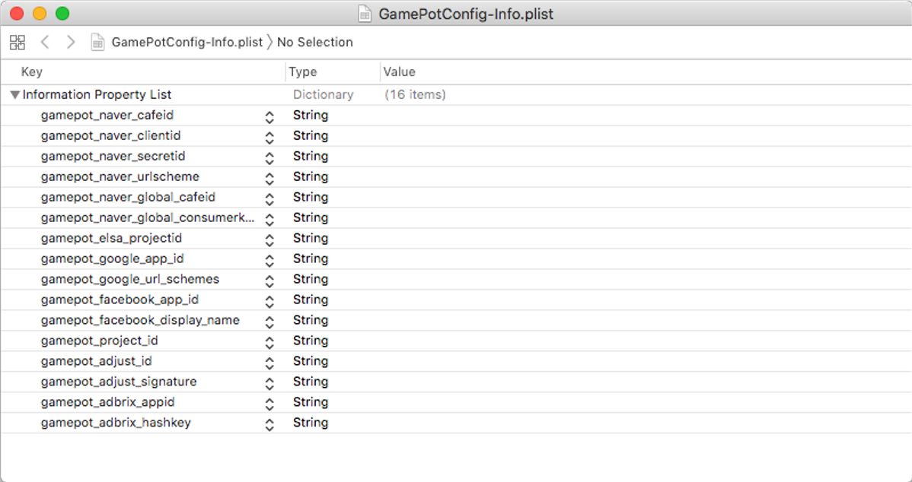
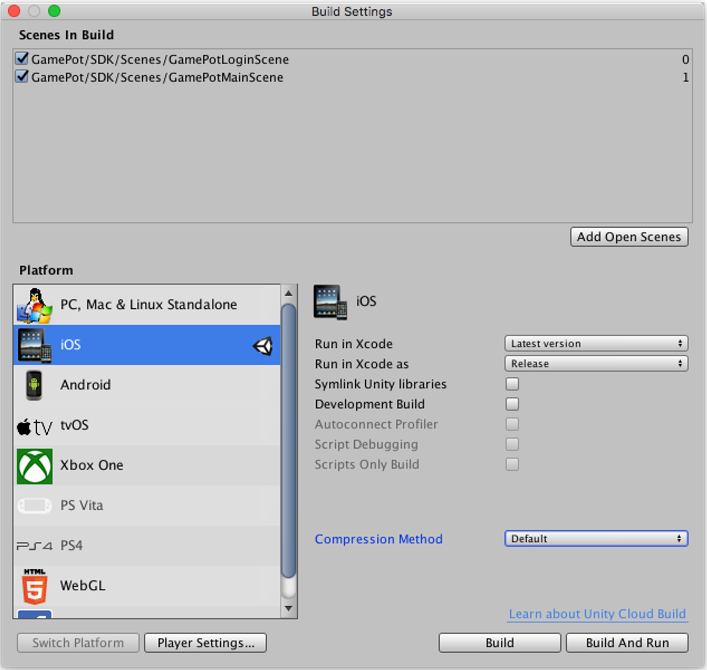
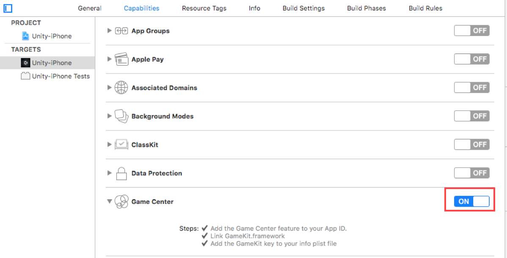

---
search:
  keyword: ['gamepot']
---

## Unity插件介绍

### 入门

#### STEP 1. 导入GAMEPOT插件

访问已生成的GAMEPOT Dashboard并下载最新插件。

#### STEP 2. 导入插件

选择**Assets > Import Package > Custom Package** 菜单中下载的GamePotUnityPlugin-xxxx.unitypackage文件。


import所确认的插件，项目就会被添加。


#### STEP 3. Android

##### 如何设置Gradle首选项

/Assets/Plugin/Android/mainTemplate.gradle文件请使用编辑器打开。

```java
...
android {
	...
	defaultConfig {
		...
        resValue "string", "gamepot_project_id", "" // required
        resValue "string", "gamepot_api_url", "" // required
        resValue "string", "gamepot_store", "google" // required
        resValue "string", "gamepot_app_title","@string/app_name" // required (fcm)
        resValue "string", "gamepot_push_default_channel","Default" // required (fcm)
		resValue "string", "facebook_app_id", "0" // optional (facebook)
		resValue "string", "fb_login_protocol_scheme", "fb0" // optional (facebook)
		// resValue "string", "gamepot_elsa_projectid", "" // optional (ncp elsa)
	}
	...
}
```

查找以下必须值并修改。必须要修改以下值才可以正常操作。

```java
resValue "string", "[key]", "[value]"
```

| 值                           | 说明                                                         |
| ---------------------------- | ------------------------------------------------------------ |
| gamepot_project_id           | 输入从GamePot获取的项目ID。                                  |
| gamepot_api_url              | 输入从GamePot获取的API URL。                                 |
| gamepot_store                | 渠道商城值 ( google or one )                                 |
| gamepot_app_title            | 应用标题 (FCM)                                               |
| gamepot_push_default_channel | 已注册的默认频道名称(Default) - 请勿更改。                   |
| facebook_app_id              | 从Facebook获取的应用ID                                       |
| fb_login_protocol_scheme     | 从Facebook获取的protocol scheme  fb[app_id]                  |
| gamepot_elsa_projectid       | 使用NCLOUD ELSA时项目ID([了解更多](https://www.ncloud.com/product/analytics/elsa)) |

##### 如何更改推送显示图标


接受推送时在Android Notification bar所显示的Small icon是基本使用SDK内部的默认图像，也可以手动添加适合游戏的图标。

手动添加需要为每个`drawable`文件夹放入图像。

> ([链接](http://romannurik.github.io/AndroidAssetStudio/icons-notification.html#source.type=clipart&source.clipart=ac_unit&source.space.trim=1&source.space.pad=0&name=ic_stat_gamepot_small))通过此链接制作图像时会自动创建每个文件夹的图像。

图像文件名必须为ic_stat_gamepot_small。

| 文件夹名称             | 大小  |
| --------------------- | ----- |
| res/drawable-mdpi/    | 24x24 |
| res/drawable-hdpi/    | 36x36 |
| res/drawable-xhdpi/   | 48x48 |
| res/drawable-xxhdpi/  | 72x72 |
| res/drawable-xxxhdpi/ | 96x96 |

##### 如何设置屏幕定向

以编辑器的身份打开/Assets/Plugin/Android/AndroidManifest.xml文件。

```xml
...
    <activity android:screenOrientation="sensorLandscape">
      <intent-filter>
        <action android:name="android.intent.action.MAIN" />
          ...
      </intent-filter>
    </activity>
...
```

将screenOrientation添加到Main Activity并为您的游戏输入`sensorLandscape`或`sensorPortrait`。

##### Firebase使用方法

从 Google Firebase Console 下载的`google-services.json` 文件复制到 `/Assets/Plugins/Android/`里面。

> 为了使用Google登录以及推送必须要接入。

#### STEP 4. iOS

> 如果您不使用`GameCenter登录`，请删除以下文件。<br> > `Assets/Plugins/IOS/Frameworks/GamePotGameCenter.framework`<br>
> 如果包含库，则必须在 `在功能设置中启用GameCenter` 中激活 GameCenter

将从 Google Firebase 下载的`GamePotConfig-Info.plist`文件复制到`/Assets/Plugins/IOS/`。

/Assets/Plugin/GamePotConfig-Info.plist 里添加所需要环境参数。



|                                  | 说明                                                 |
| -------------------------------- | ---------------------------------------------------- |
| gamepot_project_id               | 输入从GamePot获取的项目ID                           |
| gamepot_facebook_app_id          | 从Facebook获取的应用ID                              |
| gamepot_facebook_display_name    | 在Facebook所被显示的名称                             |
| gamepot_google_app_id		       | GoogleService-Info文件的CLIENT_ID值             |
| gamepot_google_url_schemes       | GoogleService-Info文件的REVERSED_CLIENT_ID值     |
| gamepot_elsa_projectid           | 使用NCLOUD ELSA时项目ID                        |
| gamepot_api_url | API URL |

添加scenes之后

File -> Build Settings -> Build And Run 就完成。


### 初始化

将把以下代码添加到游戏开始时加载的第一个场景中所使用的对象中。

```csharp
using GamePotUnity;
public class GamePotLoginSampleScene : MonoBehaviour {
    void Awake() {
        GamePot.initPlugin();
    }
    void Start () {
        GamePot.setListener(  GamePotInterface.cs 继承的 class );
         // ex) GamePot.setListener(new GamePotSampleListener());
    }

}

ex)
public class GamePotSampleListener : MonoBehaviour , NSDKInterface {
    ....
}
```

### 错误代码

```csharp
public class NError
{
    //Detail Error code
    public static readonly int CODE_UNKNOWN_ERROR           = 0;                    // 未知Error
    public static readonly int CODE_NOT_INITALIZE           = 1;                    // 初始化失败
    public static readonly int CODE_INVAILD_PARAM           = 2;                    // 参数不正确
    public static readonly int CODE_MEMBERID_IS_EMPTY       = 3;                    // 没有MemberID数据
    public static readonly int CODE_NOT_SIGNIN              = 4;                    // 不是登录状态
    public static readonly int CODE_NETWORK_MODULE_NOT_INIT = 3000;                 // 未初始化网络模块
    public static readonly int CODE_NETWORK_ERROR           = 3001;                 // 网络连接错误和超时
    public static readonly int CODE_SERVER_ERROR            = 4000;                 // 从server-side发生错误
    public static readonly int CODE_SERVER_HTTP_ERROR       = 4001;                 // 未成功http response code
    public static readonly int CODE_SERVER_NETWORK_ERROR    = 4002;                 // 网络连接错误和超时
    public static readonly int CODE_SERVER_PARSING_ERROR    = 4003;                 // 解析从服务器获取的数据时错误
    public static readonly int CODE_CHARGE_UNKNOWN_ERROR    = 5000;                 // 在支付出现未知错误和渠道传达错误时
    public static readonly int CODE_CHARGE_PRODUCTID_EMPTY  = 5001;                 // 未输入product id
    public static readonly int CODE_CHARGE_PRODUCTID_WRONG  = 5002;                 // product id输入错误
    public static readonly int CODE_CHARGE_CONSUME_ERROR    = 5003;                 // consume时错误


    public int code { get; set; }                                                      // error Code
    public string message { get; set; }                                             // error Message
}
```

### 设置登录环境

#### Google登录

##### Google Firebase Console

1. 从Google Firebase Console下载Android专用google-service.json之后复制到 `/Assets/Plugins/Android/`。
2. 将把编译APK时所使用的Keystore的SHA-1值添加到Google Firebase console里。

3. 从Google Firebase Console下载iOS专用GoogleService-Info.plist之后复制到 `/Assets/Plugins/IOS/`。

#### Facebook登录

##### Facebook Developer Console

将把编译APK时使用的Keystore的key hash值添加到Facebook Console里。

##### Android

修改mainTemplate.gradle

```java
...
defaultConfig {
	resValue "string", "facebook_app_id", "1234567890"
	resValue "string", "fb_login_protocol_scheme", "fb1234567890"
}
...
```

将把从Facebook开发者中心获取的facebook_app_id里添加之后输入fb[facebook_app_id]。

> 如app_id为1234567890的时候，fb1234567890就是fb_login_protocol_scheme。

##### iOS

在/Assets/Plugins/IOS/Frameworks添加以下Frameworks。

FBSDKLoginKit.framework
FBSDKCoreKit.framework
Bolts.framework
GamePotFacebook.framework

#### GameCenter登录

> 只针对 iOS 的功能。<br>
> 如果您不使用`GameCenter登录`，请删除以下文件。<br> > `Assets/Plugins/IOS/Frameworks/GamePotGameCenter.framework`<br>
> 如果包含库，则必须在 `在功能设置中启用GameCenter` 中激活 GameCenter

在/Assets/Plugins/IOS/Frameworks/复制Gamekit.framwork。General -> Linked Frameworks and Libraries里添加复制的Frameworks。

在Capabilities设置中设置为Game Center ON。 ( 在App Store Console里也需要设置为Game Center ON。)



### 登录/退出/注销

#### 登录

无需注册也可以生成用户账号。生成可以检查身份的MemberId，生成的信息储存到NUserInfo结构体中并返回。

Request:

```csharp
GamePot.login(NCommon.LoginType);
```

Response:

```csharp
// 登录成功
public void onLoginSuccess(NUserInfo userInfo)
{
}
// 登录失败
public void onLoginFailure(NError error)
{
	// 如果登录失败
	// error.message请使用弹窗告知给用户
}
// 取消登录
public void onLoginCancel()
{
	// 用户取消登录
}
// 强制更新(渠道版本和客户端版本不一致的时候调用)
public void onNeedUpdate(NAppStatus status)
{
	// TODO : 需要根据传递过来的status信息做出弹窗告知给用户。
	// TODO : 可以选择以下两种方式之一。
    // case 1 : 使用游戏内弹窗开发上来实现UI
    // case 2 : 使用SDK的弹窗(此情况下，请调用下面代码。)
    // GamePot.showAppStatusPopup(status.ToJson());
}
// 维护(Dashboard中维护为激活状态时调用)
public void onMainternance(NAppStatus status)
{
   	// TODO : 需要根据传递过来的status信息做出弹窗告知给用户。
	// TODO : 可以选择以下两种方式之一。
    // case 1 : 使用游戏内弹窗开发上来实现UI
    // case 2 : 使用SDK的弹窗(此情况下，请调用下面代码。)
    // GamePot.showAppStatusPopup(status.ToJson());
}
// 结束应用
public void onAppClose()
{
    // TODO: 如果使用case2方式实现强制更新或者维护功能
    // TODO: 需要可以强制结束应用，请在此地方实现结束应用。
}
```

LoginType定义

```csharp
public enum LoginType
{
     NONE,
     GOOGLE,
     FACEBOOK,
     GAMECENTER,
     NAVER,
     GUEST
}

```

NUserInfo定义

```csharp
public class NUserInfo
{
    public string id { get; set; }              // MemberID. (用户唯一ID)
    public string name { get; set; }            // 名称
    public string profileUrl { get; set; }      // 简介URL (如有)
    public string email { get; set; }           // 电子邮件 (如有)
    public string socialid { get; set; }        // Social ID(google, facebook ...)
}
```

####获取登录信息

```csharp
GamePot.getMemberId(); // MemberID. (用户唯一ID)
```
#### 自动登录
```csharp
NCommon.LoginType type = GamePot.getLastLoginType();
if(type != NCommon.LoginType.NONE) {
{
    // 使用最终登录的登录类型来登录的方式。
    GamePot.login(type);
}
else
{
    // 首次启动游戏或者退出状态。请移动至可以登录的登录界面。
}
```

#### 退出

退出用户。账户不被删除，可以重新用同样账号登录。

Request:

```
GamePot.logout();
```

Response:

```csharp
/// 退出成功
public void onLogoutSuccess()
{
}

/// 退出失败
public void onLogoutFailure(NError error)
{
   	// 如果退出失败
	// error.message请使用弹窗告知给用户
}
```


#### 注销

注销会员，无法复原。

Request:

```
GamePot.deleteMember();
```

Response:

```csharp
/// 会员注销成功
public void onDeleteMemberSuccess() {
}

/// 会员注销失败
public void  onDeleteMemberFailure(NError error) {
   	// 如果会员注销失败
	// error.message请使用弹窗告知给用户
}
```


### 绑定账号

可以将多个社交账户(Google，FaceBook 等)连接/断开连接到一个游戏账户的功能。(至少可以绑定一个社交账户。)

> 绑定相关UI界面，请由开发公司来支持实现。

```csharp
public enum LinkingType
{
      GAMECENTER,
      GOOGLE,
      FACEBOOK,
      NAVER
}
```

#### 绑定

可以使用Google, Facebook 等账号来绑定账户。

Request:

```csharp
GamePot.createLinking(NCommon.LinkingType.XXXXX);
```

Response:

```csharp
/// 绑定账号取消
public void onCreateLinkingCancel() {
    // 用户取消绑定账号
}

/// 绑定账号成功
public void onCreateLinkingSuccess(NUserInfo userInfo) {
}

/// 绑定账号失败
public void onCreateLinkingFailure(NError error) {
	// 如果绑定账户失败
	// error.message请使用弹窗告知给用户
}
```

可以获取目前所绑定的所有账号信息。

```csharp
List<NLinkingInfo> linkedList = GamePot.getLinkedList();
```

定义链接信息

```csharp
public class NLinkingInfo
{
    public LinkingType provider { get; set; }  // google, facebook, naver
}
```

#### 解除绑定

解除已绑定的账号。

Request :

```
void GamePot.deleteLinking(NCommon.LinkType.XXXXX);
```

Response:

```csharp
/// 解除绑定成功
public void onDeleteLinkingSuccess() {
}

/// 解除绑定失败
public void onDeleteLinkingFailure(NError error) {
	// 如果解除绑定失败
	// error.message请使用弹窗告知给用户
}
```

#### 对于处理账户绑定状态结果示例

根据createLinking / deleteLinking结果获取目前已绑定的账号信息并更新绑定状态的UI。

```csharp
public void onInit()
{
	UI_Update();
}
public void onCreateLink_GAMECENTER_Click()
{
	GamePot.createLinking(NCommon.LinkingType.GAMECENTER);
}
public void onCreateLink_GOOGLE_Click()
{
	GamePot.createLinking(NCommon.LinkingType.GOOGLE);
}
public void onCreateLinkingSuccess(NUserInfo userInfo)
{
	UI_Update();
}
public void onCreateLinkingFailure(NError error)
{
	UI_Update();
}
public void onDeleteLinkingSuccess(NUserInfo userInfo)
{	
	UI_Update();
}
public void onDeleteLinkingFailure(NError error)
{
	UI_Update();
}

Public void UI_Update()
{
	// Ui Update in GAME
	CreateLinkManager.instance._IOS_google_state  = false;
	CreateLinkManager.instance._IOS_gamecenter_state  = false;

	List<NLinkingInfo> linkedList = GamePot.getLinkedList(); 
	foreach ( NLinkingInfo item in linkedList)
	{
		case NCommon.LinkingType.GOOGLE : 
			CreateLinkManager.instance._IOS_google_state  = true;
		break;
		case NCommon.LinkingType.GAMECENTER :
			CreateLinkManager.instance._IOS_gamecenter_state  = true;
		break;
	}
}
```


### 支付

#### 查询In App商品

请从渠道商城获取的商品信息显示在画面上。根据价格，货币、描述等信息会显示不同。

```csharp
NPurchaseItem[] items = GamePot.getPurchaseItems();
foreach(NPurchaseItem item in items) {
    Debug.Log(item.productId);		// 商品ID
    Debug.Log(item.price);			// 价格
    Debug.Log(item.title);			// 标题
    Debug.Log(item.description);	// 说明
}
```

### 支付In App商品

使用下面的一个函数，可以在Google, Apple, AppStore支付。

Request:

```csharp
// productId : 渠道商城里所注册的商品ID
GamePot.purchase(string productId)
```

Response:

```csharp
/// In App支付成功
public void onPurchaseSuccess(PurchaseInfo purchase) {
}

/// In App支付失败
public void onPurchaseFailure(NError error) {
	// 如果In App支付失败
	// error.message请使用弹窗告知给用户
}

/// In App支付失败
public void onPurchaseCancel() {
}
```

### 广告

基本包含着 IGAWorks Unity Plugin，所以接入[IGAWorks的指南](http://help.igaworks.com/hc/ko/3_3/Content/Article/common_unity_aos)即可。

> 希望使用IGAWorks之外的library的时候我方会说明如何接入。

版本如下所示。

| 平台    | 版本                                           |
| ------- | ---------------------------------------------- |
| Android | IGAWorks_Unity_Android_Full_Package_2018-12-05 |
| iOS     | IGAWorks_Unity_iOS_Full_Package_2018-10-02     |

### Push on/off

全体推送，夜间推送和广告推送的这3种类型的推送可以各个设置开关。

> 设置开关on/off的UI界面，请由开发公司来支持实现。

#### 设置推送

Request:

```csharp
GamePot.setPushStatus(bool pushEnable);
```

Response:

```csharp
/// 对于更改推送状态服务器通信成功
public void onPushSuccess() {
}

/// 对于更改推送状态服务器通信失败
public void onPushFailure(NError error) {
	// 如果更改推送状态失败
	// error.message请使用弹窗告知给用户
}
```

#### 设置夜间推送

Request:

```csharp
GamePot.setPushNightStatus(bool nightPushEnable);
```

Response:

```csharp
/// 对于更改夜间推送状态服务器通信成功
public void onPushNightSuccess() {
}

/// 对于更改夜间推送状态服务器通信失败
public void onPushNightFailure(NError error) {
	// 如果更改夜间推送状态失败
	// error.message请使用弹窗告知给用户
}
```

#### 设置广告推送

Request:

```csharp
GamePot.setPushADStatus(bool adPushEnable);
```

Response:

```csharp
/// 对于更改广告推送状态服务器通信成功
public void onPushAdSuccess() {
}

/// 对于更改广告推送状态服务器通信失败
public void onPushAdFailure(NError error) {
	// 如果更改广告推送状态失败
	// error.message请使用弹窗告知给用户
}
```

#### 一并设置 推送/夜间推送/广告推送

游戏如果在登录之前接受推送，夜间推送，广告推送时，必须要在登录之后调用以下代码。

Request:

```csharp
GamePot.setPushStatus(bool pushEnable, bool nightPushEnable, bool adPushEnable);
```

Response:

```csharp
/// 对于更改夜间推送状态服务器通信成功
public void onPushStatusSuccess() {
}

/// 对于更改夜间推送状态服务器通信失败
public void onPushStatusFailure(NError error) {
	// 如果更改夜间推送状态失败
	// error.message请使用弹窗告知给用户
}
```

#### 查询推送状态

```csharp
NPushInfo pushInfo = GamePot.getPushStatus();
// pushInfo.enable  是否接受推送
// pushInfo.night   是否接受夜间推送
// pushInfo.ad      是否接受广告推送
```

### 优惠卷

#### 使用优惠卷

Request:

```csharp
GamePot.coupon(string couponNumber); // 优惠卷号码
```

Response:

```csharp
/// 优惠卷使用成功
public void onCouponSuccess() {
}

/// 优惠卷使用失败
public void onCouponFailure(NError error) {
	// 如果失败使用优惠卷
	// error.message请使用弹窗告知给用户
}
```

### Naver论坛SDK

使用包含着Naver论坛SDK(4.0.4)的plugin的话，参考[Naver论坛SDK指南](https://github.com/naver/cafe-sdk-unity/blob/master/README.md#usages)接入即可。

> 因为Naver论坛SDK的容量大，所以有包含的Plugin以及没有包含的Plugin两个版本。按照需求来选择使用就可以。

### 公告

```csharp
GamePot.showNoticeWebView();
```

### 客服中心

```csharp
GamePot.showCSWebView();
```

### 本地推送(Local Push notification)

不通过推送服务器，直接在设备自行显示推送的功能。

#### 调用

##### 注册推送

在指定时间显示本地推送的方法为如下。

> 返回所传达的pushid值由开发公司来管理。

```Java
int pushId = GamePot.sendLocalPush(DateTime.Parse("2018-01-01 00:00:00"), "title", "content");
```

##### 取消注册推送

可以根据注册推送时所获得的pushid来取消现有的推送。

```Java
GamePot.cancelLocalPush(/*注册推送时获得的 pushId*/);
```
