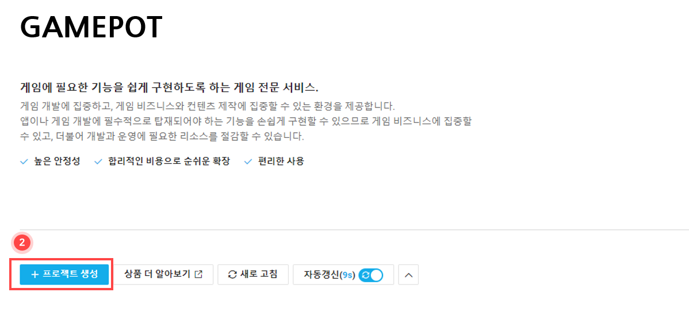
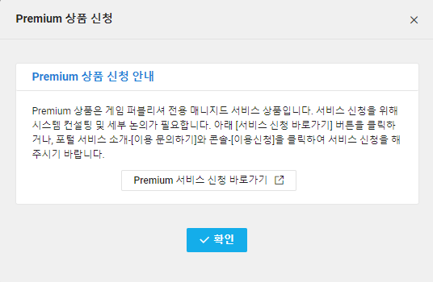
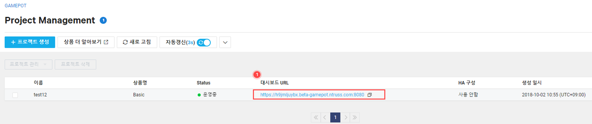
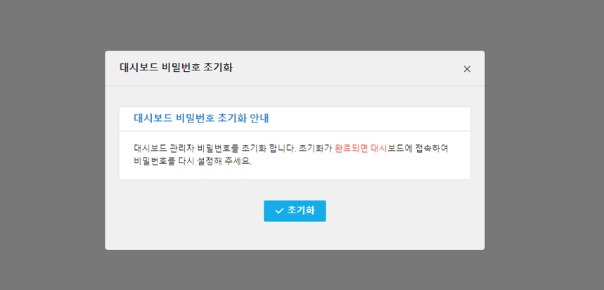

---
search:
  keyword: ['gamepot']
---

## 사용하기 전에

해당 상품은 게임을 개발하고 서비스하는 데 필요한 기능을 별도의 개발 비용을 들이지 않고 간단하게 구현할 수 있는 클라우드 서비스입니다. 특히, 공통 SDK와 더불어 각종 필요한 보안 인증을 받은 네이버 클라우드 플랫폼의 안정적인 클라우드 인프라 자원 및 네트워크 자원을 함께 제공하므로 게임을 보다 효율적으로 운영할 수 있습니다.

**네이버 클라우드 플랫폼 GAMEPOT만의 특징**

* 고객 간 서비스 품질 간섭이 없습니다. 고객사는 각 프로젝트마다 별도의 인프라를 제공받기 때문에 장애나 품질 문제를 최소화할 수 있습니다.
* 편리하게 관리와 통계를 이용할 수 있는 별도의 "대시보드"가 제공됩니다. 대시보드는 모든 고객사를 단순히 계정으로만 구분하는 것이 아니므로 데이터 보안성이 높습니다.
* 다양한 네이버 클라우드 플랫폼의 상품과 쉽게 연동할 수 있습니다. 더불어 연동 상품의 가격도 합리적입니다.

**Q. GAMEPOT은 왜 별도의 인프라를 제공하여 구성하나요?**

많은 공통 게임 SDK 서비스는 플랫폼 제공자의 업데이트 또는 패치, 기능 개선 중에 장애가 발생하거나 일부 기능이 멈출 경우 모든 고객사의 게임이 동일한 서비스 중단을 경험합니다. GAMEPOT은 플랫폼 업데이트, 백업 등 운영에 필요한 모든 기능을 고객이 직접 선택할 수 있도록 하고 장애 발생 시 품질의 간섭을 최소화하기 위해 별도의 인프라를 제공하고 있습니다.

**Q. 타사 서비스는 게임의 규모가 커질수록 비용이 증가합니다. GAMEPOT은 어떤가요?**

GAMEPOT은 게임의 성장과 비례하여 비용이 증가하는 구조가 아닙니다. 처리 가능한 DAU 한도 내에서는 SDK 사용량이 증가한다고 해서 비용이 증가하지 않습니다. 현재 출시된 게임 SDK 클라우드 서비스 중 가장 비용 효율적이라는 장점이 있습니다.

**Q. 대시보드 보안성에 대해 설명해 주세요.**

고객 계정을 통해 공통된 대시보드에 접근할 경우, 고객사 계정 정보가 유출되면 저장된 모든 데이터가 유출될 수 있습니다. 네이버 클라우드 플랫폼의 보안은 외부 정보 유출을 원천적으로 차단하고 있으나 더욱 견고한 보안을 위해 GAMEPOT의 모든 고객은 모두 다른 접근 도메인과 대시보드 시스템을 제공받기 때문에 데이터를 보다 안전하게 지킬 수 있습니다.

## GAMEPOT 이용하기

#### Step 1. 프로젝트 생성하기

서비스를 사용하기 위해서는 우선 프로젝트를 생성해야 합니다.

① 콘솔에서 **Game > GAMEPOT**을 선택합니다.

② **+프로젝트 생성** 버튼을 클릭합니다.

③ 게임 클러스터의 이름을 입력합니다.

- 클러스터 이름은 최소 3자에서 최대 20자까지 입력할 수 있습니다.
- 영문자, 숫자 및 '-' 기호만 가능합니다.

④ 상품을 선택합니다.

* Premium 상품을 선택하면 별도의  서비스 신청을 위한 안내 팝업이 노출됩니다.

⑤ **프로젝트 생성** 버튼을 클릭하여 프로젝트 생성을 완료하세요.

* 게임 클러스터 인프라가 구성되기까지 수 분이 소요됩니다.

⑥ 프로젝트 Status 항목이 **생성중**이면 대시보드로 접근할 수 있는 URL이 비활성화 상태로 노출됩니다. Status 항목이 **운영중**으로 변경되면 대시보드로 접근할 수 있는 URL이 활성화됩니다.

#### Step 2. 프로젝트 관리하기

프로젝트가 생성되면 게임 클러스터 이름과 상품명이 명시된 리스트 화면을 볼 수 있습니다.

① 대시보드 URL을 통해 게임 기능을 관리할 수 있는 대시보드로 진입이 가능합니다.

② 프로젝트에 체크하고 **프로젝트 관리** 버튼을 클릭하면 간단한 관리 메뉴가 나옵니다.

* 상품 변경: 사용 중인 서비스 상품을 변경합니다. 일시적으로 대시보드 접근이 되지 않을 수 있습니다. **상품 변경** 버튼을 클릭하면 아래와 같은 팝업이 노출됩니다. 변경하고자 하는 상품을 선택 후 **수정** 버튼을 클릭합니다.

  

* 비밀번호 초기화: 대시보드 접근 비밀번호를 분실하거나 초기화가 필요한 경우 사용합니다. 비밀번호 초기화를 한 후 대시보드에 접속하면 비밀번호를 다시 설정할 수 있습니다.

  

#### Step 3. 프로젝트 삭제

GAMEPOT은 프로젝트 생성이 완료된 시점부터 시간당 요금이 발생합니다. 따라서 필요하지 않는 경우 프로젝트를 삭제하여 불필요한 요금이 발생하는 것을 방지해야 합니다.

① 프로젝트 삭제를 위해서는 **프로젝트 삭제** 버튼을 클릭합니다. **프로젝트 삭제** 버튼을 클릭하면 아래와 같은 팝업이 노출됩니다.

② 삭제하기 위해서는 프로젝트의 이름을 입력해야 합니다.

③ 위에 같은 팝업이 노출되고 **확인** 버튼을 클릭하면 최종적으로 삭제가 진행됩니다.
