---
search:
  keyword: ['gamepot']
---

NAVER CLOUD PLATFORM의 GAMEPOT에서 제공하는 대시보드에 대한 가이드입니다.

## GAMEPOT 대시보드 소개

**Q. 대시보드란?**

대시보드를 통해 게임을 운영하고 관리하실 수 있습니다.

**Q. 대시보드에서 어떤 운영 기능이 포함되나요?**

대시보드에는 회원 접속 통계 및 결제에 관한 통계 및 확인이 가능하고 NAVER CLOUD PLATFORM의 서비스와 연동하여 PUSH, SMS, 로그 분석 등 다양한 기능을 제어할 수 있습니다. 또한 쿠폰이나 업데이트 등 게임에 필요한 운영 기능을 자체적으로 가지고 있어 보다 효율적인 게임 관리가 가능합니다.

## GAMEPOT 대시보드 시작하기

### 로그인

#### Step 1. 대시보드 접속

NAVER CLOUD PLATFORM의 콘솔에서 대시보드 URL을 클릭하여 대시보드에 접속합니다.

#### STEP 2. 회원가입

대시보드에 접속하면 가장 먼저  **GAMEPOT 회원가입**을 클릭하여 계정을 생성해 주세요.

가장 처음에 생성된 계정이 대시보드 관리의 모든 권한을 갖는 마스터 계정이 됩니다.

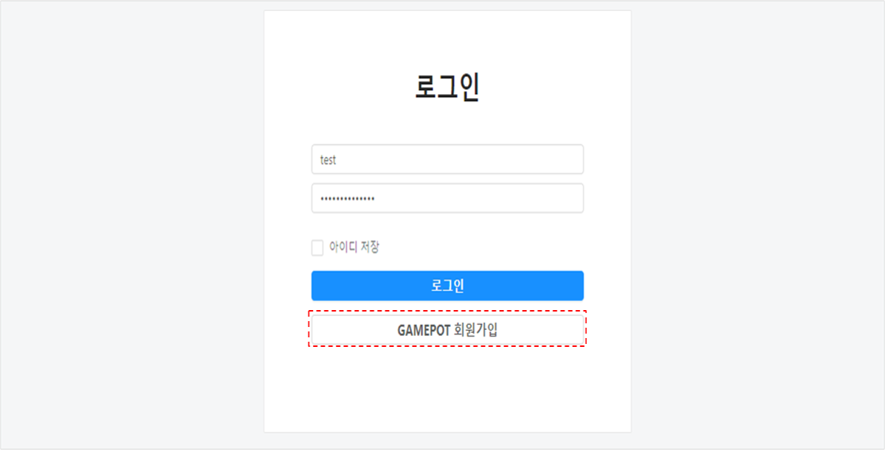

대시보드 이용할 계정을 생성합니다. 초기에 생성된 계정은 자동으로 마스터로 지정됩니다.

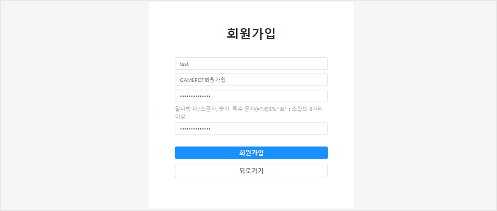

#### STEP 3. 로그인

생성한 계정으로 로그인하여 대시보드에 접속합니다.

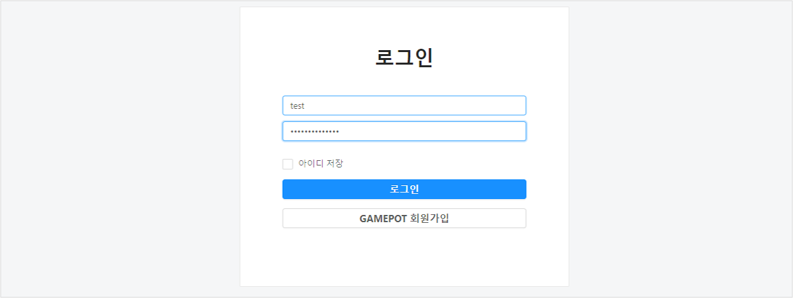

## 대시보드 메뉴 활용하기

### 대시보드

대시보드에서는 가입현황, 매출, 접속, 통계 등의 게임의 전반적인 운영 상황을 한눈에 파악할 수 있습니다.

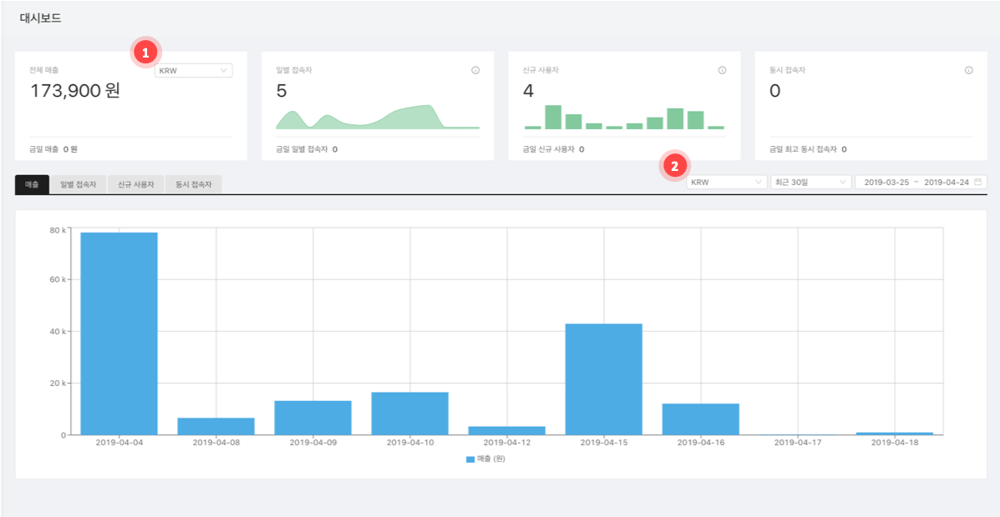

### 회원

#### 목록

가입된 회원 목록이 표시됩니다.

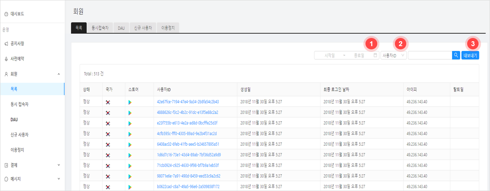

① 특정 날짜에 가입한 회원만을 조회할 수 있도록 회원 가입일 범위를 지정할 수 있습니다.

② 사용자 ID 또는 IP를 지정하여 특정 회원만을 조회할 수 있습니다.

③ 회원 목록을 CSV 파일 형태로 다운로드 할 수 있습니다.

④ 사용자ID를 클릭하면 아래와 같은 상세페이지가 나타납니다.

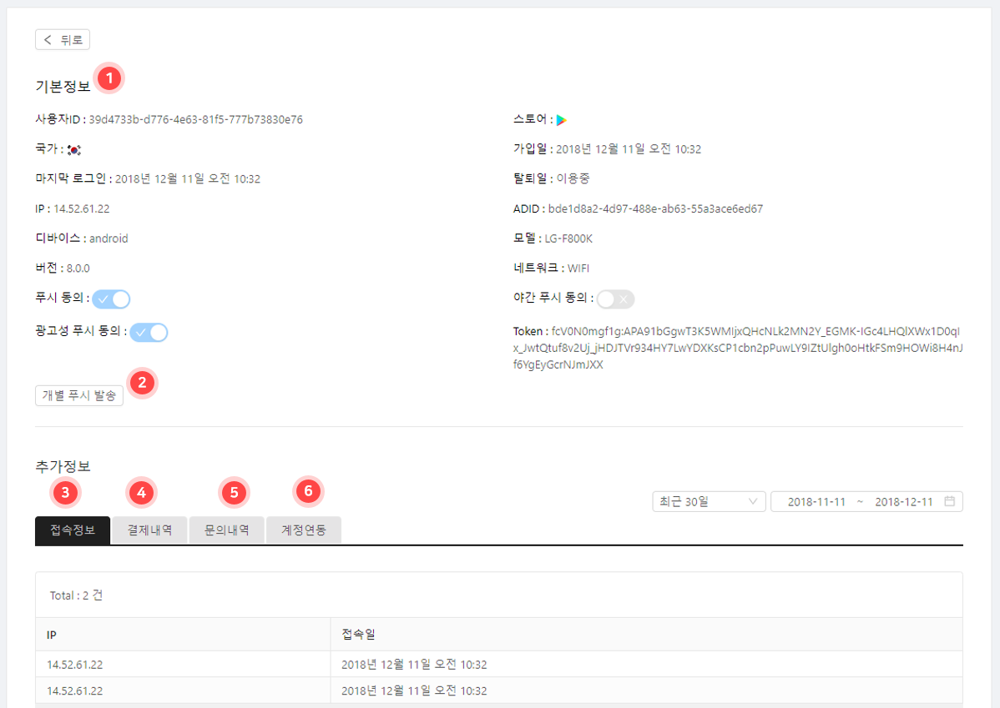

① 회원에 대한 기본정보를 보여줍니다.

② 회원 개인별로 푸시를 발송할 수 있는 기능입니다.

③ 게임에 로그인한 내역을 표시합니다.

④ 회원이 게임에서 결제한 내역을 표시합니다.

⑤ 회원이 접수한 문의와 그에 대한 답변 내역을 표시합니다.

⑥ 회원이 연동한 소셜 계정을 모두 보여줍니다.

- 소셜 계정을 추가하거나 연결을 취소할 수 있습니다.

#### 일별 접속자

지정된 기간 동안의 일일 접속자 수를 그래프로 나타냅니다.

기본적으로는 당일 기준 30일간의 일일 접속자 수를 출력하며, 일자 지정을 통하여 자유롭게 선택한 기간의 일일 접속자 수를 조회할 수 있습니다.

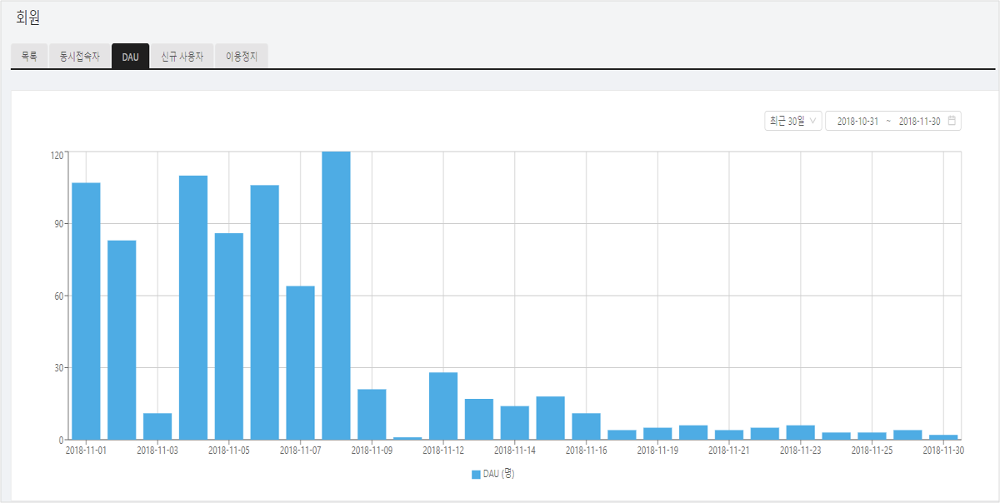

#### 신규 사용자

지정된 기간 동안 게임에 가입한 일일 신규 가입자 수를 그래프로 나타냅니다.

기본적으로는 당일 기준 30일간의 일일 신규 가입자 수를 출력하며, 일자 지정을 통하여 자유롭게 선택한 기간의 일일 신규 가입자 수를 조회할 수 있습니다.

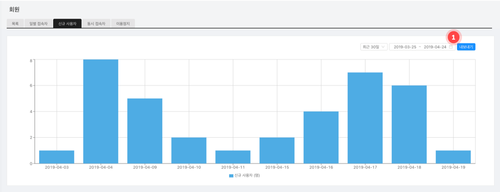

#### 동시 접속자

게임에 접속한 회원의 수를 1분 단위로, 최대 3일간의 접속자 수를 동시에 조회할 수 있습니다.

① 지정된 3일간의 동시 접속자 수를 1분 단위의 그래프로 나타냅니다.

② 당일과 전일, 전전일이 기본적으로 지정되어 있으며, 조회하고자 하는 최대 3개의 일을 변경할 수 있습니다. 초기화 버튼을 이용하여 기본 지정 일로 되돌아 올 수 있습니다.

③ 지정된 일의 1분 단위 동시 접속자 수를 표로 나타냅니다.

#### 이용정지

특정 회원에 대해서 지정된 기간동안 게임에 접속할 수 없도록 합니다.

이용정지는 회원의 사용자 ID를 기준으로 적용됩니다.

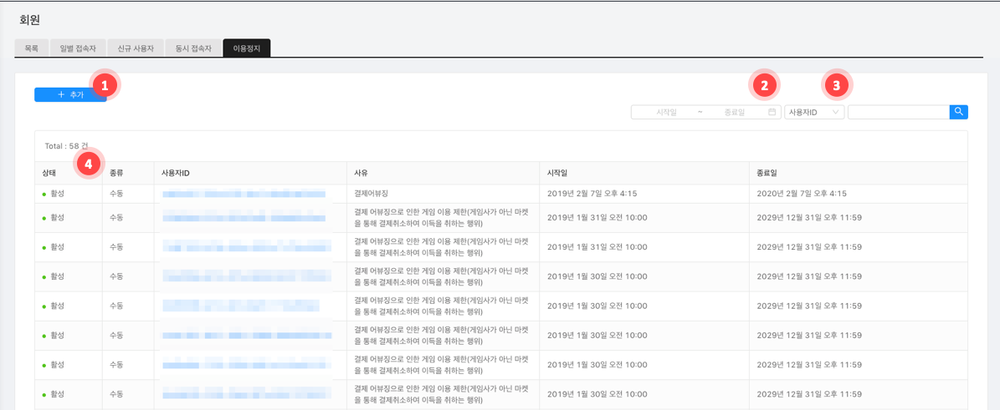

① 이용정지를 적용하기 위해, 추가 버튼을 이용합니다.

② 특정 기간 동안의 이용 정지 기록을 조회할 수 있습니다.

③ 특정 회원의 사용자 ID로 이용정지 내역을 조회할 수 있습니다.

④ 이용정지 회원 내역이 출력됩니다.

- 활성 : 현재 이용 정지 상태가 적용된 경우
- 비활성 : 현재 이용 정지 상태가 해제된 경우

### 결제

#### 결제목록

회원이 Google Play store, APPSTORE, ONE Store에서 결제를 시도한 내역을 확인할 수 있습니다.

① 성공된 결제에 대해서 결제 취소 처리를 할 수 있습니다. 결제를 취소할 경우 매출 통계에서 제외됩니다.

② 회원이 시도한 결제의 성공 여부를 조회할 수 있습니다. 실패한 결제 시도에 대해서는 아이템을 재지급할 수 있습니다.

③ 각각의 결제 내역 중 결제 취소 내역을 확인할 수 있습니다.

- Y : 결제 취소 상태
- N : 결제 미취소 상태

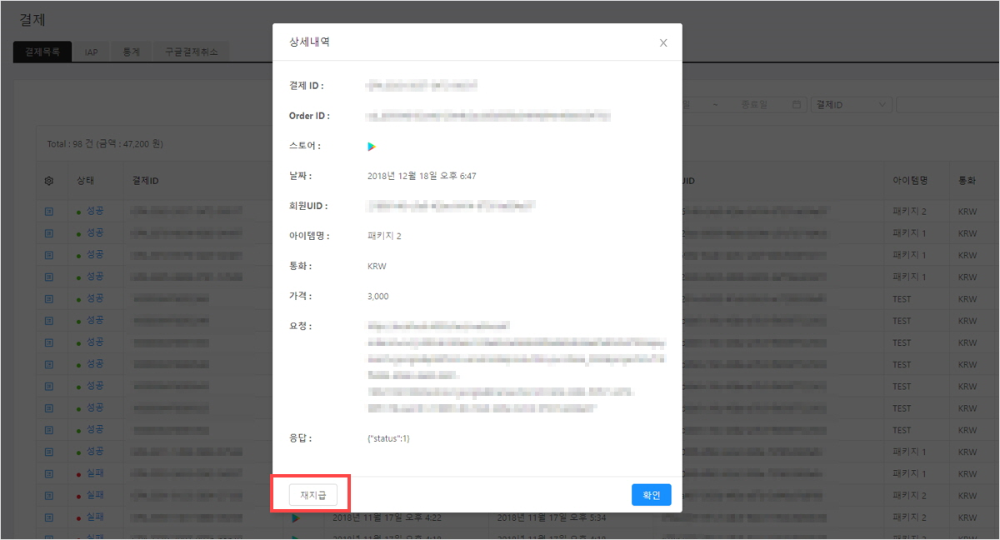

결제 상태를 클릭하여 시도된 결제에 대한 상세 내역을 확인할 수 있으며, 실패된 결제에 대해서는 재지급 버튼을 이용하여 아이템을 재지급할 수 있습니다.

#### IAP

인앱 구매 시 상품정보를 관리하는 기능입니다. 구글플레이, 앱스토어, 원스토어 등의 상품을 모두 등록하셔야 합니다.

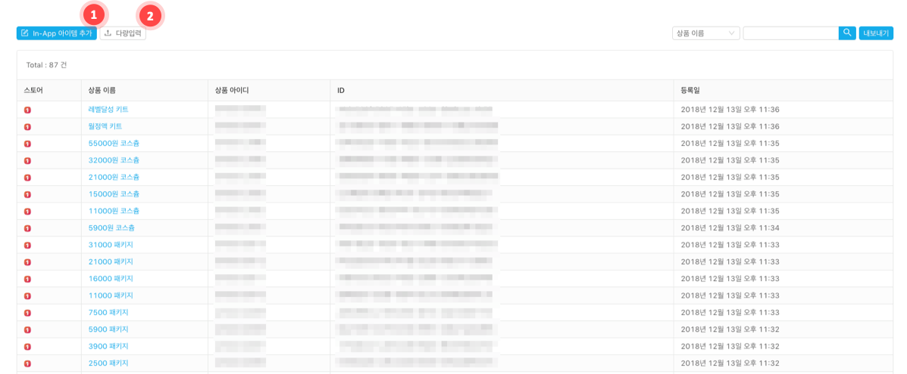

① **In-App 아이템 추가** 버튼을 클릭하면 스토어, 상품 이름, 상품 아이디를 입력하여 유료 아이템을 생성할 수 있습니다.

② **다량입력** 버튼을 클릭하면 인앱 상품을 CSV 파일로 한번에 등록할 수 있습니다.

#### 통계

일일 단위로 결제 금액 데이터를 그래프로 보여주는 기능입니다.

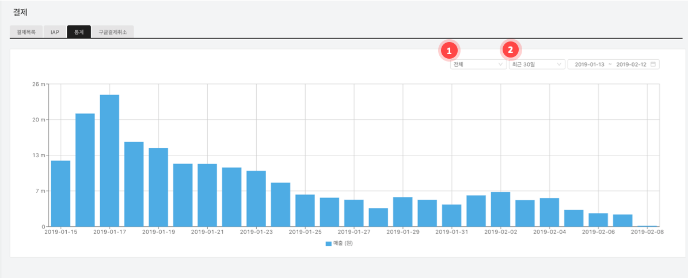

① 스토어를 지정하여 그래프를 볼 수 있습니다.

② 기간을 지정하여 그래프를 볼 수 있습니다.

#### 구글결제취소

일정 시간마다 Google console의 결제 영수증 상태와 비교하여

정상 결제건에 대해서 회원이 임의대로 결제를 취소한 경우를 알려줍니다.

① 임의적으로 구글 결제를 취소하는 회원의 게임 접속에 대해서, 일정 조건을 설정하여 이용정지 조치를 할 수 있습니다.

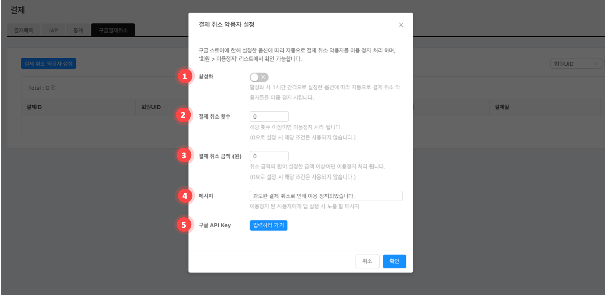

① 회원이 임의적으로 결제 취소를 악용한 부분에 대하여 이용 정지 여부를 결정할 수 있습니다. 활성화 시 1시간 간격으로 설정한 옵션에 따라 자동으로 결제 취소 악용자들을 이용 정지 시킵니다.

② 회원이 임의적으로 결제 취소를 진행한 총 횟수가 설정된 횟수 이상일 경우 게임 이용이 정지됩니다.

③ 회원이 임의적으로 결제 취소한 상품의 총합이 설정된 가격 이상일 경우 게임 이용이 정지됩니다.

④ 게임 이용이 정지된 회원이 게임 접속을 시도할 경우 출력되는 안내 메시지입니다.

⑤ 구글의 결제 취소 리스트를 받아오기 위하여 구글 API key를 입력합니다.

### 공지사항

대시보드에 등록된 공지사항 이미지는 게임에 접속한 회원들에게 노출됩니다. 노출할 일정 및 스토어를 지정하면 해당 조건에 맞춰 공지사항이 노출되고 일정 종료 후에는 노출되지 않습니다.

공지사항 기능을 사용하기 위해서는 먼저 NAVER CLOUD PLATFORM의 API 인증키와 Object Storage 서비스가 필요합니다. 공지사항 기능 사용 시, Object Storage 비용은 별도로 발생합니다.

#### Step 1. API 인증키 준비

공지사항 메뉴는 API를 통해 Object Storage를 연동하여 사용합니다. 따라서 NAVER CLOUD PLATFORM의 API 인증키를 사전에 준비해야 합니다.

API 인증키는 **포털 > 마이페이지 > 계정관리 > 인증키 관리** 메뉴에서 만들 수 있습니다.

① API 인증키를 생성하기 위해서 **신규 API 인증키 생성**을 클릭하세요.

- API 인증키는 계정당 2개까지 생성할 수 있습니다.

#### Step 2. 대시보드와 API 인증키 연동하기

발급 받은 인증키를 대시보드 연동을 해야 Object Storage의 버킷이 생성되고 공지사항 기능을 사용할 수 있습니다. 대시보드의 **프로젝트 설정 > Ncloud** 메뉴로 이동하여 API 인증키를 연결합니다.

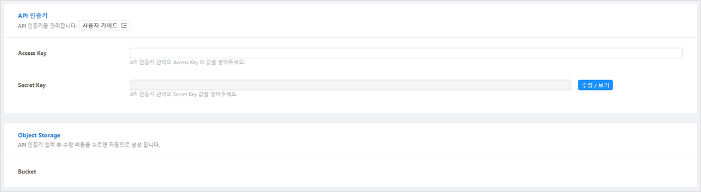

API 인증키가 연결되면 Object Storage의 버킷이 자동으로 생성됩니다. 공지사항에 사용된 모든 이미지는 해당 버킷에 저장됩니다.

#### Step 3. 공지사항 추가

공지사항을 추가하기 위해서 **공지사항** 메뉴로 이동합니다.

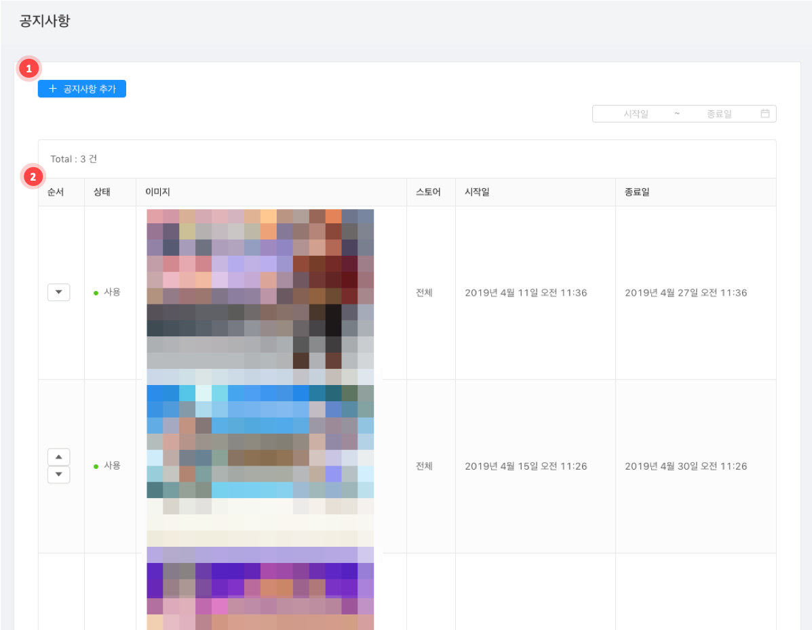

① **공지사항 추가**버튼을 통해 이미지를 추가할 수 있습니다.

② 사용자에게 노출할 이미지 순서를 지정할 수 있습니다.

이후 다음과 같은 팝업 메뉴가 나타나면 원하는 값을 입력하고 **저장** 버튼을 클릭하면 공지가 추가됩니다.

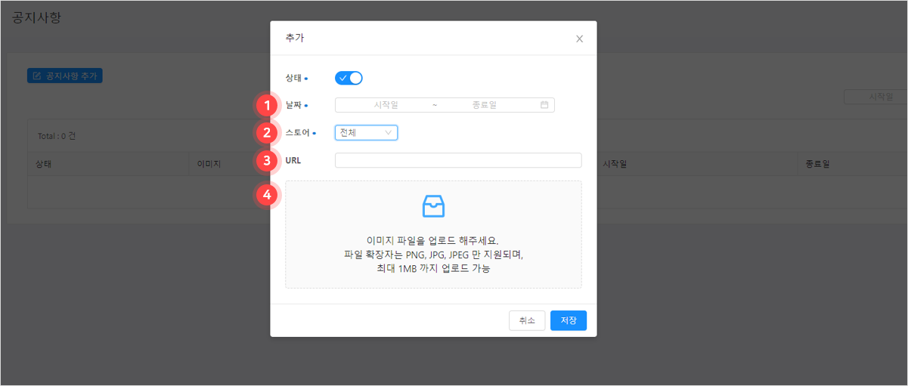

① 해당 공지사항의 활성화 여부를 선택합니다.

② 노출할 공지사항의 시작일시와 종료일시를 지정합니다.

③ 선택한 스토어의 분류에 따라 모든 스토어의 해당 앱에 공지사항이 노출되거나, 특정 스토어를 통하여 게임을 접속한 사용자에게만 공지사항이 노출될 수 있도록 지정할 수 있습니다.

④ 노출된 공지사항 이미지를 사용자가 터치할 경우 URL은 외부 브라우저로 이동하며, SCHEME은 callback 함수로 값을 리턴합니다.

⑤ 노출될 공지사항 이미지를 마우스로 끌어다 놓거나 직접 파일을 선택하실 수 있습니다.

### 점검 & 업데이트  

점검 및 업데이트 기능을 이용하여 더욱 쉽고 편리하게 게임을 관리할 수 있습니다.

#### 점검

게임 점검 시간에 자동으로 점검 메시지와 함께 게임 접속을 차단합니다.

점검 시간과 메시지를 입력한 뒤 저장하면 게임 내 점검 공지가 노출됩니다.

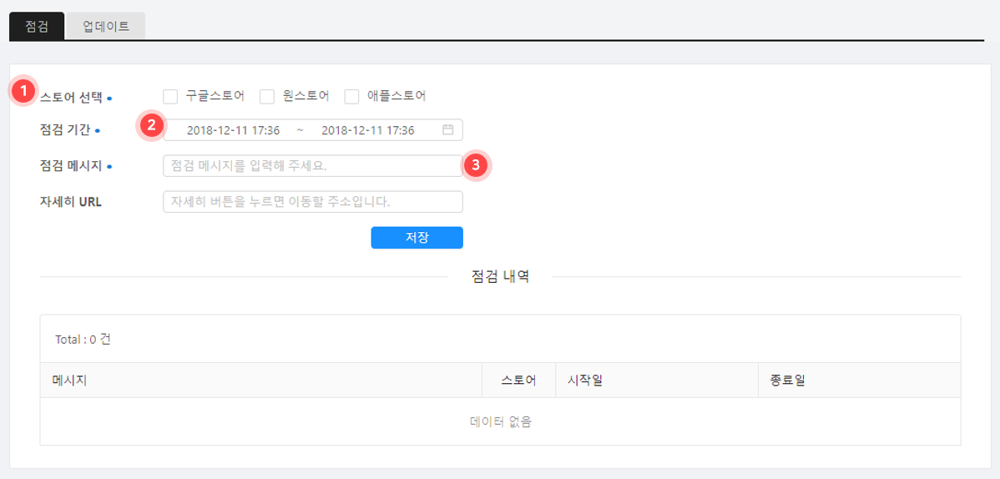

① 스토어를 지정하실 수 있습니다. 전체 점검일 경우 전체 스토어로 지정해 주세요.

② 점검 시작 시간과 종료 시간을 지정해 주세요.

③ URL은 점검 시에 자세히 보기 클릭 시에 이동시킬 주소를 입력해 주세요.

**예: 카페 공지사항 이나 자체 제작된 점검 안내 페이지**

#### 업데이트

최신 버전이 아닐 경우 업데이트 안내를 보여주고 구글플레이나 애플스토어와 같은 스토어의 업데이트 화면으로 이동합니다.

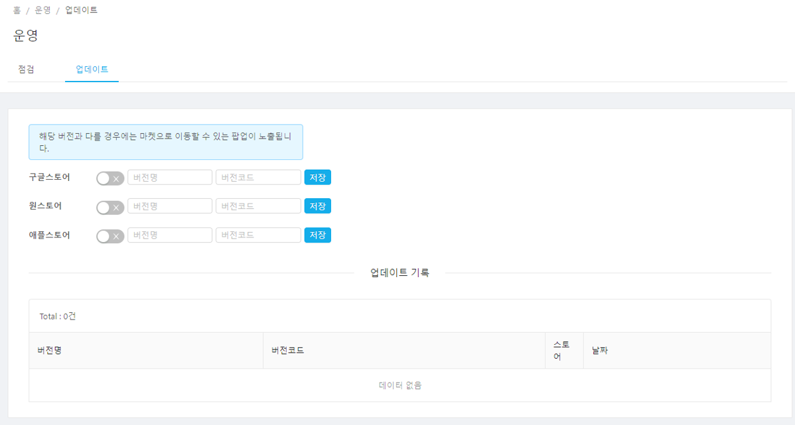

① 스토어별로 설정을 합니다.

② 기능 활성화 여부를 선택합니다.

③ **강제**로 선택한 경우 스토어에서 업데이트를 하기 전까지 게임을 이용할 수 없고, **권장**을 선택한 경우 스토어에서 업데이트를 하지 않아도 게임을 이용할 수 있습니다.

④ 버전정보를 입력합니다. 입력된 버전과 다르거나 낮을 경우 기능이 동작합니다.

### 메시지

별도의 메시지 서버 구축 없이 SMS, PUSH 등을 통해 메시지 알림 기능을 구현할 수 있는 서비스입니다. 해당 기능을 사용하기 위해서는 NAVER Cloud Plaform의 Simple & Easy Notification Service(SENS)를 신청해야만 합니다.

① SENS와 연동하기 위해서는 우선 서비스 키를 발급해야 합니다. **서비스 키 발급** 버튼을 클릭하고 [SENS 공통 가이드](../sens/sens-1-2.md)를 참고하여 서비스 키를 발급 받습니다.

② **인증서 등록 가이드** 버튼을 클릭하여 **SENS 웹 콘솔 사용 가이드**에 따라 인증서를 등록합니다.

③ **설정** 버튼을 클릭하여 아래의 화면으로 이동하여 PUSH 서비스 ID 값을 입력합니다.

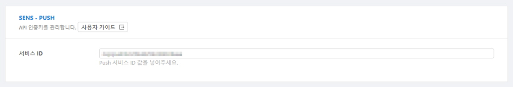

#### 푸시메시지

**메시지 > 푸시 메시지** 메뉴를 클릭하면  발송 상태, 예약 시간, 발송 시간 등을 확인할 수 있는 목록 화면이 나타납니다.

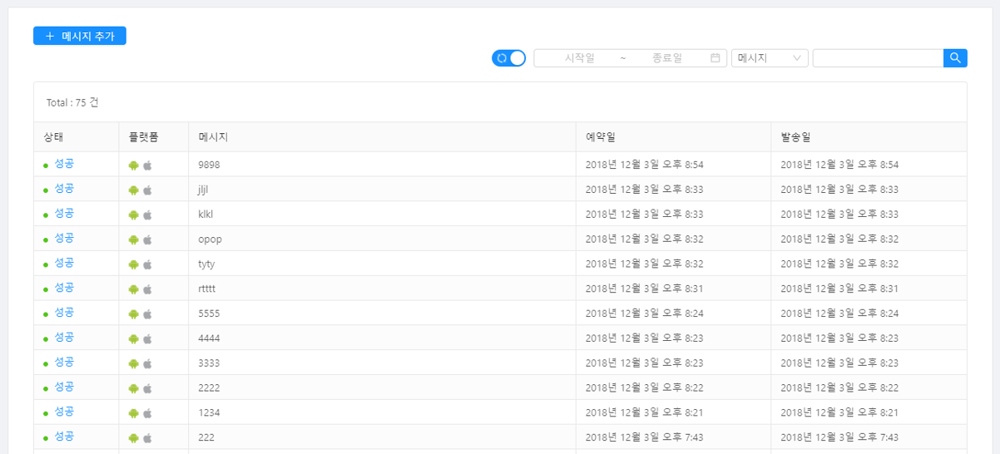

**푸시 메시지** 메뉴에서 **+메시지 추가** 버튼을 클릭하면 아래와 같은 팝업이 노출됩니다. 해당 팝업 메뉴를 통해 메시지 발송이 가능합니다.

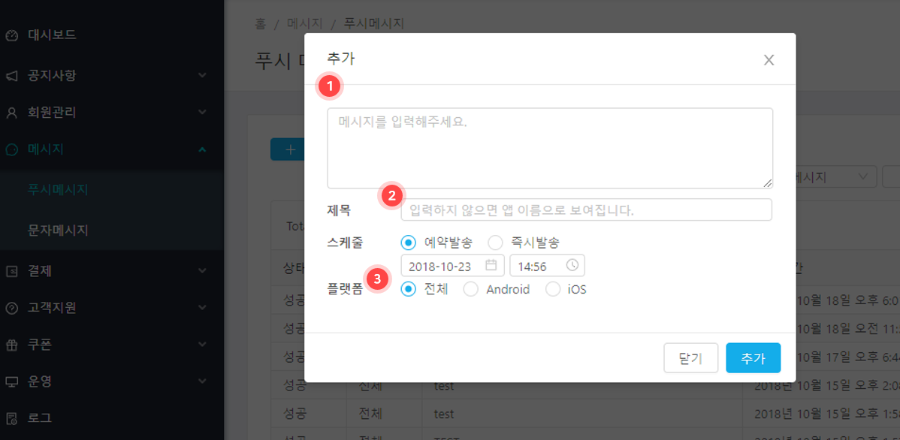

① 푸시 메시지 내용을 입력해 주세요.

② 제목은 필요에 따라 입력해 주시고 미입력 시 앱 이름이 제목으로 보입니다.

③ 플랫폼을 지정하여 지정된 플랫폼 유저들만 푸시를 받을 수 있습니다.

#### 문자메시지

SMS/LMS 발송, 이력 및 결과 조회 등의 기능을 사용할 수 있습니다. SMS/LMS를 발송하려면 먼저 NAVER CLOUD PLATFORM의 SENS에서 서비스 키 발급과 발신 번호 등록이 필요합니다.

① SENS와 연동하기 위해서는 우선 서비스 키를 발급과 발신번호 등록을 해야 합니다. **서비스 키 발급** 버튼을 클릭하여 [SENS 공통 가이드](../sens/sens-1-2.md)와 [SENS SMS 사용 가이드](../sens/sens-1-3.md)를 참고하여 서비스 키  발급과 발신 번호를 등록합니다.

② **설정** 버튼을 클릭하여 서비스 ID와 Secret Key를 입력하여 주세요.

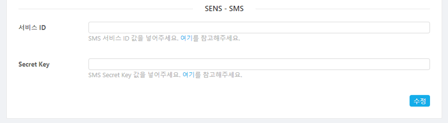

**메시지 추가** 버튼을 클릭합니다. 아래와 같은 팝업이 노출됩니다.

① SMS 단문메시지, LMS 장문 메시지입니다. 메시지에 따라 가격이 상이합니다.

② 네이버 클라우드 콘솔에 등록하신 발신번호를 입력해 주세요.(등록되지 않은 번호는 발송이 되지 않습니다.)

③ SMS,LMS로 발송될 수신 번호를 입력할 수 있습니다. 

④ SMS,LMS 수신 번호/쿠폰 난수 번호 등이 다량일 경우, CSV 형태의 파일로 구성할 수 있으며 이에 대한 샘플 파일을 다운로드 받을 수 있습니다.

⑤ SMS,LMS 수신 번호/쿠폰 난수 번호 등이 다량일 경우, CSV 형태의 파일로 구성하여 업로드 할 수 있습니다. 업로드 된 SMS,LMS 수신 번호 및 쿠폰 난수 번호는 ⑥의 메세지 내용 중 지정된 항목에 매칭되어 자동으로 입력 및 SMS,LMS로 발송됩니다.

⑥ SMS, LMS로 발송될 메시지 내용을 입력해 주세요.

⑦ 예약시간을 지정하시면 지정된 시간에 메시지가 발송됩니다.

### 쿠폰

게임 내에 필수적으로 사용되는 쿠폰 기능은 일반 쿠폰, 키워드 쿠폰을 지원합니다.

#### 일반쿠폰

일반 쿠폰은 일반적으로 코드 형태로 되어 있는 쿠폰입니다. 게임 내에서 사용될 쿠폰을 쉽게 생성 및 관리 하실 수 있는 기능입니다. **+쿠폰생성**을 클릭하면 아래와 같은 팝업이 나타나고 이를 통해 쿠폰을 생성할 수 있습니다.

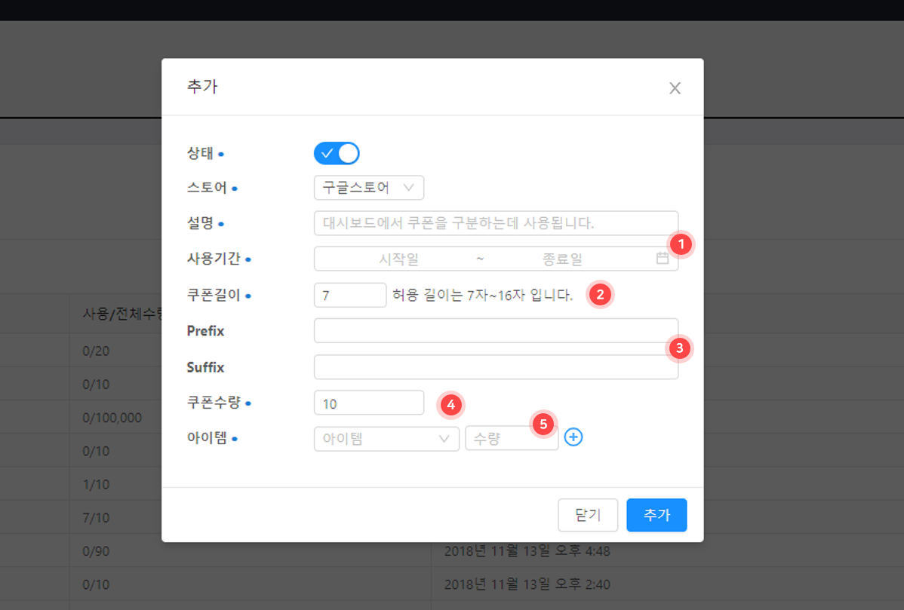

① 사용기간을 지정하여 해당 기간이외에는 쿠폰이 사용되지 않도록 합니다.

② 쿠폰 길이에 따라서 만들 수 있는 쿠폰이 제한이 있습니다. 8~10 사이가 생성하시면 됩니다.

③ Prefix(접두사), Suffix(접미사)를 지정한 경우 쿠폰번호 생성 시 지정된 문구가 붙습니다.

④ 쿠폰 수량은 최대 10만개 생성 가능하며, 생성 후에 증가시킬 수 있습니다. (최대 쿠폰 수는 50만개 입니다.)

⑤ 쿠폰 사용 시 지급되는 아이템과 아이템의 수량을 지정할 수 있습니다. + 버튼을 통해 복수의 아이템을 지급할 수 있습니다.

쿠폰 생성이 완료되면 생성된 쿠폰 리스트가 아래와 같이 나타납니다.

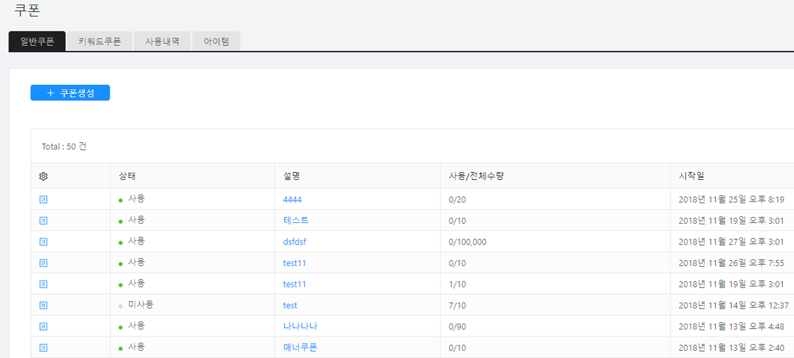

쿠폰의 현재 상태와 사용량 제한수량 등을 확인하실 수 있습니다.

리스트에서 기존에 생성된 쿠폰 수량을 변경할 수 있어 손쉽게 쿠폰 수량을 증가시킬 수 있습니다.

① 리스트에서 가장 앞쪽에 파란색 아이콘을 클릭하면 쿠폰 추가 팝업이 노출됩니다.

② 팝업된 설정창에서 추가 개수를 입력하여 쿠폰을 추가하면 됩니다.

#### 키워드 쿠폰

'크리스마스','오픈이벤트','새해'와 같이 지정된 키워드를 생성하고 해당 키워드를 쿠폰창에 입력시에 아이템을 지급하는 기능입니다.  최근 쿠폰 코드 입력이 복잡하여 게임 사용자의 편의를 위해 키워드 쿠폰이 많이 활용됩니다.

**+쿠폰 생성**을 클릭합니다.

① 쿠폰을 사용가능한 기간을 지정합니다.

② 쿠폰을 지급할 키워드를 입력합니다.

③ 제한 수량을 초과하지 않고 지급이 가능합니다.

④ 쿠폰 사용 시 지급되는 아이템과 아이템의 수량을 지정할 수 있습니다. + 버튼을 통해 복수의 아이템을 지급할 수 있습니다.

#### 사용내역

전체 발급된 쿠폰 번호를 조회하실 수 있습니다. 

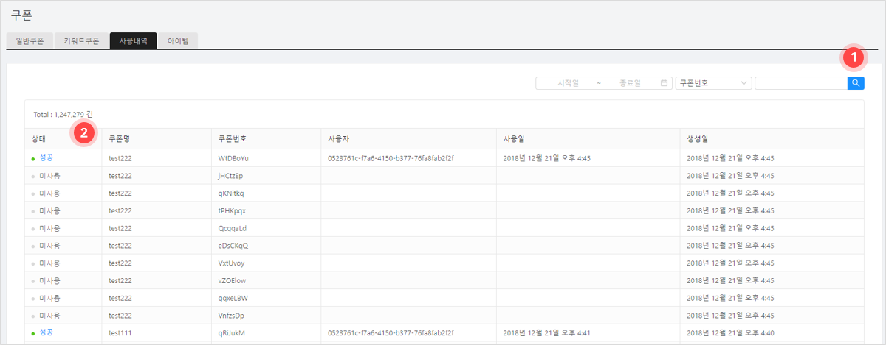

① 기간, 쿠폰 번호, 사용자 ID 등으로 지정하여 쿠폰 사용 여부를 검색할 수 있습니다.

② 발급된 쿠폰에 대하여 사용 여부를 확인할 수 있습니다.

-  성공 : 쿠폰 사용 완료 상태
- 미사용 : 쿠폰 미사용 상태

#### 아이템

아이템 메뉴에서는 쿠폰을 통해 획득 가능한 쿠폰 아이템을 생성할 수 있는 메뉴입니다. **아이템 추가** 버튼을 클릭하여 아이템을 추가할 수 있습니다.
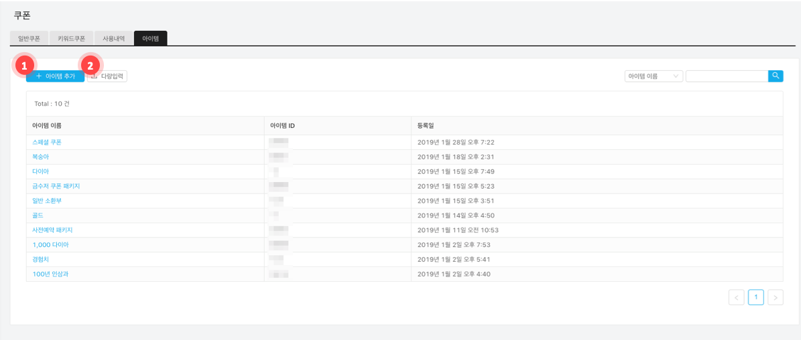

① 아이템을 추가 할 수 있습니다.

② **다량입력** 버튼을 클릭하면 아이템을 CSV 파일로 한번에 등록할 수 있습니다.

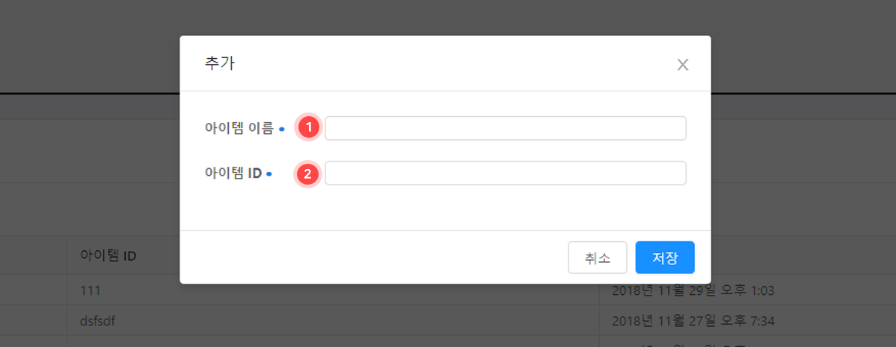

① 아이템의 이름을 입력합니다.

② 아이템 ID를 입력합니다. 아이템 ID는 아이템마다 고유해야 합니다.

### 고객지원

고객이 게임 내에서 문의를 남겼을 경우 조회하고 답변할 수 있는 기능입니다. 게임 내 고객지원 창에서 기본 정보를 입력할 수 있도록 되어 있는 경우 GAMEPOT에서도 해당 정보를 확인하실 수 있습니다.

#### 고객지원

고객이 문의한 내역을 확인하실 수 있습니다.

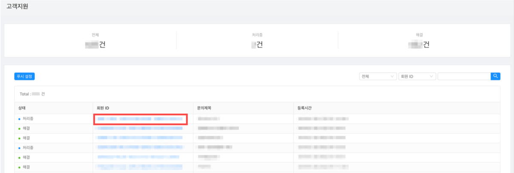

**회원 ID**를 클릭합니다.

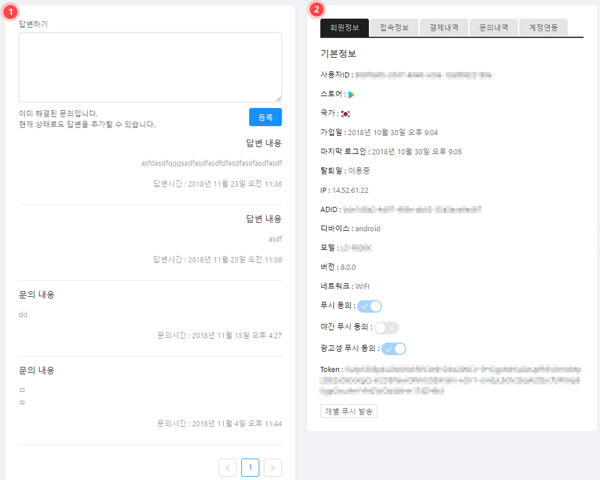

① 문의한 고객의 정보를 확인할 수 있습니다. (답변 만족도는 문의 종료 후 고객이 만족도를 선택해야 노출됩니다.)

② 문의에 대해 답변할 수 있습니다.

③ 답변에 필요한 이미지 및 텍스트 파일을 업로드 할 수 있습니다.

④ 고객과 문의/답변한 내역입니다. 채팅 형식으로 그 동안의 모든 내용을 확인하실 수 있습니다.

⑤ 답변 등록 알람 설정을 한 경우에 노출되며, 답변 등록시 푸시 발송 여부를 선택할 수 있습니다.

⑥ 해당 회원에 대한 모든 정보를 기본적으로 표시합니다.

#####푸시 설정

고객에게 답변을 할 경우 고객에게 푸시를 발송하는 기능입니다.

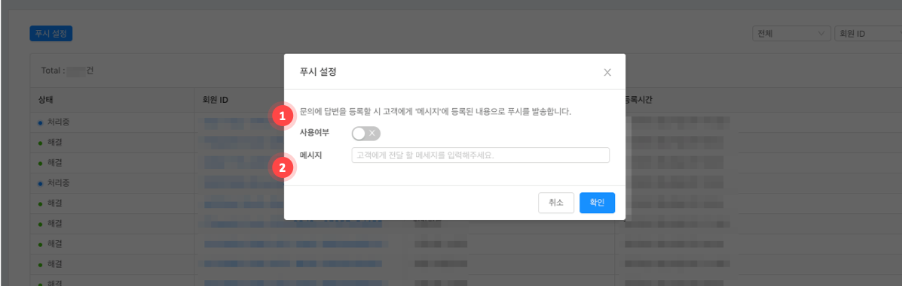

① 사용여부를 체크하면 기능이 동작합니다.

② 고객에게 발송할 푸시 메시지 입니다.

#### 이용약관 설정

사내 이용약관 내용을 입력할 수 있습니다. 이 내용은 SDK를 통해 사용자에게 노출 할 수 있습니다.

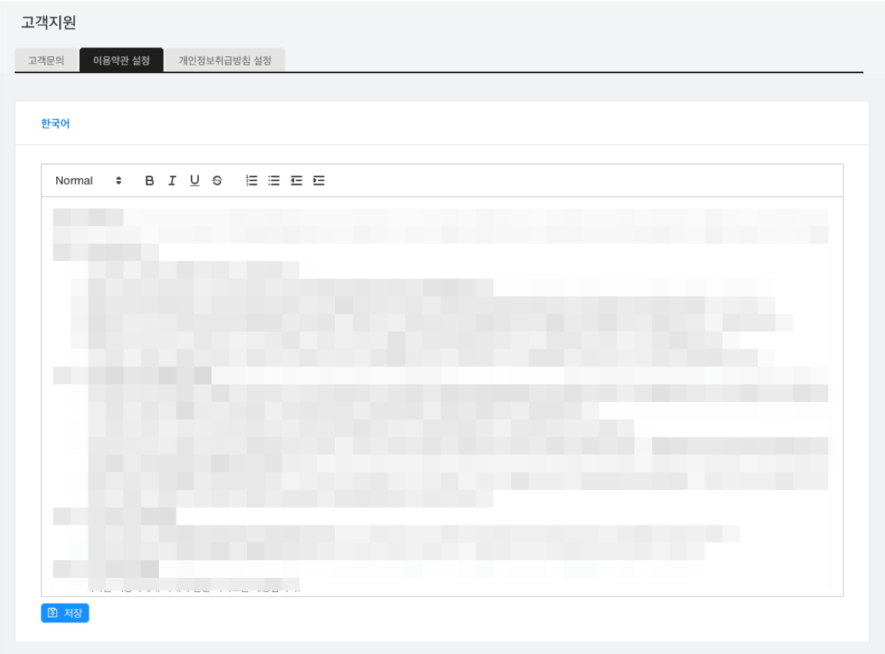

#### 개인정보 취급 방침 설정

사내 개인정보 취급 방침 내용을 입력할 수 있습니다. 이 내용은 SDK를 통해 사용자에게 노출 할 수 있습니다.

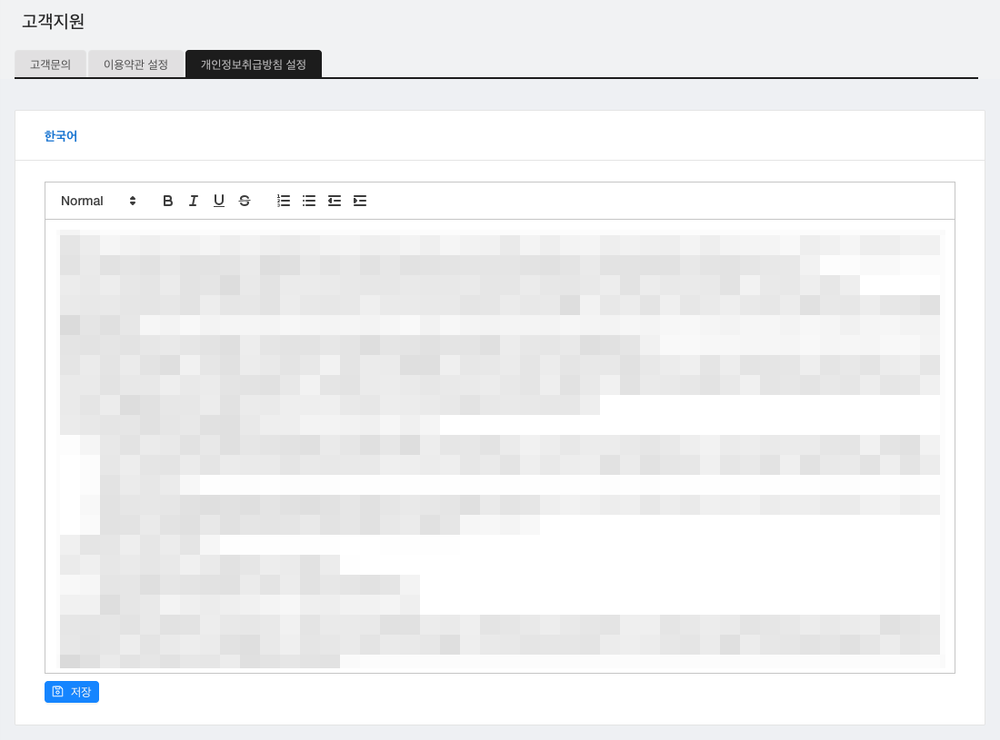

### 사전예약

사전 예약 기능은 사전예약 웹페이지를 통해 등록한 사용자의 통계를 보여주는 기능입니다. 

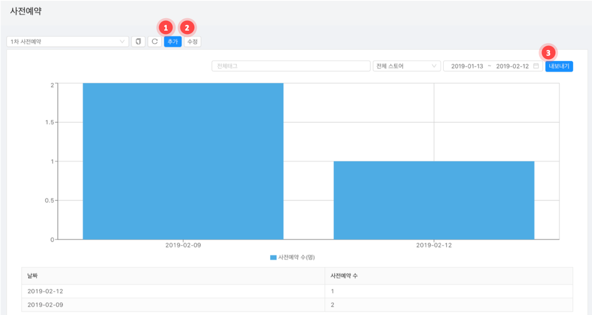

① 사전예약을 추가 할 수 있습니다. 사전예약명은 통계 산출을 위한 ID로 활용됩니다. 

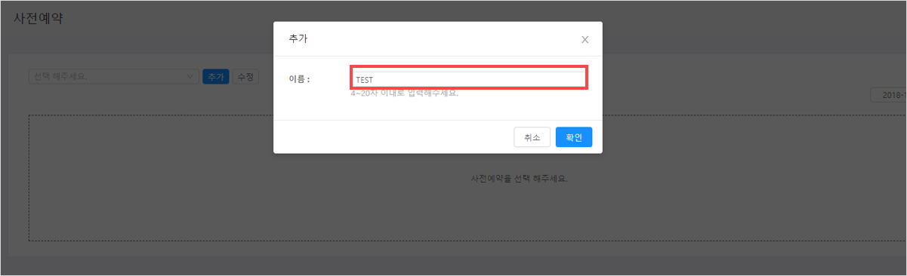

② 사전예약명을 수정할 수 있습니다.

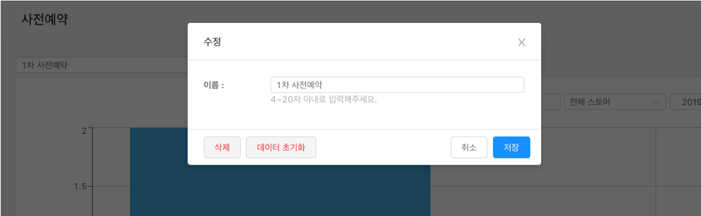

③ 사전예약 신청자를 다운로드 받을 수 있습니다.

향후 사전 예약자에게 대량 문자 발송이 가능하도록 기능을 추가할 예정입니다.

### 원격구성

원격구성 기능은 앱을 업데이트 하지 않고 앱의 동작과 모양을 변경할 수 있도록 하는 기능입니다. 서버에 매개변수를 추가하고 해당 값을 GAMEPOT SDK에서 불러와 사용하실 수 있습니다. 따라서 게임 내에 기능을 서버에서 제어하고자 하는 경우 이 기능을 이용하면 쉽게 적용 및 제어가 가능합니다.

**추가** 버튼을 클릭합니다. 아래와 같은 팝업 창이 노출되면, 매개변수와 값을 입력합니다.

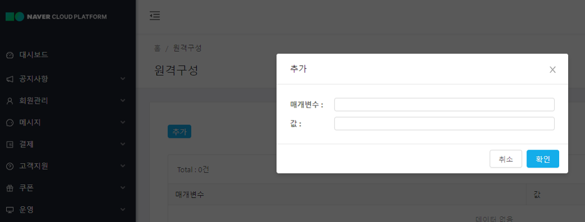

해당 매개변수와 값이 반영되는 시점은 새롭게 앱을 실행하는 유저부터 반영됩니다.

### 프로젝트 설정

#### 일반

앱의 전반적인 환경을 설정하고 앱을 운영하기 위한 다양한 키값을 입력하실 수 있습니다.

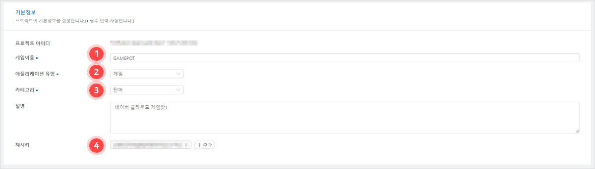

① 게임이름을 적어주세요.

② 애플리케이션 유형을 선택할 수 있습니다.

③ 카테고리를 선택할 수 있습니다.

④ 해시키를 입력할 수 있습니다. 

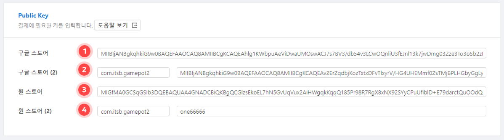

구글 스토어와 원 스토어와 연동하기 위해 설정하는 항목입니다.

① 구글 스토어 Public key 값을 입력합니다.

② 구글 스토어에서 동일한 게임을 2가지 버전으로 출시할 경우(예를 들어 12세, 18세), 패키지 명을 앞에 넣고 뒤에 Public key 값을 넣습니다.

③ 원 스토어 Public key 값을 입력합니다.

④ 원 스토어에서 동일한 게임을 2가지 버전으로 출시할 경우(예를 들어 12세, 18세), 패키지 명을 앞에 넣고 뒤에 Public key 값을 넣습니다.

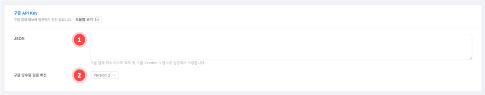

구글 API 연동(구글스토어 결제 취소자 목록 확인 및 최신버전의 결제 영수증 검증)에 필요한 설정 항목입니다.

1. 구글에서 제공하는 JSON 데이터를 입력합니다. '도움말 보기'를 참고하세요.
2. 결제 영수증 검증 버전입니다. 1번 항목에 데이터를 입력 했다면 'Version 3'로 선택하세요.

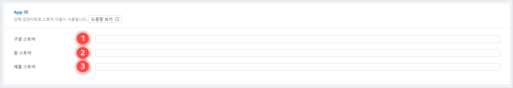

① 구글 스토어 ID를 입력합니다.

② 원 스토어의 ID를 입력합니다.

③ 앱 스토어의 ID를 입력합니다.

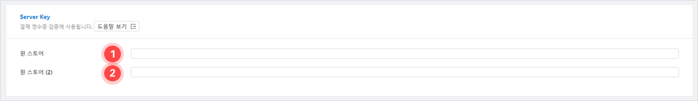

원 스토어에서 인앱 결제를 하고 아이템 지급을 요청하기 위해서 사전에 설정해야 하는 정보입니다.

① 원 스토어의 라이선스 키를 입력합니다.

② 두 가지 버전으로 출시하는 경우 다른 버전의 라이선스 키를 입력합니다.(두 가지 버전이 아닌 경우 입력하지 않아도 됩니다.)

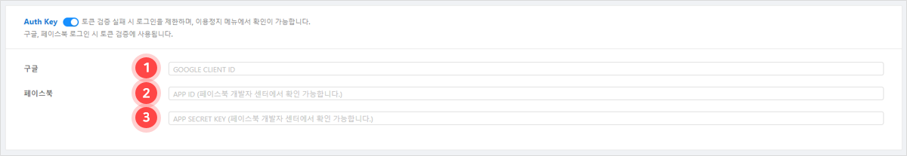

Auth Key 항목은 구글, 페이스북 로그인 시 토큰 검증에 사용되며, 토큰 검증 실패 시 게임 유저의 로그인을 제한합니다. 로그인이 제한된 게임 유저는 이용정지 메뉴에 자동으로 등록됩니다. 

① 구글의 Client ID값을 입력합니다.

② 페이스북의 App ID값을 입력합니다. 

③ 페이스북의 App Secret Key값을 입력합니다.

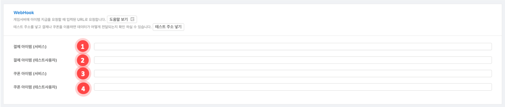

WebHook 항목에 결제 아이템은 결제 성공 시 아이템 지급을 요청하는 주소를 입력합니다.

쿠폰 아이템은 SDK를 이용하여 쿠폰 사용 성공시 SDK 서버에서 개발사 서버로 성공에 대한 처리(아이템 지급)를 요청하는 주소이며,
실 서비스에 이용되는 주소(서비스)과 서비스 중 테스트 환경이 필요한 경우의 주소(테스트사용자)가 제공됩니다.
테스트사용자 주소로 동작하게 하려면 '프로젝트 설정 > 테스트 사용자'에 추가해 주셔야 합니다.

① 결제 아이템의 서비스용 URL을 입력합니다.

② 결제 아이템의 테스트사용자용 URL을 입력합니다.

③ 쿠폰 아이템의 서비스용 URL을 입력합니다.

④ 쿠폰 아이템의 테스트사용자용 URL을 입력합니다.

#### Ncloud

네이버 클라우드 플랫폼과 연동하기 위한 키값을 추가 변경하실 수 있습니다.
자세한 사용법은 붉은색 박스 부분을 클릭하여 사용자 가이드를 참고.

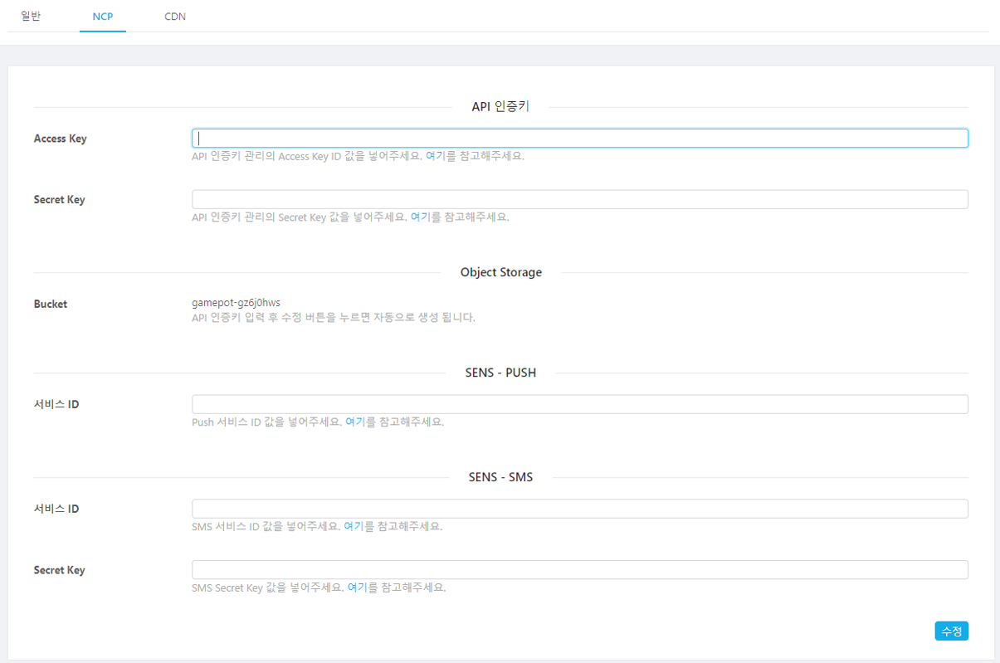

#### CDN

CDN을 이용하고자 할 경우 아래 CDN 주소를 입력해 주세요.

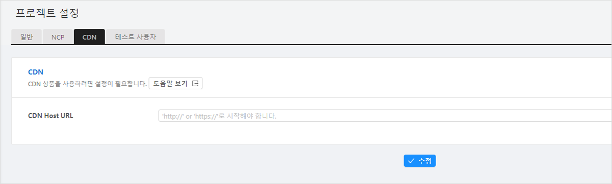

**CDN 주소 입력 시 주의 사항**

* 반드시 CDN의 원본은 [공지사항] 기능에 사용되는 Object Storage가 설정되어야 합니다.
* 입력한 CDN이 없거나 URL 오타, 또는 원본 설정이 잘못되었을 경우, 업로드된 이미지가 게임상에 정상적으로 보이지 않게 됩니다.

#### 외부결제

원스토어의 경우 기본 스토어 결제 모듈이 아닌 제 3의 결제모듈을 허용하고 있습니다.

지원중인 PG사는 다날이며 지속적으로 추가될 예정입니다.

#####설정

결제 수단별로 필요한 값은 다날을 통해 얻고 **Store Secret key** 는 원스토어 콘솔에 **Client secret** 값을 입력하세요.

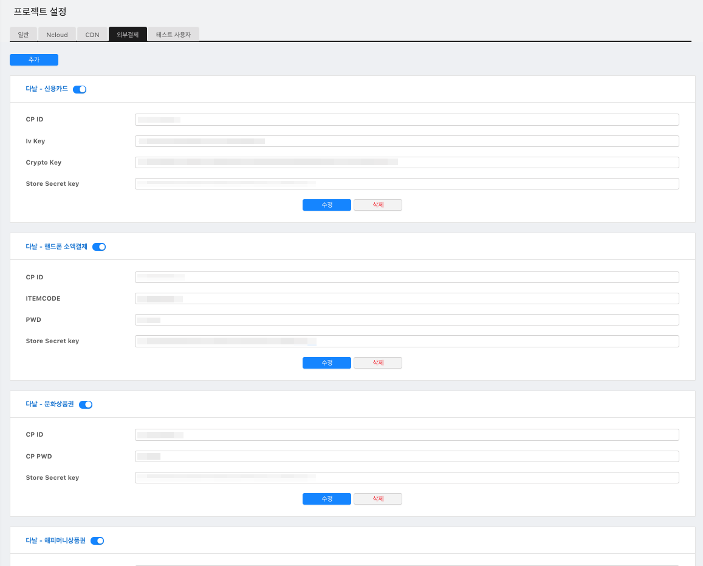

##### 가격 입력

결제 - IAP 메뉴에서 인앱 아이템 별로 사용자가 지불할 가격을 입력하세요. 

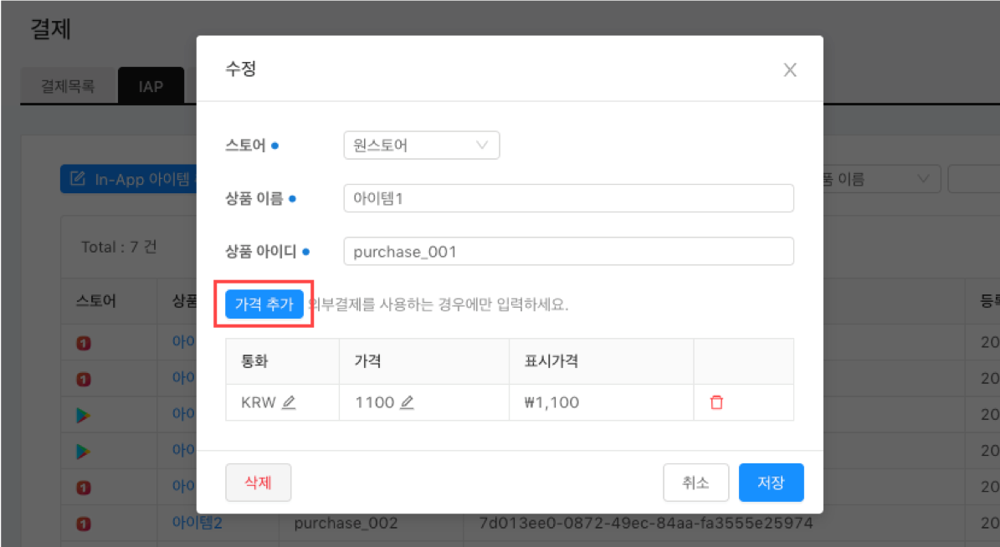

#### 테스트 사용자

등록된 아이피로 접속하는 경우 지정된 종류에 따라 아래 기능이 활성화됩니다.

* 개발 : SDK 로그가 활성화 되어 로그가 노출됩니다.
* 점검 : 점검 기능이 활성화 되어있더라도 무시하고 진행됩니다.
* 업데이트 : 업데이트 기능이 활성화 되어있더라도 무시하고 진행됩니다.

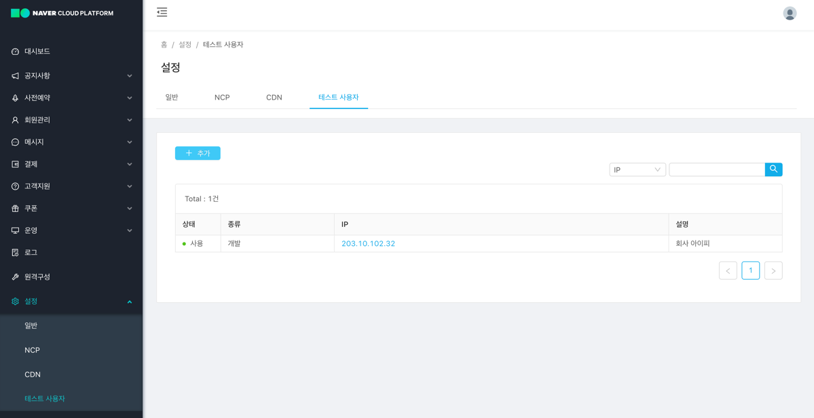

**추가** 버튼을 클릭합니다. 아래와 같은 팝업 창이 노출되면, 매개변수와 값을 입력합니다.

### 로그

로그는 NAVER CLOUD PLATFORM의 ELSA를 연동하여 게임 내 로그나 크래시 로그 등을 수집하실 수 있는 기능입니다. ELSA의 사용법은 [ELSA 이용 가이드](../elsa/elsa-1-1.md)를 참고하세요.

### 사용자 가이드

GAMEPOT 대시보드 사용 가이드 페이지로 이동합니다.

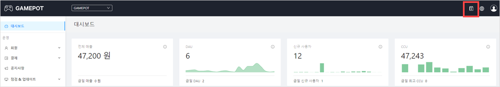

### 언어 변경

대시보드의 각 메뉴 등이 선택한 언어로 변경됩니다.

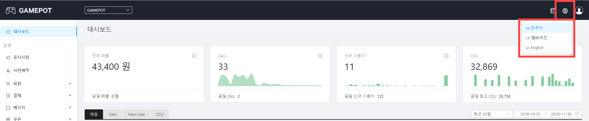

### 회원정보수정

대시보드 이용 계정의 이름, 비밀번호를 변경하실 수 있습니다.

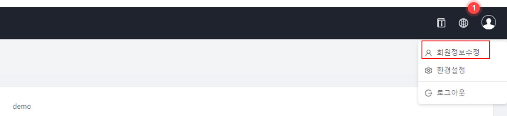

① 대시보드 우측 상단의 아이콘을 클릭하면 나타나는 드롭다운 메뉴 중 회원정보수정을 선택할 수 있습니다.

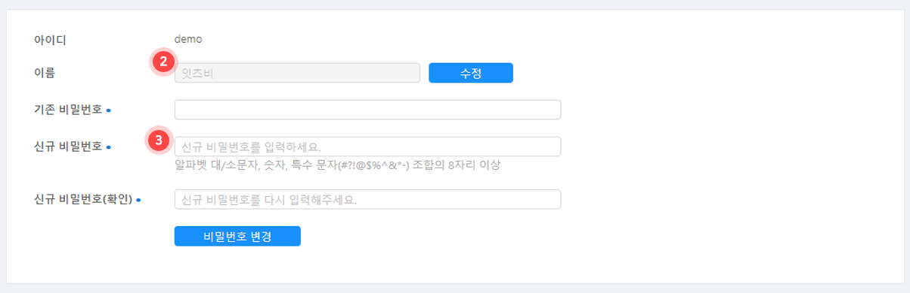

② 사용자의 이름을 변경할 수 있습니다.

③ 비밀번호를 변경할 수 있습니다.

### 환경설정

게임팟 대시보드 관리를 위한 사용자 관리, 업데이트, 시스템 기능 등이 있습니다.

#### 사용자

대시보드를 이용할 수 있는 사용자를 관리하는 메뉴로 사용자를 추가/삭제하실 수 있습니다.

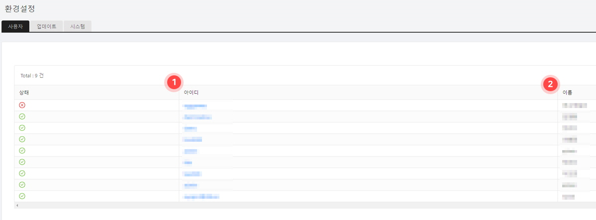

① 등록된 사용자 아이디입니다.

② 등록된 사용자 이름입니다.

#### 업데이트

게임팟 시스템을 최신의 버전으로 업데이트합니다.

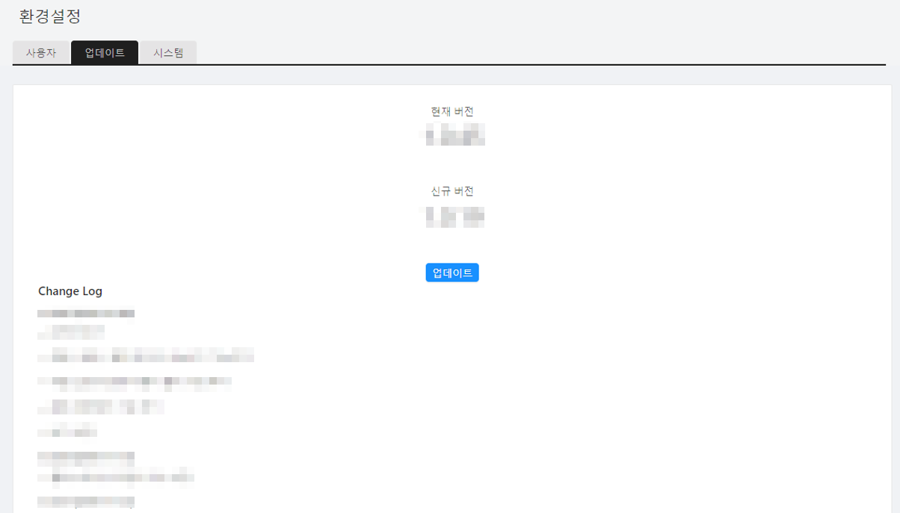

#### 시스템

현재 디스크 상태와 백업 현황을 파악하실 수 있습니다. 마지막 백업 시간을 확인하실 수 있습니다.

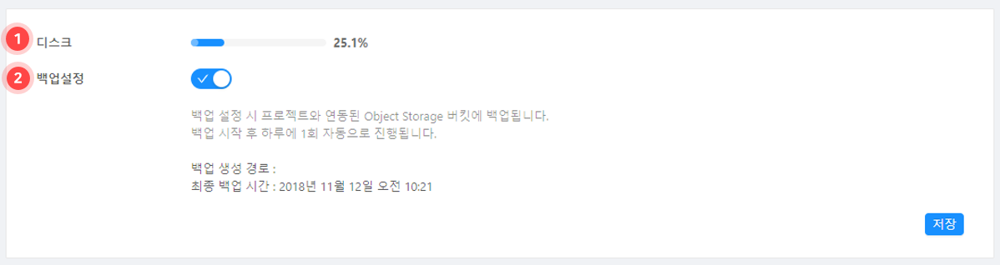

① 현재 시스템의 디스크 사용량입니다.

② 백업설정은 전체 DB에 대하여 하루에 한번 백업을 하며, Object Storage에 자동 저장됩니다.

※ 백업 주기는 백업설정을 활성화하는 시간으로부터 12시간마다 백업을 진행합니다.