# FAQ

## 구글

### 로그인이 안 돼요!

####Q. 로그인 시도시 바로 로그인 취소가 리턴됩니다.

####A. 필요한 환경이 올바로 설정 되지 않아 발생하는 현상입니다.

1. Firebase 설정 파일인 `google-service.json`파일이 프로젝트에 정상적으로 포함 됐는지 확인

2. APK 빌드 시 사용한 Keystore의 SHA-1값을 Firebase console에 추가했는지 확인

   > SHA-1값은 개발사에 요청합니다.

   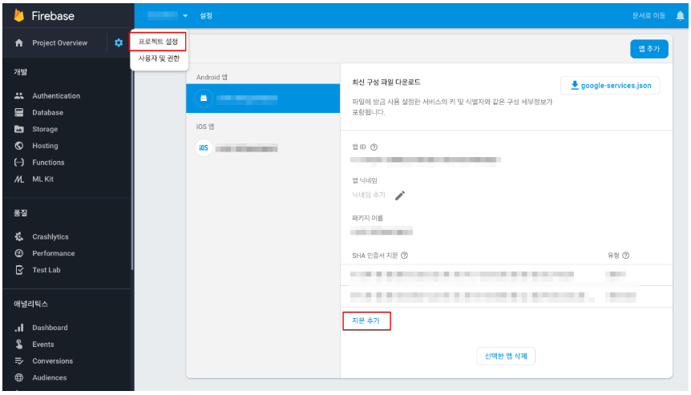

   * 구글 콘솔에서 `앱 서명`을 사용하는 경우 콘솔에서 만들어진 SHA-1값도 같이 넣어주셔야 합니다.

3. APK가 아래 내용이 적용된 빌드가 맞는지 확인

   1. Firebase 콘솔에서 Andorid 앱에 추가한 Package name으로 빌드 여부
   2. SHA-1을 추출한 Keystore로 빌드 여부

### 구글 결제가 안 돼요!

#### Q. 결제 시도시 'productid was wrong!' 문구가 노출됩니다.

#### A. GAMEPOT 대시보드 -> 결제 -> IAP에 스토어의 상품 아이디를 추가해주세요.

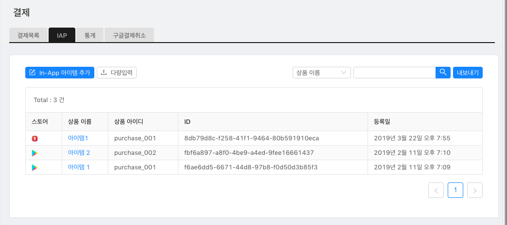

#### Q. 구글 결제 팝업은 노출되나 결제가 진행되지 않아요.

#### A. 구글 결제를 할 수 있는 환경이 올바로 설정되지 않아 발생하는 경우입니다. 아래 항목을 하나씩 체크하세요.

1. 콘솔에 앱이 `출시됨` 상태인지 확인

   > `프로덕션` 트랙이 아닌 `비공개`/`내부 테스트` 트랙에 올리시면 됩니다.

   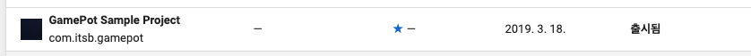

2. 콘솔 -> 출시 관리 -> 앱 버전 -> 트랙 -> 관리 -> 테스트 참여 대상 관리에 테스트 계정을 등록했는지 확인

   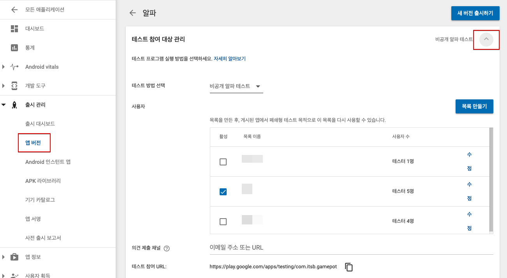

3. 테스트 참여 URL로 접속하여 테스트 참여를 신청했는지 확인

   

4. 콘솔 -> 설정에서 `라이선스 테스트`에 테스트 계정을 추가했는지 확인

   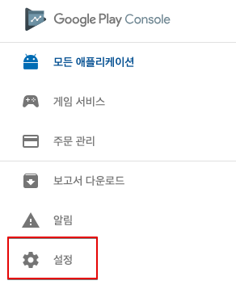

   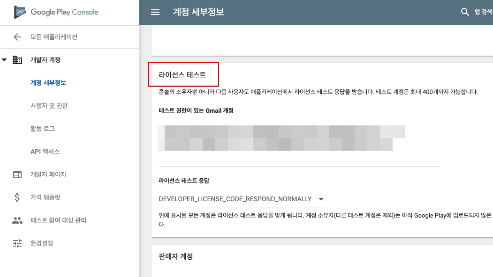

5. 단말기 -> 설정 -> 계정 메뉴에 테스트 참여한 계정만 남기고 모두 삭제 했는지 확인

## 원스토어

### 결제가 안 돼요!

####Q. '비정상 앱에서 결제가 요청되었습니다' 문구 노출됩니다.

#### A. 오픈 전에 앱은 테스트 계정만 접근이 가능합니다. 아래 사항을 확인하세요.

1. 테스트 계정이 등록 여부
2. 단말기에 설치된 원스토어 앱이 1번에서 등록한 테스트 계정으로 로그인 여부

#### Q. 결제시 [package] doesn't exist or wrong secret. 문구 노출됩니다.

#### A. GAMEPOT 대시보드에 원스토어 관련 키값이 정상 적용됐는지 다시 확인하세요.

1. APK의 Package name 이 원스토어에 등록된 패키지명과 동일 여부

   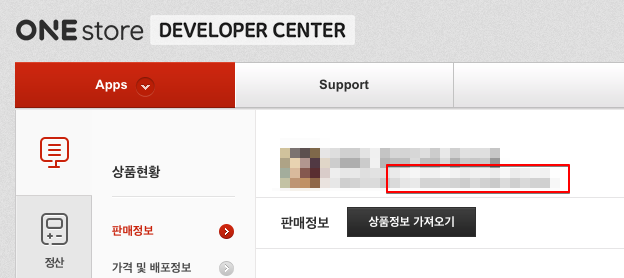

2. 원스토어 콘솔의 `라이선스 키` 적용 여부

   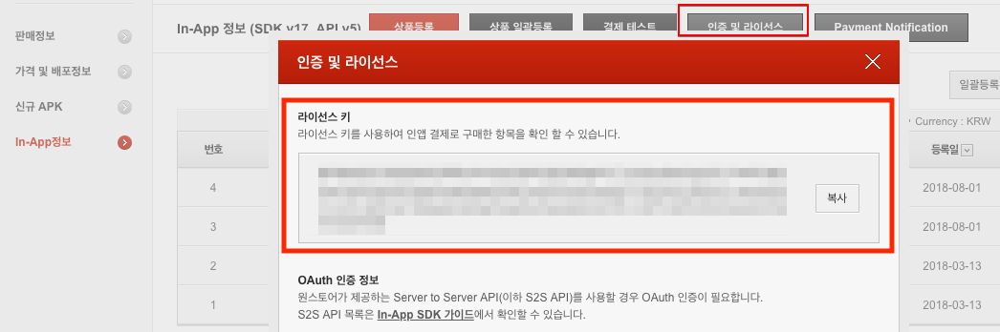

   위 값이 GAMEPOT 대시보드 아래 항목에 적용 여부

   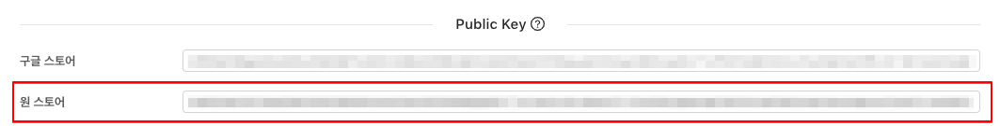

3. 원스토어 콘솔의 `Client secret` 적용 여부

   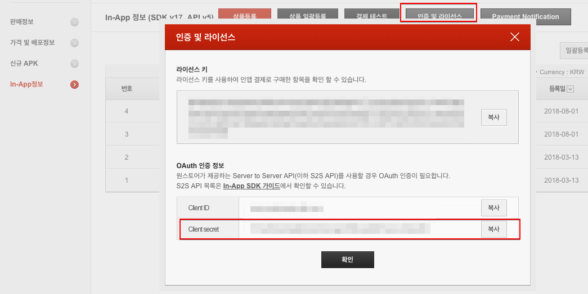

   위 값이 GAMEPOT대시보드 아래 항목에 적용 여부

   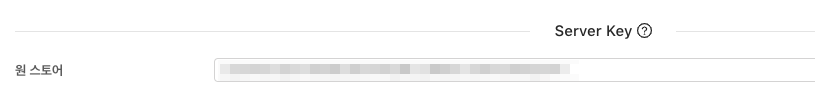

#### Q. 결제 완료 후 "영수증 검증에 실패했습니다." 문구와 함께 결제가 실패합니다.

#### A. 원스토어에 영수증 검증 요청 시 리얼/테스트 환경의 문제가 발생한 경우입니다.

원스토어 콘솔에서 테스트 계정으로 등록한 계정으로 결제시 원스토어에 영수증 검증 API도 테스트 환경 주소로 보내야 합니다. GAMEPOT에서 이를 구분하는 방법은 아래 GAMEPOT 대시보드에서 `테스트 사용자` 항목에 활성화가 돼있어야 합니다.

따라서, 우선 테스트 사용자를 등록 후 결제 테스트를 진행 하세요.

> 추가시 종류는 결제/쿠폰으로, 아이피는 단말기의 외부 네트워크 아이피를 넣어주시면 됩니다.

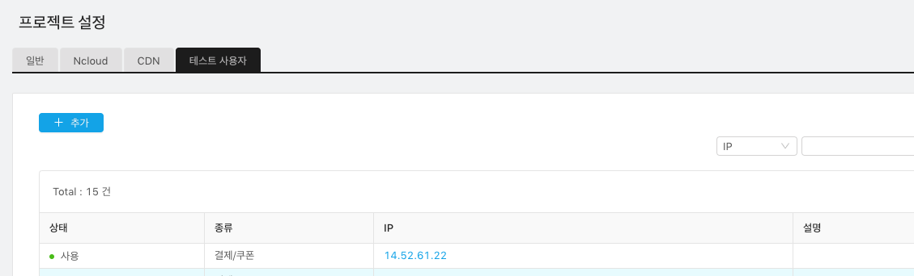