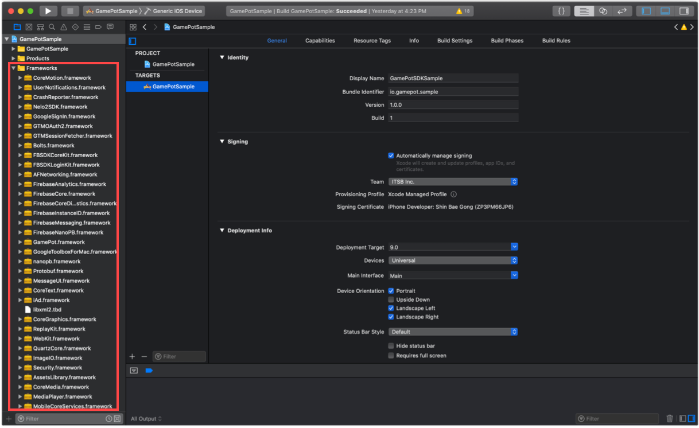
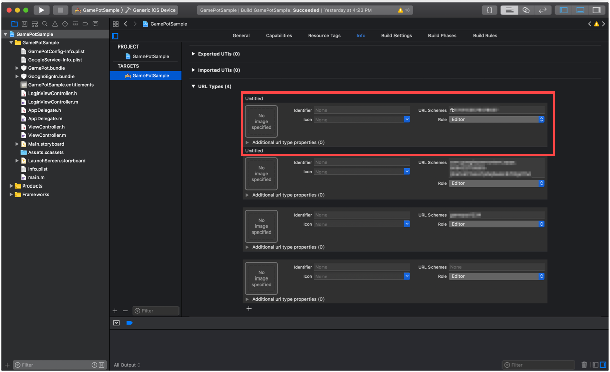

---
search:
  keyword: ['gamepot']
---

## 1. 시작하기

#### Step 1. 개발환경 구성

iOS용 애플리케이션 개발을 위해서는 개발 툴(Xcode)을 설치해야 합니다. iOS에서 GAMEPOT을 사용하기 위한 시스템 환경은 다음과 같습니다.

- 운영체제: iOS 9.0 이상
- 개발 환경: Xcode

#### Step 2. Framework 추가



다운로드한 iOS SDK 파일을 Xcode 프로젝트 폴더 타겟에 마우스로 끌어다 놓아 추가합니다.

#### Step 3. Dependencies 추가

이용하고자 하는 서비스에 따라 필수 Dependencies 목록이 다릅니다.

서비스에 따라 다음 표를 참고하여 Dependencies를 추가합니다.

서비스별 Dependencies

| Service       | Framework                                                                                                                                                                                                                                                                                                                                    | Dependencies                                                                                                                                                                                                                                                                                                                                                                                                                                                                                                                                                       | bundle                                                  |
| ------------- | -------------------------------------------------------------------------------------------------------------------------------------------------------------------------------------------------------------------------------------------------------------------------------------------------------------------------------------------- | ------------------------------------------------------------------------------------------------------------------------------------------------------------------------------------------------------------------------------------------------------------------------------------------------------------------------------------------------------------------------------------------------------------------------------------------------------------------------------------------------------------------------------------------------------------------ | ------------------------------------------------------- |
| 기본(Base)    | AFNetworking.framework<br />FirebaseAnalytics.framework<br />FirebaseCore.framework<br />FirebaseCoreDiagnostics.framework<br />FirebaseInstanceID.framework<br />FirebaseMessaging.framework<br />FirebaseNanoPB.framework<br />GamePot.framework<br />GoogleToolboxForMac.framework<br />nanopb.framework<br />Protobuf.framework<br />    | libz.tbd<br />WebKit.framework<br />UserNotifications.framework<br />                                                                                                                                                                                                                                                                                                                                                                                                                                                                                              | GamePot.bundle<br />                                    |
| 로그인(Login) | [ Base ]<br />GamePotChannel.framework<br /><br />[ Google Sign In ]<br />GamePotGoogleSignIn.framework<br/>GoogleSignIn.framework<br />GTMOAuth2.framework<br />GTMSessionFetcher.framework<br /><br />[ Facebook ]<br />Bolts.framework<br/>FBSDKCoreKit.framework<br />FBSDKLoginKit.framework<br />GamePotFacebook.framework<br /><br /> | [ Google Sign In ]<br />SafariServices.framework<br />[ Facebook ]<br />SafariServices.framework<br /><br />                                                                                                                                                                                                                                                                                                                                                                                                                                                       | [ Google Sign In ]<br />GoogleSignIn.bundle<br /><br /> |
| 광고(AD)      | [ Base ]<br />GamePotAd.framework<br /><br />[ Facebook ]<br />Bolts.framework<br/>FBSDKCoreKit.framework<br/>GamePotAdFacebook.framework<br /><br />[ Adbirx ]<br />AdBrix.framework<br />GamePotAdAdbrix.framework<br />IgaworksCore.framework<br /><br />[ Adjust ] <br />AdjustSdk.framework<br />GamePotAdAdjust.framework<br />        | [ Facebook ]<br /><br />[ Adbrix ]<br />MessageUI.framework<br />libxml2.tbd<br />iAd.framework<br />CoreTelephony.framework<br />UIKit.framework<br />CoreGraphics.framework<br />CoreText.framework<br />MobileCoreServices.framework<br />SystemConfiguration.framework<br />Security.framework<br /><br />[ Adjust ] <br />AdSupport.framework<br />                                                                                                                                                                                                           |                                                         |
| GameCenter    | GamePotGameCenter.framework                                                                                                                                                                                                                                                                                                                  |                                                                                                                                                                                                                                                                                                                                                                                                                                                                                                                                                                    |                                                         |
| NaverCafe     | AFNetworking.framework<br/>GamePotNavarCafe.framework<br />NaverCafeSDK.framework<br />                                                                                                                                                                                                                                                      | AVKit.framework<br />AVFoundation.framework<br />MediaPlayer.framework<br />CoreMedia.framework<br />AssetsLibrary.framework<br />ImageIO.framework<br />QuartzCore.framework<br />ReplayKit.framework(Optional로 설정)<br />MobileCoreServices.framework<br />SystemConfiguration.framework<br />Security.framework<br />WebKit.framework<br />libNaverLogin.a<br/>NaverThirdPartyConstantsForApp.h<br />NaverThirdPartyLoginConnection.h<br />NLoginThirdPartyOAuth20InAppBrowserViewController.h<br />NLoginThirdPartyOAuth20InAppBrowserViewController.m<br /> | NaverAuth.bundle<br/>NaverCafeSDK.bundle<br />          |
|               |                                                                                                                                                                                                                                                                                                                                              |                                                                                                                                                                                                                                                                                                                                                                                                                                                                                                                                                                    |                                                         |


#### Step 4. Bundle Resource 추가

이용하고자 하는 서비스에 따라 Bundle Resource 파일을 추가해야 합니다.

서비스별 Dependencies 표를 참고하여 Bundle Resource 파일을 추가합니다.


#### Step 5. InfoPlist 추가


GAMEPOT SDK는 Google Firebase를 사용합니다. 따라서 Google Firebase를 설정하여 생성된 GoogleService-Info.plist를 프로젝트에 추가합니다.

GAMEPOT SDK의 기본설정 값을 포함하고 있는 GamePotConfig-Info.plist 파일도 추가합니다. GamePotConfig-Info.plist 파일이 없다면 동일한 파일명으로 생성 후 키에 해당하는 값을 입력합니다.

**GamePotConfig-Info.plist 설정**


```xml
gamepot_project_id : GAMEPOT 프로젝트 아이디
gamepot_elsa_projectid : GAMEPOT 로그 프로젝트 아이디(optional)
gamepot_api_url : 게임팟 API URL
```

#### Step 6. 빌드 옵션 추가

**Build Settings > Linking > Other Linker Flags** 섹션에 -ObjC 옵션을 추가합니다.


#### Step 7. Google Sign In 로그인 환경 설정

서비스별 Dependencies 표의 **Login > Google Sign In**을 참고하여 Framework 및 Dependencies를 추가합니다.

GoogleService-Info.plist 파일의 `REVERSED_CLIENT_ID` 값을 복사하여 **Info > URL Types**에 항목을 추가하여 URL Schemes에 값을 입력합니다.



**GamePotConfig-Info.plist 설정**


```xml
gamepot_google_app_id : GoogleService-Info.plist 파일의 CLIENT_ID 값
gamepot_google_url_schemes : GoogleService-Info.plist 파일의 REVERSED_CLIENT_ID 값
```

#### Step 8. Facebook 로그인 환경 설정

서비스별 Dependencies 표의 **Login > Facebook**을 참고하여 Framework 및 Dependencies를 추가합니다.

Facebook App ID를 **Info > URL Types**에 fb+Facebook App ID 형태로 추가합니다.


**Info > iOS Target Property**의 **LSApplicationQueriesSchemes**에 아래 항목을 추가합니다.

- fbapi
- fb-messenger-share-api
- fbauth2
- fbshareextension


**GamePotConfig-Info.plist 설정**


```xml
gamepot_facebook_app_id : Facebook App ID
gamepot_facebook_display_name : Facebook display name
```

## 2. 초기화

AppDelegate 파일에 아래 부분을 추가합니다.

```objc
#import <GamePot/GamePot.h>

- (BOOL)application:(UIApplication *)application didFinishLaunchingWithOptions:(NSDictionary *)launchOptions {
    ...
    // GamePot SDK Initialize
    [[GamePot getInstance] setup];

    // Push Permission
    if(SYSTEM_VERSION_GRATERTHAN_OR_EQUALTO(@"10.0"))
    {
        UNUserNotificationCenter *center = [UNUserNotificationCenter currentNotificationCenter];
        center.delegate = self;
        [center requestAuthorizationWithOptions:(UNAuthorizationOptionSound | UNAuthorizationOptionAlert | UNAuthorizationOptionBadge) completionHandler:^(BOOL granted, NSError * _Nullable error){
            if(!error){
                dispatch_async(dispatch_get_main_queue(), ^{
                    [[UIApplication sharedApplication] registerForRemoteNotifications];
                });
            }
        }];
    }
    else
    {
        // Code for old versions
        UIUserNotificationType allNotificationTypes = (UIUserNotificationTypeSound | UIUserNotificationTypeAlert | UIUserNotificationTypeBadge);
        UIUserNotificationSettings *settings = [UIUserNotificationSettings settingsForTypes:allNotificationTypes categories:nil];
        [application registerUserNotificationSettings:settings];
        [application registerForRemoteNotifications];
    }
    ...
}

 // Push
- (void)application:(UIApplication *)application didRegisterForRemoteNotificationsWithDeviceToken:(NSData *)deviceToken
{
    ...
    [[GamePot getInstance] handleRemoteNotificationsWithDeviceToken:deviceToken];
    ...
}

- (void)applicationWillEnterForeground:(UIApplication *)application {
    [[GamePotChat getInstance] start];
}

- (void)applicationDidEnterBackground:(UIApplication *)application {
    [[GamePotChat getInstance] stop];
}
```

## 3. 로그인, 로그아웃, 회원 탈퇴

구글, 페이스북, 네이버 등 다양한 로그인 SDK를 통합하여 사용할 수 있습니다.

#### Step 1. 설정

```objc
// AppDelegate.m
#import <GamePotChannel/GamePotChannel.h>

// Google Login 사용 시
#import <GamePotGoogleSignIn/GamePotGoogleSignIn.h>

// Facebook Login 사용 시
#import <GamePotFacebook/GamePotFacebook.h>

- (BOOL)application:(UIApplication *)application didFinishLaunchingWithOptions:(NSDictionary *)launchOptions {
    ...
    // GamePotSDK 채널 초기화. 사용하려는 채널별로 addChannel을 사용해야만 하며,
    // Guest 방식은 기본으로 포함됩니다.
    // Google Login 초기화
    GamePotChannelInterface* google     = [[GamePotGoogleSignIn alloc] init];
    [[GamePotChannelManager getInstance] addChannelWithType:GOOGLE interface:google];

    // Facebook 로그인 초기화
    GamePotChannelInterface* facebook   = [[GamePotFacebook alloc] init];
    [[GamePotChannelManager getInstance] addChannelWithType:FACEBOOK interface:facebook];

    // 로그인 처리를 위해 필요합니다.
    [[GamePotChannel getInstance] application:application didFinishLaunchingWithOptions:launchOptions];

    ...
}

- (BOOL)application:(UIApplication *)app openURL:(NSURL *)url options:(NSDictionary<UIApplicationOpenURLOptionsKey,id> *)options
{
    // 로그인 처리를 위해 필요합니다.
    BOOL nChannelResult = [[GamePotChannel getInstance] application:app openURL:url options:options];
    return nChannelResult;
}
```

#### Step 2. 로그인

로그인 버튼 클릭 시에 연동합니다.

```objc
#import <GamePotChannel/GamePotChannel.h>
// 로그인 타입 정의
// GamePotChannelType.GOOGLE
// GamePotChannelType.FACEBOOK
// GamePotChannelType.GUEST

// 구글 로그인 버튼 클릭 시에 호출
[[GamePotChannel getInstance] Login:GOOGLE viewController:self success:^(GamePotUserInfo* userInfo) {
    // 로그인 완료
} cancel:^{
    // 로그인 시도 중 유저가 취소 하였을 때
} fail:^(NSError *error) {
    // 로그인 중 오류 발생
    // TODO: 게임 팝업으로 실패 원인에 대한 문구를 노출시켜 주세요.
    // TODO: 문구는 [error localizedDescription]를 사용해 주세요.
}];

```

#### Step 3. 자동 로그인

GAMEPOT은 자동 로그인을 지원합니다.

```objc
#import <GamePotChannel/GamePotChannel.h>

// 마지막 로그인된 정보를 가져와서 해당 정보로 자동 로그인이 될 수 있도록 호출합니다.
// lastLoginType: 마지막 로그인 값을 가져올 수 있습니다.
GamePotChannelType type = [[GamePotChannel getInstance] lastLoginType];

if(type != NONE)
{
    // 마지막에 로그인했던 로그인 타입으로 로그인하는 방식입니다.
    // 자동 로그인 처리 시 아래와 같이 호출하면 됩니다.
    [[GamePotChannel getInstance] Login:type viewController:self success:^(GamePotUserInfo* userInfo) {

    } cancel:^{

    } fail:^(NSError *error) {
        // TODO: 게임 팝업으로 실패 원인에 대한 문구를 노출시켜 주세요.
        // TODO: 문구는 [error localizedDescription]를 사용해 주세요.
    }];
}
else
{
	// 마지막 로그인된 정보가 없음. 로그인 버튼이 있는 로그인 화면으로 이동
}
```

#### Step 4. 로그아웃

현재 회원 계정을 로그아웃시킵니다.

```objc
#import <GamePotChannel/GamePotChannel.h>

[[GamePotChannel getInstance] LogoutWithSuccess:^{
	// 로그아웃 완료 후에는 초기화면으로 이동합니다.
} fail:^(NSError *error) {
    // 로그아웃 실패 오류 메시지를 보여줍니다.
    // TODO: 게임 팝업으로 실패 원인에 대한 문구를 노출시켜 주세요.
    // TODO: 문구는 [error localizedDescription]를 사용해 주세요.
}];
```

#### Step 5. 회원 탈퇴

현재 회원 계정을 탈퇴시킵니다.

```objc
#import <GamePotChannel/GamePotChannel.h>

[[GamePotChannel getInstance] DeleteMemberWithSuccess:^{
	// 회원 탈퇴 성공 로그인 화면으로 이동
} fail:^(NSError *error) {
    // 회원 탈퇴 실패
    // TODO: 게임 팝업으로 실패 원인에 대한 문구를 노출시켜 주세요.
    // TODO: 문구는 [error localizedDescription]를 사용해 주세요.
}];

```

#### Step 6. 검증

로그인 완료 후 로그인 정보를 개발사 서버에서 GAMEPOT 서버로 전달하면 로그인 검증이 진행됩니다.

자세한 설명은 `Server to server api` 매뉴에 `Authentication check` 항목을 참고해주세요.

## 4. 계정 연동

하나의 게임 계정에 복수 개의 소셜 계정(구글/페이스북 등)을 연결/해제할 수 있는 기능입니다.(최소 연동 소셜 계정은 1가지입니다.)

게임 내에서 연동 화면 UI를 구현하고, 연동 버튼을 누를 때 아래 코드를 호출합니다.

#### Step 1. 계정 연동

Google, Facebook 등의 아이디로 계정을 연동할 수 있습니다.

```objc
#import <GamePotChannel/GamePotChannel.h>

// 타입 정의
// GamePotChannelType.GOOGLE
// GamePotChannelType.FACEBOOK
[[GamePotChannel getInstance] CreateLinking:GOOGLE viewController:self success:^(GamePotUserInfo *userInfo) {
	// TODO: 연동 완료. 게임 팝업으로 연동 결과에 대한 문구를 노출시켜 주세요.(예: 계정 연동에 성공했습니다.)
} cancel:^{
	// TODO: 사용자가 취소한 경우
} fail:^(NSError *error) {
    // TODO: 연동 실패. 게임 팝업으로 연동 실패 원인에 대한 문구를 노출시켜 주세요.
    // TODO: 문구는 [error localizedDescription]를 사용해 주세요.
}];

```

#### Step 2. 연동된 리스트

해당 API를 통해 계정에 대해 연동 여부를 확인할 수 있습니다.

```objc
#import <GamePotChannel/GamePotChannel.h>

// 타입 정의
// GamePotChannelType.GOOGLE
// GamePotChannelType.FACEBOOK
// 타입에 따른 연동 결과를 리턴합니다.
BOOL isGoogleLinked = [[GamePotChannel getInstance] isLinked:GOOGLE];

// 연동되어 있는 타입에 대해 JsonString 형태로 리턴합니다.
NSString* linkedList = [[GamePotChannel getInstance] getLinkedListJsonString];
```

#### Step 3. 연동 해제

기존에 연동되어 있는 계정을 해제합니다.

```objc
#import <GamePotChannel/GamePotChannel.h>

[[GamePotChannel getInstance] DeleteLinking:GOOGLE success:^{
     // TODO: 해제 완료. 게임 팝업으로 연동 결과에 대한 문구를 노출시켜 주세요. (예: 계정 연동을 해제했습니다.)
} fail:^(NSError *error) {
     // TODO: 해제 실패. 게임 팝업으로 해지 실패 원인에 대한 문구를 노출시켜 주세요.
     // TODO: 문구는 [error localizedDescription]를 사용해 주세요.
}];
```

## 5. 광고 플랫폼

Facebook, Adjust, Adbrix 등의 여러가지 다양한 광고 플랫폼 SDK를 통합하여 사용하실 수 있습니다.

#### Step 1. 설정

```objc
// AppDelegate.m

#import <GamePotAd/GamePotAd.h>
// Facebook 광고 플랫폼 사용 시
#import <GamePotAdFacebook/GamePotAdFacebook.h>
// Adjust 광고 플랫폼 사용 시
#import <GamePotAdAdjust/GamePotAdAdjust.h>
// Adbrix 광고 플랫폼 사용 시
#import <GamePotAdAdbrix/GamePotAdAdbrix.h>

- (BOOL)application:(UIApplication *)application didFinishLaunchingWithOptions:(NSDictionary *)launchOptions {
    ...
    // Facebook 광고 플랫폼 초기화
    GamePotAdInterface* adFacebook    = [[GamePotAdFacebook alloc] init];
    [[GamePotAd getInstance] addAds:adFacebook];

    // Adjust 광고 플랫폼 초기화
    GamePotAdInterface* adAdjust      = [[GamePotAdAdjust alloc] init];
    [[GamePotAd getInstance] addAds:adAdjust];

    // Adbrix 광고 플랫폼 초기화
    GamePotAdInterface* adAdbrix      = [[GamePotAdAdbrix alloc] init];
	[[GamePotAd getInstance] addAds:adAdbrix];
	...
}
```

#### Step 2. Facebook 광고 플랫폼 사용 시

위의 초기화하는 부분을 제외한 특별한 추가 작업은 없습니다.

#### Step 3. Adbrix 광고 플랫폼 사용 시

GamePotConfig-Info.plist에 Adbrix 키 값을 입력합니다.


```
gamepot_adbrix_appid : Adbrix 앱 ID
gamepot_adbrix_hashkey : Adbrix Hash Key
```

#### Step 4. EventTracking 전달

Event Tracking은 경우에 따라 호출하는 코드가 다릅니다. 다음 코드를 참고하여 호출합니다.

```objc
#import <GamePotAd/GamePotAd.h>

// 일반
TrackerEvent* event = [[TrackerEvent alloc] init];
[event setEvent:@"test"];
// [event setAdjustKey:@"3m586u"]; // Adjust 사용 시 해당 코드로 값을 전달해 주세요.
[[GamePotAd getInstance] tracking:EVENT obj:event];

// 레벨 업 시
TrackerLevel* level = [[TrackerLevel alloc] init];
[level setLevel:@"12"];
// [level setAdjustKey:@"x7en7q"]; // Adjust 사용 시 해당 코드로 값을 전달해 주세요.
[[GamePotAd getInstance] tracking:LEVEL obj:level];

// 튜토리얼 완료 시
TrackerTutorial* tutorialEvent = [[TrackerTutorial alloc] init];
[tutorialEvent setContentData:@"튜토리얼 완료"];
[tutorialEvent setContentId:@"1"];
[tutorialEvent setSuccess:YES];
// [tutorialEvent setAdjustKey:@"byoplo"]; // Adjust 사용 시 해당 코드로 값을 전달해 주세요.
[[GamePotAd getInstance] tracking:TUTORIAL_COMPLETE obj:tutorialEvent];

```

#### Step 5. Deep Link

**Inpo.plist > URL types** 항목에 URL Schemes를 추가합니다.


AppDelegate.m 파일 내에 아래와 같이 추가합니다.

```objc

// AppDelegate.m
#import <GamePotAd/GamePotAd.h>

- (BOOL)application:(UIApplication *)app openURL:(NSURL *)url options:(NSDictionary<UIApplicationOpenURLOptionsKey,id> *)options
{
    ...
    // DeepLinking 사용 시 추가
    [[GamePotAd getInstance] application:app openURL:url options:options];
	...
}

```

## 6. 결제

#### Step 1. 설정

결제의 결과 값은 Delegate 형태로 구현되어 있습니다. 따라서 아래와 같이 Delegate를 추가해 주세요.

```objc
#import <GamePot/GamePot.h>

@interface ViewController () <GamePotPurchaseDelegate>
@end
@implementation ViewController

- (void)viewDidLoad
{
    ...
    [[GamePot getInstance] setPurchaseDelegate:self];
    ...
}

- (void)GamePotPurchaseSuccess:(GamePotPurchaseInfo *)_info
{
    // 결제 성공

    // 광고 플랫폼에 결제 이벤트를 던져주기 위한 코드로 광고를 사용한다면 꼭! 삽입해 주세요.
    [[GamePotAd getInstance] tracking:BILLING obj:_info];
}

- (void)GamePotPurchaseFail:(NSError *)_error
{
    // 결제 오류
    // TODO: 게임 팝업으로 실패 원인에 대한 문구를 노출시켜 주세요.
    // TODO: 문구는 [error localizedDescription]를 사용해 주세요.
}

- (void)GamePotPurchaseCancel
{
    // 결제 시동 중 취소
    // '결제가 취소되었습니다.'라는 문구를 게임 팝업으로 노출합니다.
}
@end
```

#### Step 2. 결제 시도

```objc
#import <GamePot/GamePot.h>

// productid에는 스토어에 등록된 상품 ID를 입력합니다.
[[GamePot getInstance] purchase:productid];
```

#### Step 3. **결제 아이템 리스트 획득** 

스토어에서 전달하는 인앱 아이템 리스트를 획득할 수 있습니다.

```objective-c
NSArray<SKProduct*>* itemList = [[GamePot getInstance] getDetails];

// Device설정에 따른 통화 가격 얻어올때
[[GamePot getInstance] getLocalizePrice:[product productIdentifier]];
```

#### Step 4. 결제 아이템 지급

GAMEPOT은 Server to server api를 통해 결제 스토어에 영수증 검증까지 모두 마친 후 개발사 서버에 지급 요청을 하기 때문에 불법 결제가 불가능합니다.

이를 위해선 `Server to server api` 메뉴에 `Purchase` 항목을 참고하여 처리하셔야 합니다.

## 7. 기타 API

#### 네이버 카페 SDK

해당 기능을 사용하려면 네이버 카페 SDK와 선행해서 연동에 필요한 값을 획득해야 합니다.

GamePotConfig-Info.plist 파일에 사용에 필요한 값을 추가해주세요.


```objc
gamepot_naver_cafeid // 네이버 카페 아이디
gamepot_naver_clientid // 네이버에서 사용할 client 아이디
gamepot_naver_secretid // 네이버에서 사용할 secret 아이디
gamepot_naver_urlscheme // 네이버에서 사용할 urlscheme
```

서비스별 Dependencies 표의 **Naver Cafe** 항목을 참고하여 Framework 및 Dependencies를 추가합니다.

```objc
// AppDelegate.m
#import <GamePotNavarCafe/GamePotNavarCafe.h>

- (BOOL)application:(UIApplication *)application didFinishLaunchingWithOptions:(NSDictionary *)launchOptions {
    ...
    // 네이버 카페 초기화
    [[GamePotNaverCafe getInstance] setup];
    ...
}

- (BOOL)application:(UIApplication *)app openURL:(NSURL *)url options:(NSDictionary<UIApplicationOpenURLOptionsKey,id> *)options
{
    BOOL nChannelResult = [[GamePotChannel getInstance] application:app openURL:url options:options];
    BOOL nNaverCafeResult = [[GamePotNaverCafe getInstance] application:app openURL:url options:options];

    return nChannelResult || nNaverCafeResult;
}
```

네이버 카페 SDK는 아래와 같이 호출합니다.

```objc
#import <GamePotNavarCafe/GamePotNavarCafe.h>

[[GamePotNaverCafe getInstance] start:self];
```

로그인에 성공 후, 아래 코드를 추가하면 네이버 카페 관리자 메뉴에서 회원을 식별할 수 있습니다.

```objc
#import <GamePotNavarCafe/GamePotNavarCafe.h>

[[GamePotNaverCafe getInstance] setUserId:[userInfo memberid]];
```

#### 쿠폰

사용자에게 입력받은 쿠폰을 사용할 때 아래 코드를 호출해 주세요.

> 쿠폰 입력 화면 UI는 개발사에서 구현해주세요.

```objc
#import <GamePot/GamePot.h>

[[GamePot getInstance] coupon:/*사용자에게 입력받은 쿠폰*/ handler:^(BOOL _success, NSError *_error) {
    if(_success)
    {
        // TODO: message에 쿠폰 사용에 대한 결과가 리턴됩니다. 게임 팝업에 이 메시지를 노출해 주세요.
    }
    else
    {
        // TODO: _error에 쿠폰 사용 실패 원인에 대한 정보가 리턴됩니다.
        // [_error localizedDescription]의 내용을 게임 팝업으로 노출해 주세요.
    }
}];
```

##### 아이템 지급

쿠폰 사용이 성공하면 개발사 서버에 Server to server api를 통해 아이템 지급을 요청합니다.

이를 위해선 `Server to server api` 메뉴에 `Item` 항목을 참고하여 처리하셔야 합니다.

#### Push

```objc
#import <GamePot/GamePot.h>

// 푸시 수신 On/Off
[[GamePot getInstance] setPushEnable:YES success:^{

} fail:^(NSError *error) {

}];

// 야간푸시 수신 On/Off
[[GamePot getInstance] setNightPushEnable:YES success:^{

} fail:^(NSError *error) {

}];

// 푸시/야간푸시를 한번에 설정
// 로그인 전에 푸시/야간푸시 허용 여부를 받는 게임이라면 로그인 후에 아래 코드를 반드시 호출합니다.
[[GamePot getInstance] setPushStatus:YES night:YES ad:YES success:^{
    <#code#>
} fail:^(NSError *error) {
    <#code#>
}];
```

## 공지사항

대시보드 - 공지사항에서 업로드한 이미지가 노출되는 기능입니다.

### 호출

```objc
[[GamePot getInstance] showNotice:/*viewController*/ setSchemeHandler:^(NSString *scheme) {
	NSLog(@"scheme = %@", scheme);
}];
```

## 고객센터

대시보드 - 고객센터와 연동되는 유저와 운영자간에 소통 채널입니다.

### 호출

```objc
[[GamePot getInstance] showHelpWebView:(UIViewController *)];
```

## 로컬 푸시(Local Push notification)

푸시 서버를 통하지 않고 단말기에서 자체적으로 푸시를 노출하는 기능입니다.

### 호출

#### 푸시 등록

정해진 시간에 로컬 푸시를 노출하는 방법은 아래와 같습니다.

> 리턴 값으로 전달되는 pushid는 개발사에서 관리합니다.

```objc
 NSDateFormatter* formatter = [[NSDateFormatter alloc] init];
 [formatter setDateFormat:@"yyyy-MM-dd HH:mm:ss"];

 NSString* strDate = [formatter stringFromDate:[[NSDate date] dateByAddingTimeInterval:30]];

 int pushId  = [[GamePot getInstance] sendLocalPush:@"Title" setMessage:@"Message" setDateString:strDate];
```

#### 등록한 푸시 취소

푸시 등록 시 얻은 pushid를 기반으로 기존에 등록된 푸시를 취소할 수 있습니다.

```objc
[[GamePot getInstance] cancelLocalPush:(int)pushId];
```

## 점검, 강제 업데이트

점검이나 강제 업데이트 기능이 필요한 경우 대시보드 - 운영에서 기능을 활성화할 경우 동작합니다.

### 호출

기존에 적용된 아래 API에서 사용이 가능합니다.

#### 1. Login API

```objc
[[GamePotChannel getInstance] Login:GAMECENTER viewController:self 		    
    success:^(GamePotUserInfo* userInfo) {
    		// 로그인 완료. 게임 로직에 맞게 처리해주세요.
    } cancel:^{
    		// 사용자가 로그인을 취소한 상황.
    } fail:^(NSError *error) {
    		// 로그인 실패. [error localizedDescription]를 이용해서 오류 메시지를 보여주세요.
    } update:^(GamePotAppStatus *appStatus) {
        // TODO: 강제 업데이트가 필요한 경우. 아래 API를 호출하면 SDK 자체에서 팝업을 띄울 수 있습니다.
        // TODO: Customizing을 하고자 하는 경우 아래 API를 호출하지 말고 Customizing을 하면 됩니다.
        [[GamePot getInstance] showAppStatusPopup:self setAppStatus:appStatus 
         setCloseHandler:^{
            // TODO: showAppStatusPopup API를 호출하신 경우 앱을 종료해야 하는 상황에 호출됩니다.
            // TODO: 종료 프로세스를 처리해주세요.
        }];
    } maintenance:^(GamePotAppStatus *appStatus) {
  	    // TODO: 점검 중인 경우. 아래 API를 호출하면 SDK 자체에서 팝업을 띄울 수 있습니다.
	      // TODO: Customizing을 하고자 하는 경우 아래 API를 호출하지 말고 Customizing을 하면 됩니다.
        [[GamePot getInstance] showAppStatusPopup:self setAppStatus:appStatus 
         setCloseHandler:^{
						// TODO: showAppStatusPopup API를 호출하신 경우 앱을 종료해야 하는 상황에 호출됩니다.
            // TODO: 종료 프로세스를 처리해주세요.
        }];
    }];
```

## 약관 동의

'이용약관' 및 '개인정보 수집 및 이용안내' 동의를 쉽게 받을 수 있도록 UI를 제공합니다.

`BLUE` 테마와  `GREEN` 테마 두 가지를 제공하며, 각 영역별로 Customizing도 가능합니다.

\- `BLUE` 테마 예시


\- `GREEN` 테마 예시  

### 약관 동의 호출

> 약관 동의 팝업 노출 여부는 개발사에서 게임에 맞게 처리해주세요.
>
> '보기'버튼을 클릭 시 보여지는 내용은 대시보드에서 적용 및 수정이 가능합니다.

```objective-c
// 블루테마 [[GamePotAgreeOption alloc] init:BLUE]; 
// 그린테마 [[GamePotAgreeOption alloc] init:GREEN];
GamePotAgreeOption* option = [[GamePotAgreeOption alloc] init:BLUE]; 
[[GamePot getInstance] showAgreeView:self option:option handler:^(GamePotAgreeInfo *result) {
   // [result agree] : 필수 약관을 모두 동의한 경우 true
   // [result agreeNight] : 야간 광고성 수신 동의를 체크한 경우 true, 그렇지 않으면 false
   // agreeNight 값은 로그인 완료 후 [[GamePot getInstance] setNightPushEnable]; api를 
   // 통해 전달하세요.
}];
```


### Customizing

테마를 사용하지 않고 게임에 맞게 색을 변경합니다.

약관 동의를 호출하기 전에 `GamePotAgreeOption`에서 각 영역별로 색을 지정할 수 있습니다.

```objective-c
 GamePotAgreeOption* option = [[GamePotAgreeOption alloc] init:GREEN];
    
[option setHeaderBackGradient:@[@0xFF00050B,@0xFF0F1B21]];
[option setHeaderTitleColor:0xFF042941];
[option setContentBackGradient:@[@0xFF112432,@0xFF112432]];
[option setContentIconColor:0xFF042941];
[option setContentCheckColor:0xFF91adb5];
[option setContentTitleColor:0xFF98b3c6];
[option setContentShowColor:0xFF98b3c6];
[option setFooterBackGradient:@[@0xFF112432,@0xFF112432]];
[option setFooterButtonGradient:@[@0xFF1E3A57,@0xFF57B2E2]];
[option setFooterButtonOutlineColor:0xFF0b171a];
[option setFooterTitleColor:0xFFFFFFD5];

// 문구 변경
[option setAllMessage:@"모두 동의"];
[option setTermMessage:@"필수) 이용약관"];
[option setPrivacyMessage:@"필수) 개인정보 취급 방침"];
[option setNightPushMessage:@"선택) 약간 푸쉬 수신 동의"];
[option setFooterTitle:@"게임 시작하기"];

// 미사용시 @""로 설정
[option setHeaderTitle:@"약관 동의"];

// 야간 광고성 수신동의 버튼 노출 여부
[option setShowNightPush:YES];
```


각각의 변수는 아래 영역에 적용됩니다.

> contentIconDrawable의 이미지는 IOS에는 노출 되지 않습니다.


## 이용약관

이용약관 UI를 호출합니다.

> 대시보드 - 고객지원 - 이용약관 설정 항목에 내용을 먼저 입력하세요.

```java
#import <GamePot/GamePot.h>

[[GamePot getInstance] showTerms:/*ViewController*/];
```


## 개인정보 취급방침

개인정보 취급방침 UI를 호출합니다.

> 대시보드 - 고객지원 - 개인정보취급방침 설정 항목에 내용을 먼저 입력하세요.

```java
#import <GamePot/GamePot.h>

[[GamePot getInstance] showPrivacy:/*ViewController*/];
```


## 8. 다운로드

GAMEPOT 대시보드의 **SDK 다운로드** 메뉴에서 SDK를 다운로드할 수 있습니다.
