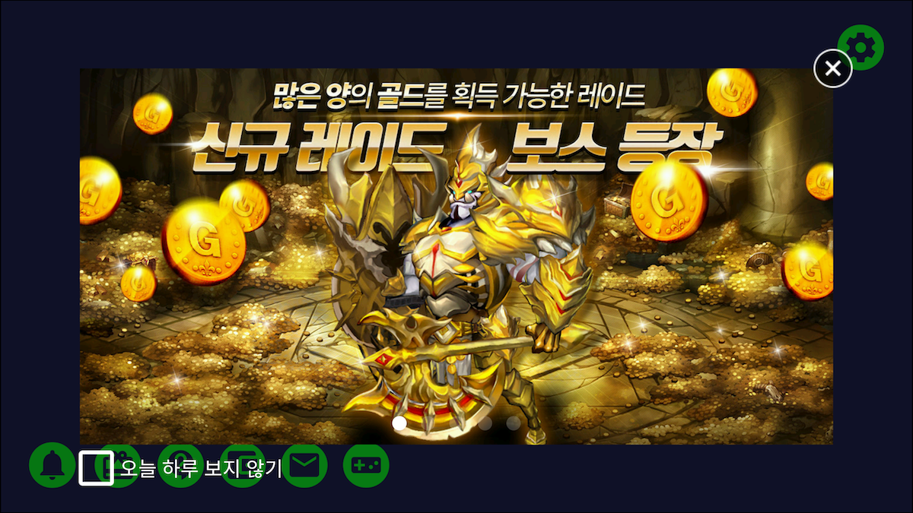
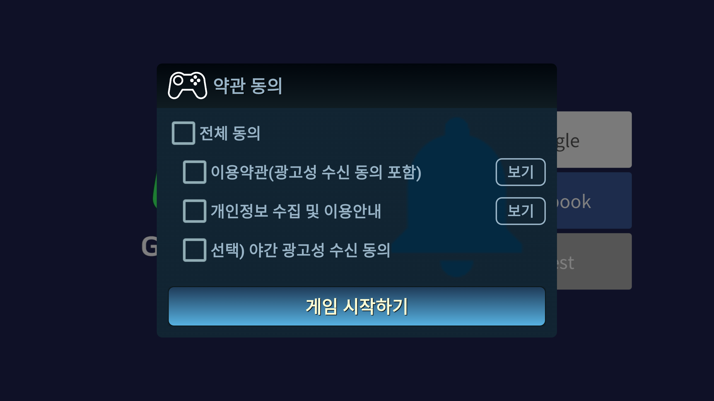
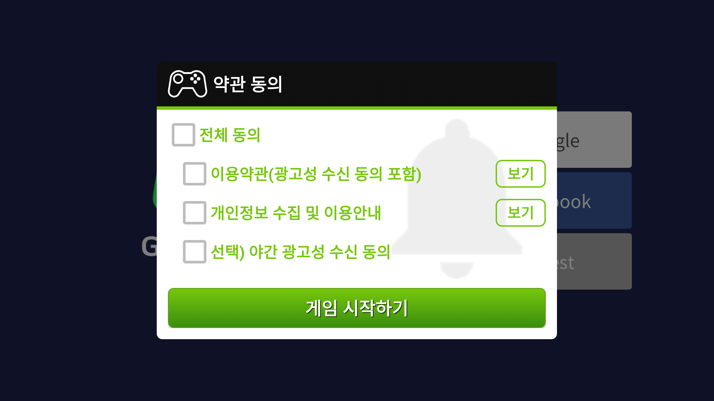
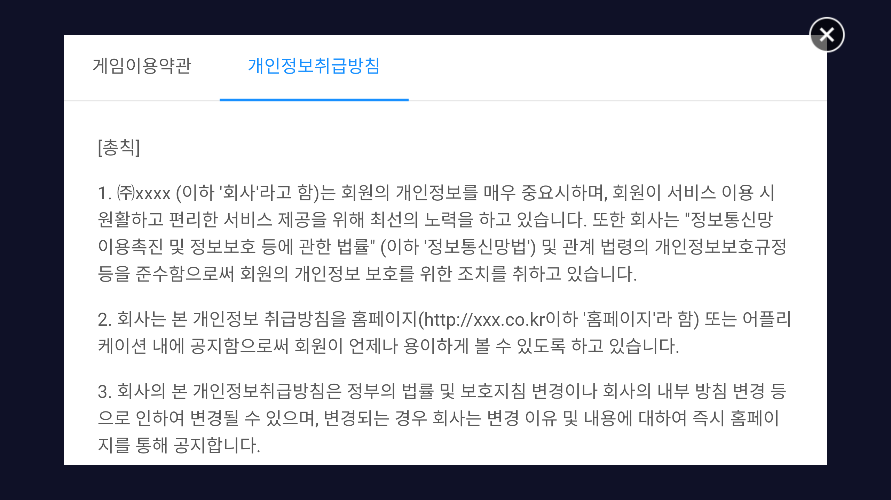

---
search:
  keyword: ['gamepot']
---

## 시작하기

### Step 1. GAMEPOT 플러그인 가져오기

생성된 GAMEPOT 대시보드에 접속한 후 최신 플러그인을 다운로드합니다.

### Step 2. 플러그인 가져오기

**Assets > Import Package > Custom Package** 메뉴에서 다운로드한 GamePotUnityPlugin-xxxx.unitypackage 파일을 선택합니다.


플러그인을 확인하고 import하면 해당 프로젝트에 추가됩니다.


### Step 3. Android

####기본 환경 설정

#####Gradle 환경 설정 방법

/Assets/Plugin/Android/mainTemplate.gradle 파일을 에디터로 엽니다.

```java
...
android {
	...
	defaultConfig {
		...
        resValue "string", "gamepot_project_id", "" // required
        resValue "string", "gamepot_api_url", "" // required
        resValue "string", "gamepot_store", "google" // required
        resValue "string", "gamepot_app_title","@string/app_name" // required (fcm)
        resValue "string", "gamepot_push_default_channel","Default" // required (fcm)
				resValue "string", "facebook_app_id", "0" // optional (facebook)
				resValue "string", "fb_login_protocol_scheme", "fb0" // optional (facebook)
				// resValue "string", "gamepot_elsa_projectid", "" // optional (ncp elsa)
	}
	...
}
```

아래의 필수 값을 찾아 수정합니다. 아래 값들을 수정해야만 정상적으로 작동됩니다.

```java
resValue "string", "[key]", "[value]"
```

| 값                           | 설명                                                         |
| ---------------------------- | ------------------------------------------------------------ |
| gamepot_project_id           | GAMEPOT에서 발급받은 프로젝트 아이디를 입력해 주세요.        |
| gamepot_api_url              | GAMEPOT에서 발급받은 API URL을 입력해 주세요.                |
| gamepot_store                | 스토어값(`google` 또는 `one`)                                |
| gamepot_app_title            | 앱 제목 (FCM)                                                |
| gamepot_push_default_channel | 등록된 기본 채널 이름 (Default) - 변경하지 마세요.           |
| facebook_app_id              | 페이스북 발급 받은 앱ID                                      |
| fb_login_protocol_scheme     | 페이스북에서 발급 받은 protocol scheme  fb[app_id]           |
| gamepot_elsa_projectid       | NCLOUD ELSA 사용시 프로젝트ID ([자세히 보기](https://www.ncloud.com/product/analytics/elsa)) |

#####노티바에 푸시 아이콘 변경 방법


푸시 수신 시 Android Notification bar에 보여줄 Small icon은 SDK 내부에서 기본 이미지로 노출하며 직접 추가할 수도 있습니다.

직접 추가하려면 `drawable` 폴더별로 이미지를 넣어야 합니다.([Android Asset Studio](http://romannurik.github.io/AndroidAssetStudio/icons-notification.html#source.type=clipart&source.clipart=ac_unit&source.space.trim=1&source.space.pad=0&name=ic_stat_gamepot_small)를 이용해 제작하면 자동으로 폴더별로 이미지가 제작되어 편리합니다.)

이미지 파일명은 ic_stat_gamepot_small이어야 합니다.

| 폴더명                | 크기  |
| --------------------- | ----- |
| res/drawable-mdpi/    | 24x24 |
| res/drawable-hdpi/    | 36x36 |
| res/drawable-xhdpi/   | 48x48 |
| res/drawable-xxhdpi/  | 72x72 |
| res/drawable-xxxhdpi/ | 96x96 |

##### Screen Orienation 설정 방법

/Assets/Plugin/Android/AndroidManifest.xml 파일을 에디터로 엽니다.

```xml
...
    <activity android:screenOrientation="sensorLandscape">
      <intent-filter>
        <action android:name="android.intent.action.MAIN" />
          ...
      </intent-filter>
    </activity>
...
```

Main Activity에 screenOrientation을 추가 후 게임에 맞게 `sensorLandscape` 혹은 `sensorPortrait` 를 입력하세요.

#####Unity Build Settings

`File > Build Settings > Build System` 메뉴에서 Gradle을 선택합니다.


### Step 4. iOS

> GameCenter Login을 `사용하지 않으실 경우`에는 아래 위치해서 해당 파일을 삭제 해주세요.<br> > `Assets/Plugins/IOS/Frameworks/GamePotGameCenter.framework`<br>
> 해당 라이브러리가 포함된 경우 `Capabilities설정에서 GameCenter를 필히 활성화` 해주셔야 합니다.<br>

구글 파이어베이스에서 다운로드한 `GoogleService-Info.plist` 파일을 `/Assets/Plugins/IOS/`에 복사합니다.

`/Assets/Plugin/IOS/GamePotConfig-Info.plist` 내에 필요한 환경 변수를 추가해 주세요.


| 환경 변수                                 | 설명                                                 |
| -------------------------------- | ---------------------------------------------------- |
| gamepot_project_id               | GAMEPOT에서 발급받은 프로젝트 아이디를 입력해 주세요. |
| gamepot_api_url | GAMEPOT에서 발급받은 API URL을 입력해 주세요. |
| gamepot_facebook_app_id          | 페이스북 발급 받은 앱ID                              |
| gamepot_facebook_display_name    | 페이스북에 보여지는 이름                             |
| gamepot_google_app_id		   | GoogleService-Info 파일의 CLIENT_ID 값             |
| gamepot_google_url_schemes       | GoogleService-Info 파일의 REVERSED_CLIENT_ID 값  |
| gamepot_elsa_projectid           | NCLOUD ELSA 사용시 프로젝트ID                        |


scenes를 추가한 후에 **File > Build Settings > Build And Run**을 실행하면 완료됩니다.


## 초기화

게임을 시작할때 로드되는 첫 장면에 사용되는 개체에 다음 코드를 추가합니다.

```csharp
using GamePotUnity;
public class GamePotLoginSampleScene : MonoBehaviour {
    void Awake() {
        GamePot.initPlugin();
    }
    void Start () {
        GamePot.setListener(  GamePotInterface.cs 상속받은 class );
         // ex) GamePot.setListener(new GamePotSampleListener());
    }

}

ex)
public class GamePotSampleListener : MonoBehaviour , NSDKInterface {
    ....
}
```

## 오류 코드

```csharp
public class NError
{
    // 알 수 없는 Error
    public static readonly int CODE_UNKNOWN_ERROR           = 0;
    // 초기화 실패
    public static readonly int CODE_NOT_INITALIZE           = 1;
    // 파라미터가 올바르지 않은 경우
    public static readonly int CODE_INVAILD_PARAM           = 2;
    // 멤버아이디 데이터가 없을때
    public static readonly int CODE_MEMBERID_IS_EMPTY       = 3;
    // 로그인이 되지 않은 상태
    public static readonly int CODE_NOT_SIGNIN              = 4;
    // 네트워크 모듈이 초기화되지 않았을 때
    public static readonly int CODE_NETWORK_MODULE_NOT_INIT = 3000;
    // 네트워크 연결 오류 및 타임아웃 발생 시
    public static readonly int CODE_NETWORK_ERROR           = 3001;
    // server-side에서 발생하는 오류
    public static readonly int CODE_SERVER_ERROR            = 4000;
    // http response code가 성공이 아닌 경우
    public static readonly int CODE_SERVER_HTTP_ERROR       = 4001;
    // 네트워크 연결 오류 및 타임아웃 발생 시
    public static readonly int CODE_SERVER_NETWORK_ERROR    = 4002;
    // 서버에서 받은 데이터를 파싱할 때 오류
    public static readonly int CODE_SERVER_PARSING_ERROR    = 4003;
    // 결제에서 알 수 없는 오류 발생 및 스토어 측에서 Error를 전달할 때
    public static readonly int CODE_CHARGE_UNKNOWN_ERROR    = 5000;
    // product id를 넣지 않은 경우
    public static readonly int CODE_CHARGE_PRODUCTID_EMPTY  = 5001;
    // product id를 잘못 넣은 경우
    public static readonly int CODE_CHARGE_PRODUCTID_WRONG  = 5002;
    // consume 시 오류
    public static readonly int CODE_CHARGE_CONSUME_ERROR    = 5003;

    // error Code
    public int code { get; set; }
    // error Message
    public string message { get; set; }
}
```

## 로그인 환경 설정

### 구글 로그인

#### Google Firebase Console

1. Google Firebase Console에서 Android용 google-service.json 파일을 다운로드한 후에 `/Assets/Plugins/Android/`에 복사합니다.
2. APK 빌드 시 사용한 Keystore의 SHA-1 값을 Google Firebase console에 추가합니다.
3. Google Firebase Console에서 iOS용 GoogleService-Info.plist 파일을 다운로드한 후에 `/Assets/Plugins/IOS/`에 복사합니다.

**구글 로그인 시 onCancel이 응답하며 로그인이 되지 않는 경우** 아래 내용을 체크해주세요.

1. 위에 적용요청한 google-service.json파일을 정상적으로 적용했는지 확인
2. 빌드 시 사용한 키스토어가 Firebase console에 등록한 sha-1를 추출한 키스토어인지 확인
3. Firebase console에 등록한 패키지명으로 빌드를 했는지 확인

### 페이스북 로그인

#### Facebook Developer Console

APK 빌드 시 사용한 Keystore의 키 해시 값을 페이스북 콘솔에 추가합니다.

#### Android

mainTemplate.gradle 수정

```java
...
defaultConfig {
	resValue "string", "facebook_app_id", "1234567890"
	resValue "string", "fb_login_protocol_scheme", "fb1234567890"
}
...
```

페이스북 개발자 센터에서 발급받은 앱 ID를 `facebook_app_id` 값에 입력하고 `fb_login_protocol_scheme` 값에 `fb{facebook_app_id}`를 입력합니다.

> app_id가 1234567890인 경우 fb1234567890이 `fb_login_protocol_scheme` 값입니다.

#### iOS

/Assets/Plugins/IOS/Frameworks 경로에 아래 프레임 워크를 추가합니다.

FBSDKLoginKit.framework
FBSDKCoreKit.framework
Bolts.framework
GamePotFacebook.framework

### 게임센터 로그인

> iOS에만 해당하는 기능입니다.<br>
>
> GameCenter Login을 `사용하지 않으실 경우`에는 아래 위치해서 해당 파일을 삭제 해주세요.<br> > `Assets/Plugins/IOS/Frameworks/GamePotGameCenter.framework`<br>
> 해당 라이브러리가 포함된 경우 `Capabilities설정에서 GameCenter를 필히 활성화` 해주셔야 합니다.<br>

/Assets/Plugins/IOS/Frameworks/ 경로에 Gamekit.framwork를 복사합니다. **General > Linked Frameworks and Libraries** 내에 복사한 프레임워크를 추가합니다.

Capabilities 설정에서 Game Center를 ON으로 설정합니다.(앱스토어 콘솔에서도 Game Center이 ON으로 설정되어 있어야 합니다.)


### 네이버 로그인

#### Naver Developer Console

사용 API를 `네아로`로 선택 후 애플리케이션 등록

#### Android

mainTemplate.gradle 수정

```java
...
defaultConfig {
	resValue "string", "gamepot_naver_clientid", "abcdefg1234567890"
	resValue "string", "gamepot_naver_secretid", "hijklmn"
}
...
```

발급받은 Client ID를 `gamepot_naver_clientid` 값에 입력하고 Client Secret은  `gamepot_naver_secretid` 값에 입력합니다.

#### iOS

GamePotConfig-Info.plist 파일에 아래 항목을 추가하여 해당 값을 입력 합니다.

```
gamepot_naver_clientid // 네이버에서 사용할 client 아이디
gamepot_naver_secretid // 네이버에서 사용할 secret 아이디
gamepot_naver_urlscheme // 네이버에서 사용할 urlscheme
```

GamePotConfig-Info.plist 파일을 SourceCode로 볼 때는 아래와 같이 추가

```xml
...
<key>gamepot_naver_clientid</key>
<string>xxxxxx</string>
<key>gamepot_naver_secretid</key>
<string>xxxxxx</string>
<key>gamepot_naver_urlscheme</key>
<string>xxxxxx</string>
...
```

## 로그인/로그아웃/탈퇴/검증

### 로그인

별도의 가입 없이 사용자 계정이 생성됩니다. 모든 신원 확인을 위한 MemberId가 생성되며, 생성된 정보는 NUserInfo 구조체에 저장되어 리턴됩니다.

Request:

```csharp
GamePot.login(NCommon.LoginType);
```

Response:

```csharp
// 로그인 성공
public void onLoginSuccess(NUserInfo userInfo)
{
}
// 로그인 실패
public void onLoginFailure(NError error)
{
	// 로그인을 실패하는 경우
	// error.message를 팝업 등으로 유저에게 알려주세요.
}
// 로그인 취소
public void onLoginCancel()
{
	// 사용자가 임의로 로그인을 취소한 경우
}
// 강제 업데이트(스토어 버전과 클라이언트 버전이 다를 경우 호출)
public void onNeedUpdate(NAppStatus status)
{
	// TODO: 파라미터로 넘어온 status 정보를 토대로 팝업을 만들어 사용자에게 알려줘야 합니다.
	// TODO: 아래 두 가지 방식 중 한 가지를 선택하세요.
    // case 1: 인게임 팝업을 통해 개발사에서 직접 UI 구현
    // case 2: SDK의 팝업을 사용(이 경우에는 아래 코드를 호출해 주세요.)
    // GamePot.showAppStatusPopup(status.ToJson());
}
// 점검(대시보드에 점검이 활성화되어 있는 경우 호출)
public void onMainternance(NAppStatus status)
{
   	// TODO: 파라미터로 넘어온 status 정보를 토대로 팝업을 만들어 사용자에게 알려줘야 합니다.
	// TODO: 아래 두 가지 방식 중 한 가지를 선택하세요.
    // case 1: 인게임 팝업을 통해 개발사에서 직접 UI 구현
    // case 2: SDK의 팝업을 사용(이 경우에는 아래 코드를 호출해 주세요.)
    // GamePot.showAppStatusPopup(status.ToJson());
}
// 앱 종료
public void onAppClose()
{
    // TODO: 강제 업데이트나 점검 기능을 case 2 방식으로 구현하는 경우
    // TODO: 앱을 강제 종료할 수 있기 때문에 이 곳에 앱을 종료할 수 있도록 구현하세요.
}
```

LoginType 정의

```csharp
public enum LoginType
{
     NONE,
     GOOGLE,
     FACEBOOK,
     GAMECENTER,
     NAVER,
     GUEST
}

```

NUserInfo 정의

```csharp
public class NUserInfo
{
    public string id { get; set; }              // 맴버 ID(유저의 유니크 아이디)
    public string name { get; set; }            // 이름
    public string profileUrl { get; set; }      // 프로필 URL(존재 시)
    public string email { get; set; }           // 이메일(존재 시)
    public string socialid { get; set; }        // Social ID(google, facebook ...)
}
```

### 로그인 정보 가져오기

```csharp
GamePot.getMemberId(); // 맴버 ID(유저의 유니크 아이디)
```

### 자동 로그인

```csharp
NCommon.LoginType type = GamePot.getLastLoginType();
if(type != NCommon.LoginType.NONE) {
{
    // 마지막에 로그인했던 로그인 타입으로 로그인하는 방식입니다.
    GamePot.login(type);
}
else
{
    // 처음 게임을 실행했거나 로그아웃한 상태. 로그인을 할 수 있는 로그인 화면으로 이동해 주세요.
}
```

### 로그아웃

사용자를 로그아웃시킵니다. 계정이 삭제되지 않으며, 동일한 계정으로 로그인이 가능합니다.

Request:

```
GamePot.logout();
```

Response:

```csharp
/// 로그아웃 성공
public void onLogoutSuccess()
{
}

/// 로그아웃 실패
public void onLogoutFailure(NError error)
{
   	// 로그아웃을 실패하는 경우
	// error.message를 팝업 등으로 유저에게 알려주세요.
}
```

### 탈퇴

회원을 탈퇴하며, 복구가 불가능합니다.

Request:

```
GamePot.deleteMember();
```

Response:

```csharp
/// 회원 탈퇴 성공
public void onDeleteMemberSuccess() {
}

/// 회원 탈퇴 실패
public void  onDeleteMemberFailure(NError error) {
   	// 회원 탈퇴를 실패하는 경우
	// error.message를 팝업 등으로 유저에게 알려주세요.
}
```

### 검증

로그인 완료 후 로그인 정보를 개발사 서버에서 GAMEPOT 서버로 전달하면 로그인 검증이 진행됩니다.

자세한 설명은 Server to server api 메뉴에 `Token Authentication` 항목을 참고해주세요.

## 계정 연동

하나의 게임 계정에 복수 개의 소셜계정(구글/페이스북 등)을 연결/해제할 수 있는 기능입니다.(최소 연동 소셜 계정은 1가지입니다.)

> 연동화면 UI는 개발사에서 구현해주세요.

```csharp
public enum LinkingType
{
      GAMECENTER,
      GOOGLE,
      FACEBOOK,
      NAVER
}
```

### 연동

Google / Facebook 등의 아이디로 계정을 연동 하실 수 있습니다.

Request:

```csharp
GamePot.createLinking(NCommon.LinkingType.XXXXX);
```

Response:

```csharp
/// 계정 연동 취소
public void onCreateLinkingCancel() {
    // 유저가 계정연동을 취소한 경우
}

/// 계정 연동 성공
public void onCreateLinkingSuccess(NUserInfo userInfo) {
}

/// 계정 연동 실패
public void onCreateLinkingFailure(NError error) {
	// 계정 연동을 실패하는 경우
	// error.message를 팝업 등으로 유저에게 알려주세요.
}
```

현재 연동된 모든 계정 정보를 가져올 수 있습니다.

```csharp
List<NLinkingInfo> linkedList = GamePot.getLinkedList();
```

링크 정보 정의

```csharp
public class NLinkingInfo
{
    public LinkingType provider { get; set; }  // google, facebook, naver
}
```

### 연동 해제

기존에 연동 되어 있는 계정을 해제합니다.

Request :

```
void GamePot.deleteLinking(NCommon.LinkType.XXXXX);
```

Response:

```csharp
/// 계정 연동 해제 성공
public void onDeleteLinkingSuccess() {
}

/// 계정 연동 해제 실패
public void onDeleteLinkingFailure(NError error) {
	// 연동 해제를 실패하는 경우
	// error.message를 팝업 등으로 유저에게 알려주세요.
}
```

#### 계정 연동 상태에 대한 결과 처리 예제

createLinking / deleteLinking 결과에 따라 현재 연동 되어 있는 계정 정보를 받아와 연동상태에 대한 UI를 업데이트 합니다.

```csharp
public void onInit()
{
	UI_Update();
}
public void onCreateLink_GAMECENTER_Click()
{
	GamePot.createLinking(NCommon.LinkingType.GAMECENTER);
}
public void onCreateLink_GOOGLE_Click()
{
	GamePot.createLinking(NCommon.LinkingType.GOOGLE);
}
public void onCreateLinkingSuccess(NUserInfo userInfo)
{
	UI_Update();
}
public void onCreateLinkingFailure(NError error)
{
	UI_Update();
}
public void onDeleteLinkingSuccess(NUserInfo userInfo)
{
	UI_Update();
}
public void onDeleteLinkingFailure(NError error)
{
	UI_Update();
}

Public void UI_Update()
{
	// Ui Update in GAME
	CreateLinkManager.instance._IOS_google_state  = false;
	CreateLinkManager.instance._IOS_gamecenter_state  = false;

	List<NLinkingInfo> linkedList = GamePot.getLinkedList();
	foreach ( NLinkingInfo item in linkedList)
	{
		case NCommon.LinkingType.GOOGLE :
			CreateLinkManager.instance._IOS_google_state  = true;
		break;
		case NCommon.LinkingType.GAMECENTER :
			CreateLinkManager.instance._IOS_gamecenter_state  = true;
		break;
	}
}
```

##결제

### 인앱 상품 조회

스토어에 등록된 상품 정보를 전달 합니다.

이 기능을 활용하면 사용자에 맞게 가격, 통화, 상품명이 다르게 표시됩니다.

```csharp
NPurchaseItem[] items = GamePot.getPurchaseItems();
foreach(NPurchaseItem item in items) {
    Debug.Log(item.productId);		// 상품ID
    Debug.Log(item.price);			// 가격
    Debug.Log(item.title);			// 제목
    Debug.Log(item.description);	// 설명
}
```

###인앱 상품 결제

아래 함수 하나로 구글, 애플, 앱스토어 결제가 가능합니다.

Request:

```csharp
// productId : 마켓에 등록된 상품ID
GamePot.purchase(string productId)
```

Response:

```csharp
/// 인앱 결제 성공
public void onPurchaseSuccess(NPurchaseInfo purchase) {
}

/// 인앱 결제 실패
public void onPurchaseFailure(NError error) {
	// 결제를 실패하는 경우
	// error.message를 팝업 등으로 유저에게 알려주세요.
}

/// 인앱 결제 실패
public void onPurchaseCancel() {
}
```

###NPurchaseInfo 정의

결제 성공 후 결제한 아이템의 정보입니다. 참고용으로 사용하시면 됩니다.

```csharp
public class NPurchaseInfo
{
    public string price { get; set; }  				// 결제 아이템의 가격
    public string productId { get; set; }           // 결제 아이템 ID
    public string currency { get; set; }            // 결제 가격 통화(KRW/USD)
    public string orderId { get; set; }             // 스토어 Order ID
    public string productName { get; set; }         // 결제 아이템 이름
    public string uniqueId { get; set; }            // purchase api호출 시 두번째 파라미터 값
    public string signature { get; set; }           // 결제 Signature
    public string originalJSONData { get; set; }    // 영수증 Data
}
```

###결제 아이템 지급

GAMEPOT은 Server to server api를 통해 결제 스토어에 영수증 검증까지 모두 마친 후 개발사 서버에 지급 요청을 하기 때문에 불법 결제가 불가능합니다.

이를 위해선 `Server to server api` 메뉴에 `Purchase Webhook` 항목을 참고하여 처리하셔야 합니다.

### 외부결제

외부결제를 허용하는 스토어 및 공식 스토어가 아닌 곳에서 결제를 사용할 수 있는 기능입니다.

> 호출 api만 다르고 응답 및 purchase webhook등 나머지는 일반 결제와 동일합니다.

Request:

```csharp
// productId : 마켓에 등록된 상품ID
// price : 아이템 가격
// currency : 통화
GamePot.purchaseThirdPayments(string productId, string price, string currency);
```

## 광고

IGAWorks Unity Plugin을 기본으로 포함하고 있으므로 [IGAWorks의 가이드](http://help.igaworks.com/hc/ko/3_3/Content/Article/common_unity_aos)로 적용하시면 됩니다.

> IGAWorks 외에 라이브러리를 사용하고자 하시는 경우에는 저희가 포함하는 방법을 안내해 드리도록 하겠습니다.

포함된 버전은 아래와 같습니다.

| 플랫폼  | 버전                                           |
| ------- | ---------------------------------------------- |
| Android | IGAWorks_Unity_Android_Full_Package_2018-12-05 |
| iOS     | IGAWorks_Unity_iOS_Full_Package_2018-10-02     |

## Push on/off

전체푸시, 야간푸시, 광고 푸시 3가지 종류의 푸시를 각각 on/off를 처리 할 수 있습니다.

> on/off설정하는 UI는 개발사에서 구현해주세요.

### 푸시 설정

Request:

```csharp
GamePot.setPushStatus(bool pushEnable);
```

Response:

```csharp
/// 푸시 상태 변경에 대한 서버 통신 성공
public void onPushSuccess() {
}

/// 푸시 상태 변경에 대한 서버 통신 실패
public void onPushFailure(NError error) {
	// 푸시 상태 변경을 실패하는 경우
	// error.message를 팝업 등으로 유저에게 알려주세요.
}
```

### 야간 푸시 설정

Request:

```csharp
GamePot.setPushNightStatus(bool nightPushEnable);
```

Response:

```csharp
/// 야간 푸시 상태 변경에 대한 서버 통신 성공
public void onPushNightSuccess() {
}

/// 야간 푸시 상태 변경에 대한 서버 통신 실패
public void onPushNightFailure(NError error) {
	// 야간 푸시 상태 변경을 실패하는 경우
	// error.message를 팝업 등으로 유저에게 알려주세요.
}
```

### 광고 푸시 설정

Request:

```csharp
GamePot.setPushADStatus(bool adPushEnable);
```

Response:

```csharp
/// 광고 푸시 상태 변경에 대한 서버 통신 성공
public void onPushAdSuccess() {
}

/// 광고 푸시 상태 변경에 대한 서버 통신 실패
public void onPushAdFailure(NError error) {
	// 광고 푸시 상태 변경을 실패하는 경우
	// error.message를 팝업 등으로 유저에게 알려주세요.
}
```

### 푸시 / 야간푸시 / 광고 상태를 한번에 설정

로그인 전에 푸시 / 야간푸시 / 광고푸시 허용 여부를 받는 게임이라면 로그인 후에 아래 코드로 필히 호출합니다.

Request:

```csharp
GamePot.setPushStatus(bool pushEnable, bool nightPushEnable, bool adPushEnable);
```

Response:

```csharp
/// 야간 푸시 상태 변경에 대한 서버 통신 성공
public void onPushStatusSuccess() {
}

/// 야간 푸시 상태 변경에 대한 서버 통신 실패
public void onPushStatusFailure(NError error) {
	// 야간 푸시 상태 변경을 실패하는 경우
	// error.message를 팝업 등으로 유저에게 알려주세요.
}
```

### 푸시 상태 조회

```csharp
NPushInfo pushInfo = GamePot.getPushStatus();
// pushInfo.enable  푸시 허용 여부
// pushInfo.night   야간 푸시 허용 여부
// pushInfo.ad      광고 푸시 허용 여부
```

## 쿠폰

#### 쿠폰 사용

> 쿠폰을 입력받는 UI는 개발사에서 구현해주세요.

Request:

```csharp
GamePot.coupon(string couponNumber); // 쿠폰번호
```

Response:

```csharp
/// 쿠폰 사용 성공
public void onCouponSuccess() {
}

/// 쿠폰 사용 실패
public void onCouponFailure(NError error) {
	// 쿠폰 사용을 실패하는 경우
	// error.message를 팝업 등으로 유저에게 알려주세요.
}
```

#### 아이템 지급

쿠폰 사용이 성공하면 개발사 서버에 Server to server api를 통해 아이템 지급을 요청합니다.

이를 위해선 Server to server api 메뉴에 `Item Webhook` 항목을 참고하여 처리하셔야 합니다.

##네이버 카페 SDK

네이버 카페 SDK(4.0.4)를 포함한 plugin을 사용하시면 [네이버 카페 SDK 가이드](https://github.com/naver/cafe-sdk-unity/blob/master/README.md#usages)를 참고하여 적용하시면 됩니다.

> 네이버 카페 SDK의 용량이 큰 관계로 포함/미포함한 버전 두 가지로 제공됩니다. 필요에 따라 택일하시면 됩니다.

## 공지사항

GAMEPOT 대시보드에서 '공지사항'에 추가한 이미지를 순서대로 노출하는 기능입니다.



이미지 권장 스펙은 아래와 같습니다.

- 사이즈 : 720 * 1200(Portrait) / 1280 * 640(Landscape)

  > 위 사이즈를 준수하지 않을 경우 center crop으로 이미지를 처리합니다.

- 용량 : 250KB 이하

Request:

```csharp
GamePot.showNotice();
```

Response:

GAMEPOT 대시보드에서 `클릭액션`을 `SCHEME`으로 설정한 경우 해당 이미지를 클릭 시 `SCHEME`값을 전달드립니다.

```csharp
public void onReceiveScheme(string scheme)
{
    // GAMEPOT 대시보드에서 설정한 scheme값을 전달
}
```

## 고객지원

고객이 운영자에게 문의를 등록하고 답변을 받을 수 있는 기능입니다.

- 문의 등록 화면

  

- 내 문의 내역 화면

  

###호출

```csharp
GamePot.showCSWebView();
```

## 로컬 푸시(Local Push notification)

푸시 서버를 통하지 않고 단말기에서 푸시를 노출하는 기능입니다.

### 호출

#### 푸시 등록

정해진 시간에 로컬 푸시를 노출하는 방법은 아래와 같습니다.

> 리턴 값으로 전달되는 pushId는 개발사에서 관리합니다.

```Java
int pushId = GamePot.sendLocalPush(DateTime.Parse("2018-01-01 00:00:00"), "title", "content");
```

#### 등록한 푸시 취소

푸시 등록 시 얻은 pushId를 기반으로 기존에 등록된 푸시를 취소할 수 있습니다.

```Java
GamePot.cancelLocalPush(/*푸시 등록시 얻은 pushId*/);
```

## 약관 동의

'이용약관' 및 '개인정보 수집 및 이용안내' 동의를 쉽게 받을 수 있도록 UI를 제공합니다.

`BLUE` 테마와  `GREEN` 테마 두 가지를 제공하며, 각 영역별로 Customizing도 가능합니다.

- `BLUE` 테마 예시

  

- `GREEN` 테마 예시

  

### 약관 동의 호출

> 약관 동의 팝업 노출 여부는 개발사에서 게임에 맞게 처리해주세요.
>
> '보기'버튼을 클릭 시 보여지는 내용은 대시보드에서 적용 및 수정이 가능합니다.

Request:

```csharp
// 기본 호출(BLUE 테마로 적용)
GamePot.showAgreeDialog();

// GREEN 테마로 적용시
NAgreeInfo info = new NAgreeInfo();
info.theme = "green";
GamePot.showAgreeDialog(info);
```

Response:

```csharp
// 약관에 동의한 경우
public void onAgreeDialogSuccess(NAgreeResultInfo info)
{
    // info.agree : 필수 약관을 모두 동의한 경우 true
    // info.agreeNight : 야간 광고성 수신 동의를 체크한 경우 true, 그렇지 않으면 false
    // agreeNight 값은 로그인 완료 후 setPushNightStatus api를 통해 전달하세요.
}

// 오류 발생
public void onAgreeDialogFailure(NError error)
{
	// error.message를 팝업 등으로 유저에게 알려주세요.
}
```

### Customizing

테마를 사용하지 않고 게임에 맞게 색을 변경합니다.

약관 동의를 호출하기 전에 `NAgreeInfo`에서 각 영역별로 색을 지정할 수 있습니다.

```c#
NAgreeInfo info = new NAgreeInfo();
info.theme = "green";
info.headerBackGradient = new string[] { "0xFF00050B", "0xFF0F1B21" };
info.headerTitleColor = "0xFFFF0000";
info.headerBottomColor = "0xFF00FF00";
// 미사용시 ""로 설정
info.headerTitle = "약관 동의";
// Android : res/drawable 객체 아이디(파일명)
// iOS : asset 객체 아이디(파일명)
info.headerIconDrawable = "ic_stat_gamepot_agree";

info.contentBackGradient = new string[] { "0xFFFF2432", "0xFF11FF32" };
info.contentIconColor = "0xFF0429FF";
info.contentCheckColor = "0xFFFFADB5";
info.contentTitleColor = "0xFF98FFC6";
info.contentShowColor = "0xFF98B3FF";
// Android : res/drawable 객체 아이디(파일명)
// iOS : asset 객체 아이디(파일명)
info.contentIconDrawable = "ic_stat_gamepot_small";

info.footerBackGradient = new string[] { "0xFFFFFFFF", "0xFF112432" };
info.footerButtonGradient = new string[] { "0xFF1E3A57", "0xFFFFFFFF" };
info.footerButtonOutlineColor = "0xFFFF171A";
info.footerTitleColor = "0xFFFF00D5";
info.footerTitle = "게임 시작하기";
// 야간 광고성 수신동의 버튼 노출 여부
info.showNightPush = true;

// 문구 변경
info.allMessage = "모두 동의";
info.termMessage = "필수) 이용약관";
info.privacyMessage = "필수) 개인정보 취급 방침";
info.nightPushMessage = "선택) 야간 푸시 수신 동의";

GamePot.showAgreeDialog(info);
```

각각의 변수는 아래 영역에 적용됩니다.

> contentIconDrawable은 AOS에만 보여지며, 기본 값은 푸시 아이콘으로 설정됩니다.


## 이용약관

이용약관 UI를 호출합니다.

```c#
GamePot.showTerms();
```


## 개인정보 취급방침

개인정보 취급방침 UI를 호출합니다.

```c#
GamePot.showPrivacy();
```

