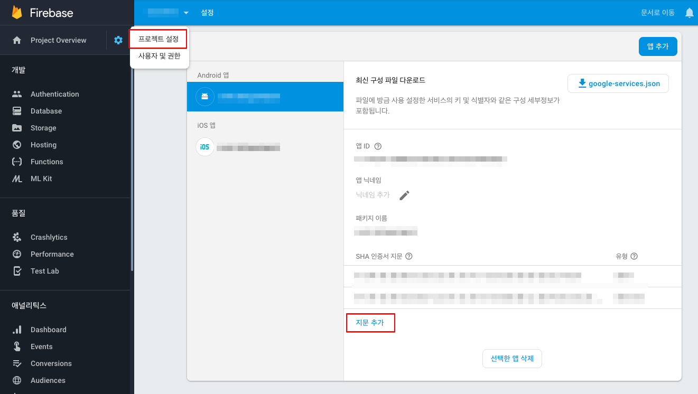

# FAQ

* 로그인
  * [구글 로그인이 안돼요!](#구글 로그인이 안돼요!)
  * [페이스북 로그인이 안돼요!](#페이스북 로그인이 안돼요!)

* 결제
  * 구글 테스트 결제는 어떻게 해요? (준비중)
  * 원스토어 테스트 결제는 어떻게 해요? (준비중)


# 구글 로그인이 안돼요!

구글 로그인을 위해 필요한 환경이 올바로 설정 되지 않아 발생하는 현상입니다.

1. Firebase의 설정 파일인 `google-service.json`이 프로젝트에 포함 됐는지 확인

2. APK 빌드 시 사용한 Keystore의 SHA-1값을 Firebase console에 추가했는지 확인

   > SHA-1 값은 개발사에 요청합니다.

   


# 페이스북 로그인이 안돼요!

1. gradle파일에 페이스북 아이디를 넣었는지 확인

   fb_login_protocol_scheme에는 페북 아이디에 앞에 fb를 포함한 값을 넣으면 됩니다.

   ```java
   android {
   	...
       defaultConfig {
       	...
           resValue "string", "facebook_app_id", "xxxxxxxxxxxxxx"
           resValue "string", "fb_login_protocol_scheme", "fbxxxxxxxxxxxxxx"
           ...
       }
   }
   ```

   페이스북 아이디는 아래와 같이 콘솔에서 확인합니다.

   

2. 키 해시 값을 콘솔에 추가했는지 확인

   APK 빌드 시 사용한 Keystore의 키 해시 값을 아래의 입력창에 추가합니다.

   > 키 해시 값은 개발사에 요청합니다.

   

